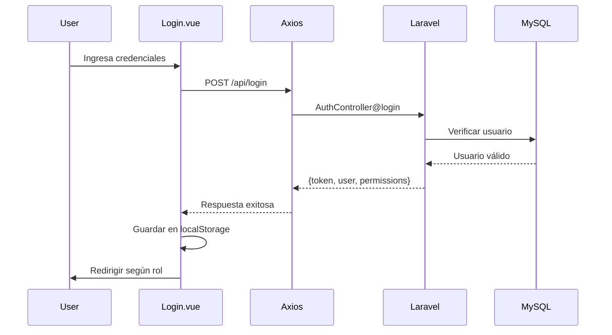

# 🏗️ Arquitectura del Sistema

[← Volver al índice](context.md)

---

## 📋 Stack Tecnológico

### Backend

| Componente | Tecnología | Versión | Descripción |
|------------|------------|---------|-------------|
| **Framework** | Laravel | 9.19 | Framework PHP para API RESTful |
| **Lenguaje** | PHP | ≥ 8.0.2 | Lenguaje de programación |
| **Autenticación** | Laravel Sanctum | 3.3 | Sistema de tokens API |
| **Base de Datos** | MySQL | - | Base de datos relacional |
| **Cliente HTTP** | Guzzle | ^7.2 | Cliente HTTP para APIs externas |
| **CLI** | Tinker | ^2.7 | REPL para Laravel |
| **i18n** | Laravel Lang | ^12.17 | Traducciones |
| **Auth Google** | Google Auth | ^1.48 | Autenticación Google |

### Frontend

| Componente | Tecnología | Versión | Descripción |
|------------|------------|---------|-------------|
| **Framework** | Vue | 3.2.25 | Framework JavaScript reactivo |
| **Router** | Vue Router | 4.5.0 | Enrutador SPA |
| **Build Tool** | Vite | 3.2.11 | Build tool y dev server |
| **HTTP Client** | Axios | 1.8.3 | Cliente HTTP |
| **Estilos** | Tailwind CSS | 3.3.3 | Framework CSS utility-first |
| **Preprocesador** | Sass | ^1.93.2 | Preprocesador CSS |

### Librerías UI

| Librería | Versión | Uso |
|----------|---------|-----|
| SweetAlert2 | ^11.17.2 | Diálogos y alertas |
| Vue Datepicker | ^3.6.8 | Selector de fechas |
| Simple Vue Camera | ^1.1.3 | Captura de imágenes |
| XLSX | ^0.18.5 | Exportación Excel |
| File Saver | ^2.0.5 | Descarga de archivos |
| Chart.js | ^4.5.1 | Gráficos |
| Vue Chart 3 | ^3.1.8 | Wrapper Vue para Chart.js |
| jsPDF | ^2.5.2 | Generación PDFs |
| html2canvas | ^1.4.1 | Captura HTML a canvas |
| vue3-html2pdf | ^1.1.2 | Conversión HTML a PDF |

---

## 📁 Estructura de Directorios

### Backend (Laravel)

```
_tag/
├── app/
│   ├── Http/
│   │   ├── Controllers/        (20 controladores)
│   │   │   ├── ApprovalController.php
│   │   │   ├── AuthController.php
│   │   │   ├── BoothController.php
│   │   │   ├── CatalogController.php
│   │   │   ├── ClientController.php
│   │   │   ├── CostController.php
│   │   │   ├── ExtrasController.php
│   │   │   ├── InventoryController.php
│   │   │   ├── MaintenanceController.php
│   │   │   ├── OperatorController.php
│   │   │   ├── PlaceController.php
│   │   │   ├── RolePermissionController.php
│   │   │   ├── ServiceController.php
│   │   │   ├── SupplierController.php
│   │   │   ├── TireController.php
│   │   │   ├── TravelController.php
│   │   │   ├── TreasuryController.php
│   │   │   ├── UnitController.php
│   │   │   └── UserController.php
│   │   └── Middleware/
│   │       └── CheckPermission.php
│   ├── Models/                 (37 modelos)
│   │   ├── Approval.php
│   │   ├── Client.php
│   │   ├── Service.php
│   │   ├── Maintenance.php
│   │   ├── Operator.php
│   │   └── ... (32 más)
│   ├── Traits/
│   │   ├── HasApproval.php
│   │   ├── UppercaseAttributes.php
│   │   └── HasMexicoTimezone.php
│   ├── Helpers/
│   │   └── NotificationHelper.php
│   └── Services/
│       ├── ApprovalService.php
│       └── FcmService.php
├── config/                     (Configuración Laravel)
├── database/
│   ├── migrations/             (45 migraciones)
│   ├── seeders/
│   └── factories/
├── routes/
│   ├── api.php                 (Rutas API)
│   └── web.php                 (SPA catch-all)
├── storage/                    (Archivos y logs)
└── public/                     (Assets públicos)
```

### Frontend (Vue 3)

```
resources/
├── js/
│   ├── pages/                  (Páginas principales)
│   │   ├── login.vue
│   │   ├── dashboard.vue
│   │   ├── clients.vue
│   │   ├── services.vue
│   │   ├── operators.vue
│   │   ├── maintenances.vue
│   │   ├── approvals.vue
│   │   ├── forms/              (Formularios)
│   │   │   ├── client.vue
│   │   │   ├── service.vue
│   │   │   ├── assign.vue
│   │   │   ├── maintenance.vue
│   │   │   └── ... (15+ más)
│   │   ├── treasury/           (Módulo tesorería)
│   │   │   ├── services.vue
│   │   │   ├── maintenances.vue
│   │   │   └── nominas.vue
│   │   ├── dashboards/         (Dashboards)
│   │   │   ├── dashboard.vue
│   │   │   └── ...
│   │   └── formats/            (Formatos)
│   │       └── PdfNomina.vue
│   ├── components/             (25+ componentes)
│   │   ├── DataTable.vue       ⭐ Tabla avanzada
│   │   ├── SegmentedControl.vue
│   │   ├── TableAction.vue
│   │   ├── FormAction.vue
│   │   ├── statebutton.vue
│   │   ├── remoteselect.vue
│   │   └── ... (20+ más)
│   ├── layouts/
│   │   └── layout.vue
│   ├── utils/
│   │   └── redirectByRole.js
│   ├── directives/
│   │   └── permission.js
│   ├── composables/
│   │   ├── usePermissions.js
│   │   └── upsert.js
│   ├── plugins/
│   │   ├── approvals.js
│   │   └── dialogs.js
│   ├── router.js
│   ├── bootstrap.js
│   └── app.js
├── css/
│   └── app.css                 (Tailwind + custom)
└── views/
    └── app.blade.php           (SPA shell)
```

---

## 🎨 Sistema de Estilos

### Tailwind CSS

**Configuración:** `tailwind.config.js`

```js
module.exports = {
  content: [
    "./resources/**/*.blade.php",
    "./resources/**/*.js",
    "./resources/**/*.vue",
  ],
  theme: {
    extend: {},
  },
  plugins: [],
}
```

### Variables CSS Personalizadas

**Archivo:** `resources/css/app.css`

```css
:root {
  --primarycolor: #18364a;
  --secondarycolor: #234053;
  --darkcolor: #091b27;
  --tintcolor: #2691e4;
}
```

### Clases Personalizadas

- `.logotype` - Logo de la aplicación
- `.sidebar` - Barra lateral de navegación
- `.table` - Tablas responsivas
- `.button`, `.form-button`, `.float-button` - Botones corporativos
- `.form-item` - Campos de formulario
- `.tabbar` - Barra de pestañas
- `.menu-app` - Menú móvil

### Responsive Design

- **Mobile-first** approach
- **Breakpoints:** sm (640px), md (768px), lg (1024px), xl (1280px)
- **Tablas adaptativas:** Se convierten en cards en <768px
- **Sidebar:** Oculta en <1024px

---

## 🧩 Componentes Reutilizables Destacados

### DataTable.vue ⭐

**Ubicación:** `resources/js/components/DataTable.vue`  
**Documentación:** `resources/js/components/DataTable.README.md`

Componente de tabla avanzada con:
- ✅ Filtrado tipo Excel por columna
- ✅ Ordenamiento ascendente/descendente
- ✅ Paginación automática (25 registros)
- ✅ Botón de resincronización
- ✅ Responsive (tabla/cards)
- ✅ Formatters personalizados
- ✅ Vue 3 Teleport para dropdowns

**Ejemplo:**
```vue
<DataTable
  :data="items"
  :columns="columns"
  :onReload="loadItems"
>
  <template #actions="{ row }">
    <TableAction title="Editar" icon="edit.png" :route="`item/${row.id}`" />
  </template>
</DataTable>
```

### SegmentedControl.vue

Control segmentado (tabs) para filtros.

### TableAction.vue

Botón de acción para tablas (editar, eliminar, ver).

### FormAction.vue

Acciones de formulario (guardar, cancelar).

### statebutton.vue

Botón de cambio de estado para choferes en servicios.

### manttostatebutton.vue

Botón de estado para mantenimientos.

### remoteselect.vue

Select con carga remota de opciones.

### suggestioninput.vue / autocompleteinput.vue

Inputs con autocompletado.

### inventoryrequest.vue

Solicitud de inventario para mantenimientos.

### partssupplierrequest.vue

Solicitud de refacciones a proveedores.

### clientcontainers.vue

Gestión de contenedores de clientes.

### destinocasetas.vue

Gestión de destinos y casetas por contenedor.

---

## 🔧 Configuración de Axios

**Ubicación:** `resources/js/bootstrap.js`

```js
import axios from 'axios';

axios.defaults.baseURL = 'https://sistema.taglogistica.com/api/';
axios.defaults.headers.common['X-Requested-With'] = 'XMLHttpRequest';

// Interceptor para agregar token
axios.interceptors.request.use(config => {
    const token = localStorage.getItem('token');
    if (token) {
        config.headers.Authorization = `Bearer ${token}`;
    }
    return config;
});
```

### Almacenamiento Local

**Datos en localStorage:**
- `token` - Token de autenticación Sanctum
- `user_id` - ID del usuario
- `user_name` - Nombre del usuario
- `user_role` - Nombre del rol
- `user_permissions` - Array de permisos (JSON)
- `user_avatar` - Avatar del usuario

---

## 🔄 Flujo de la Aplicación

### Arquitectura SPA

```
1. Usuario accede a https://sistema.taglogistica.com
2. Servidor sirve app.blade.php (shell HTML)
3. Vite carga app.js + Vue 3
4. Vue Router evalúa ruta solicitada
5. Si no autenticado → /login
6. Si autenticado → Redirige según rol
7. Vista carga componentes
8. Componentes hacen llamadas a API
9. Axios interceptor agrega token Bearer
10. Backend (Laravel) valida token con Sanctum
11. Backend verifica permisos
12. Retorna datos JSON
13. Vue actualiza UI reactivamente
```

### Flujo de Autenticación



---

## 🚀 Comandos de Desarrollo

### Backend

```bash
# Instalar dependencias
composer install

# Copiar configuración
cp .env.example .env

# Generar key
php artisan key:generate

# Ejecutar migraciones
php artisan migrate

# Ejecutar seeders
php artisan db:seed

# Limpiar caché
php artisan config:clear
php artisan cache:clear
php artisan route:clear

# Iniciar servidor de desarrollo
php artisan serve
```

### Frontend

```bash
# Instalar dependencias
npm install

# Desarrollo (hot reload)
npm run dev

# Build para producción
npm run build

# Preview de producción
npm run preview
```

### Vite

**Configuración:** `vite.config.js`

```js
import { defineConfig } from 'vite';
import laravel from 'laravel-vite-plugin';
import vue from '@vitejs/plugin-vue';

export default defineConfig({
    plugins: [
        laravel({
            input: ['resources/css/app.css', 'resources/js/app.js'],
            refresh: true,
        }),
        vue(),
    ],
});
```

---

## 🌐 Endpoints de Producción

- **API Base URL:** `https://sistema.taglogistica.com/api/`
- **Frontend URL:** `https://sistema.taglogistica.com/`
- **Protocolo:** HTTPS
- **Formato:** JSON

---

## 🔧 Traits del Sistema

### HasApproval

**Ubicación:** `app/Traits/HasApproval.php`

Permite a modelos manejar aprobaciones polimórficas.

Ver: [modulo-aprobaciones.md](modulo-aprobaciones.md)

### UppercaseAttributes

**Ubicación:** `app/Traits/UppercaseAttributes.php`

Convierte automáticamente ciertos campos a mayúsculas al guardar.

**Aplicado en:** Client, User, Service, Operator, Unit, Place, Booth

### HasMexicoTimezone

**Ubicación:** `app/Traits/HasMexicoTimezone.php`

Maneja fechas en zona horaria `America/Mexico_City`.

**Métodos:**
- `formatDateLocalized()` - Formatea fecha en español

---

## 🔧 Helpers del Sistema

### NotificationHelper

**Ubicación:** `app/Helpers/NotificationHelper.php`

**Método principal:**
```php
NotificationHelper::notifyAdmins(
    string $title,
    string $body,
    array $data = []
): array
```

Envía notificaciones push FCM a administradores y dirección.

Ver: [modulo-aprobaciones.md](modulo-aprobaciones.md)

---

## 🔒 Configuración de Seguridad

### CORS

**Archivo:** `config/cors.php`

### Sanctum

**Archivo:** `config/sanctum.php`

**Stateful Domains:**
- `localhost`
- `127.0.0.1`
- `sistema.taglogistica.com`

### Middleware

**Global:**
- `auth:sanctum` - Protege rutas API
- `permission:{permission}` - Verifica permisos

---

## 📊 Estadísticas de Arquitectura

| Métrica | Valor |
|---------|-------|
| **Controladores** | 20 |
| **Modelos** | 37 |
| **Migraciones** | 45 |
| **Traits** | 3 |
| **Helpers** | 1 |
| **Services** | 2 |
| **Componentes Vue** | 25+ |
| **Páginas Vue** | 40+ |
| **Rutas API** | 60+ |
| **Rutas Frontend** | 35+ |

---

## 📝 Notas de Implementación

### Consideraciones

1. **SPA:** Aplicación de página única con Vue 3
2. **API RESTful:** Backend completamente desacoplado
3. **Sanctum:** Tokens para autenticación (no sesiones)
4. **Responsive:** Mobile-first con Tailwind CSS
5. **Hot Reload:** Vite proporciona HMR rápido

### Mejoras Sugeridas

1. Implementar PWA (Progressive Web App)
2. Agregar Service Workers para offline
3. Implementar lazy loading de rutas
4. Configurar CDN para assets estáticos
5. Implementar Redis para caché
6. Configurar queue workers para jobs
7. Implementar websockets (Laravel Echo + Pusher)
8. Agregar monitoring (Sentry, New Relic)
9. Configurar CI/CD (GitHub Actions)
10. Implementar Docker para desarrollo

---

**Última actualización:** Enero 23, 2026  
**Ver también:** [autenticacion.md](autenticacion.md) | [context.md](context.md)
