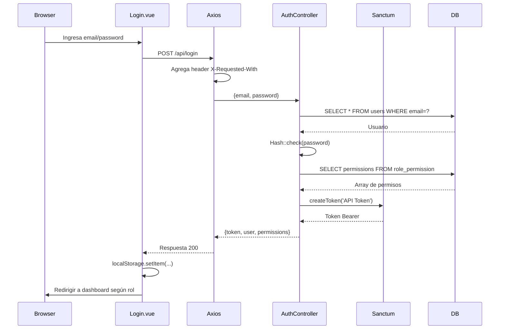
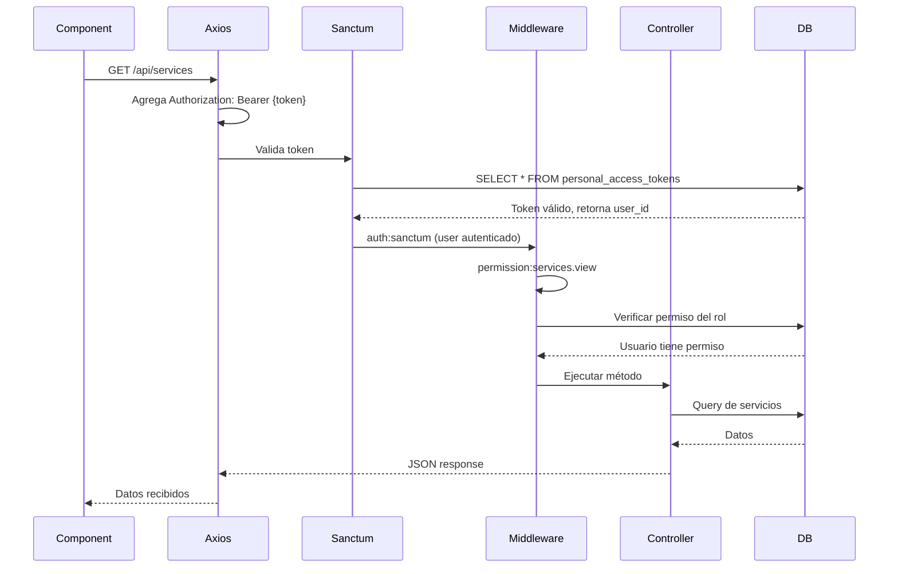

# 🔐 Autenticación y Autorización

[← Volver al índice](context.md)

---

## 📋 Descripción General

El sistema TAG Logística utiliza **Laravel Sanctum 3.3** para autenticación basada en tokens API. No maneja sesiones tradicionales, sino que cada petición HTTP incluye un token Bearer para identificar al usuario.

### Sistema de Autorización

La autorización se basa en:
- **7 roles** predefinidos
- **Permisos granulares** asignados a cada rol
- **Middleware de permisos** (`CheckPermission`)
- **Directivas Vue** para control UI
- **Composables** para lógica de permisos en frontend

---

## 🎭 Roles del Sistema

| ID | Rol | Descripción | Usuarios Típicos |
|----|-----|-------------|------------------|
| 1 | **Administrador** | Control total del sistema | Gerencia, TI |
| 2 | **Logística** | Gestiona servicios, clientes, operadores | Coordinadores |
| 3 | **Operaciones** | Visualiza servicios y asignaciones | Supervisores |
| 4 | **Chofer** | Actualiza estados de servicios asignados | Operadores en campo |
| 5 | **Documentación** | Gestiona documentos y evidencias | Personal administrativo |
| 6 | **Mantenimiento** | Gestiona mantenimientos e inventario | Mecánicos, almacén |
| 7 | **Tesorería** | Gestiona pagos y finanzas | Contadores, finanzas |

---

## 🔑 Permisos del Sistema

### Nomenclatura

Los permisos siguen el formato: `{módulo}.{acción}`

**Acciones comunes:**
- `view` - Ver listados
- `create` - Crear registros
- `edit` - Editar registros
- `delete` - Eliminar registros

### Listado de Permisos

#### Servicios
- `services.view` - Ver listado de servicios
- `services.create` - Crear nuevos servicios
- `services.edit` - Editar servicios
- `services.delete` - Eliminar servicios
- `services.assign` - Asignar operador y unidad

#### Clientes
- `clients.view` - Ver listado de clientes
- `clients.create` - Crear nuevos clientes
- `clients.edit` - Editar clientes
- `clients.delete` - Eliminar clientes

#### Unidades
- `units.view` - Ver listado de unidades
- `units.create` - Crear nuevas unidades
- `units.edit` - Editar unidades
- `units.delete` - Eliminar unidades

#### Operadores
- `operators.view` - Ver listado de operadores
- `operators.create` - Crear nuevos operadores
- `operators.edit` - Editar operadores
- `operators.delete` - Eliminar operadores
- `operators.payments.view` - Ver pagos semanales
- `operators.payments.create` - Registrar pagos

#### Usuarios
- `users.view` - Ver listado de usuarios
- `users.create` - Crear nuevos usuarios
- `users.edit` - Editar usuarios
- `users.delete` - Eliminar usuarios

#### Aprobaciones
- `approvals.view` - Ver listado de aprobaciones
- `approvals.approve` - Aprobar solicitudes
- `approvals.reject` - Rechazar solicitudes

#### Mantenimientos
- `maintenances.view` - Ver listado de mantenimientos
- `maintenances.create` - Crear mantenimientos
- `maintenances.edit` - Editar mantenimientos
- `maintenances.delete` - Eliminar mantenimientos

#### Inventario
- `inventory.view` - Ver inventario
- `inventory.create` - Crear items de inventario
- `inventory.edit` - Editar inventario
- `inventory.delete` - Eliminar items

#### Tesorería
- `treasury.services.view` - Ver servicios pendientes de pago
- `treasury.maintenances.view` - Ver mantenimientos pendientes
- `treasury.payments.view` - Ver listado de pagos
- `treasury.payments.create` - Aplicar pagos

#### Catálogos
- `places.view` - Ver lugares
- `places.create` - Crear lugares
- `places.edit` - Editar lugares
- `places.delete` - Eliminar lugares
- `booths.view` - Ver casetas
- `booths.create` - Crear casetas
- `booths.edit` - Editar casetas
- `booths.delete` - Eliminar casetas

#### Proveedores
- `suppliers.view` - Ver proveedores
- `suppliers.create` - Crear proveedores
- `suppliers.edit` - Editar proveedores
- `suppliers.delete` - Eliminar proveedores

---

## 🗄️ Modelos de Base de Datos

### Tabla `users`

| Campo | Tipo | Descripción |
|-------|------|-------------|
| id | bigint | PK |
| name | varchar(255) | Nombre del usuario |
| email | varchar(255) | Email único |
| password | varchar(255) | Hash de contraseña |
| role_id | bigint | FK a `roles` |
| picture | text | URL del avatar (nullable) |
| active | tinyint(1) | 1=activo, 0=inactivo |
| fcm_token | text | Token FCM para push (nullable) |
| zombie | tinyint(1) | 0=activo, 1=eliminado |
| created_at | timestamp | Fecha de creación |
| updated_at | timestamp | Fecha de actualización |

### Tabla `roles`

| Campo | Tipo | Descripción |
|-------|------|-------------|
| id | bigint | PK |
| name | varchar(255) | Nombre del rol |
| created_at | timestamp | Fecha de creación |
| updated_at | timestamp | Fecha de actualización |

### Tabla `permissions`

| Campo | Tipo | Descripción |
|-------|------|-------------|
| id | bigint | PK |
| name | varchar(255) | Nombre del permiso |
| created_at | timestamp | Fecha de creación |
| updated_at | timestamp | Fecha de actualización |

### Tabla `role_permission` (Pivot)

| Campo | Tipo | Descripción |
|-------|------|-------------|
| id | bigint | PK |
| role_id | bigint | FK a `roles` |
| permission_id | bigint | FK a `permissions` |
| created_at | timestamp | Fecha de creación |
| updated_at | timestamp | Fecha de actualización |

---

## 🔌 Endpoints de Autenticación

### POST `/api/register`

Registra un nuevo usuario en el sistema.

**Request:**
```json
{
  "name": "Juan Pérez",
  "email": "juan@example.com",
  "password": "password123",
  "role_id": 2
}
```

**Validaciones:**
- `name`: required, string
- `email`: required, string, email, unique:users
- `password`: required, string, min:6
- `role_id`: required, exists:roles,id

**Response 200:**
```json
{
  "token": "1|xxxxxxxxxxxxxxxxxxxxxxxxxxxxxxxxxxx"
}
```

### POST `/api/login`

Inicia sesión y retorna token de autenticación.

**Request:**
```json
{
  "email": "juan@example.com",
  "password": "password123"
}
```

**Validaciones:**
- `email`: required, email
- `password`: required

**Response 200:**
```json
{
  "token": "2|xxxxxxxxxxxxxxxxxxxxxxxxxxxxxxxxxxx",
  "user": {
    "id": 5,
    "name": "JUAN PÉREZ",
    "email": "juan@example.com",
    "role_id": 2,
    "picture": null,
    "active": 1,
    "role": {
      "id": 2,
      "name": "LOGÍSTICA"
    }
  },
  "permissions": [
    "services.view",
    "services.create",
    "services.edit",
    "clients.view",
    "operators.view"
  ]
}
```

**Response 401:**
```json
{
  "message": "Credenciales incorrectas"
}
```

### POST `/api/logout`

Cierra sesión del usuario actual (elimina todos sus tokens).

**Headers:**
```
Authorization: Bearer {token}
```

**Response 200:**
```json
{
  "message": "Cierre de sesión exitoso"
}
```

### GET `/api/roles`

Lista todos los roles (excepto ID 1 - Administrador).

**Headers:**
```
Authorization: Bearer {token}
```

**Response 200:**
```json
[
  {
    "id": 7,
    "name": "TESORERÍA",
    "created_at": "2024-01-15T10:30:00.000000Z",
    "updated_at": "2024-01-15T10:30:00.000000Z"
  },
  {
    "id": 6,
    "name": "MANTENIMIENTO",
    "created_at": "2024-01-15T10:30:00.000000Z",
    "updated_at": "2024-01-15T10:30:00.000000Z"
  }
]
```

### PUT `/api/password/{user_id}`

Cambia la contraseña de un usuario.

**Headers:**
```
Authorization: Bearer {token}
```

**Request:**
```json
{
  "password": "N3wP@ssw0rd!",
  "password_confirmation": "N3wP@ssw0rd!"
}
```

**Validaciones:**
- `password`: required, min:8, confirmed
- **Regex:** `^(?=.*[a-z])(?=.*[A-Z])(?=.*\d)(?=.*[$@$!%*?&])([A-Za-z\d$@$!%*?&]|[^ ]){8,15}$`
  - Al menos 1 minúscula
  - Al menos 1 mayúscula
  - Al menos 1 dígito
  - Al menos 1 carácter especial ($@$!%*?&)
  - 8-15 caracteres
  - Sin espacios

**Response 200:**
```json
null
```

### POST `/api/fcm_token/register`

Registra token FCM para notificaciones push (Android).

**Headers:**
```
Authorization: Bearer {token}
```

**Request:**
```json
{
  "user_id": 5,
  "fcm_token": "dXxxx...xxxxx"
}
```

**Validaciones:**
- `user_id`: required
- `fcm_token`: required

**Response 200:**
```json
null
```

---

## 🛡️ Middleware CheckPermission

### Ubicación

`app/Http/Middleware/CheckPermission.php`

### Uso

```php
Route::middleware(['auth:sanctum', 'permission:services.view'])
    ->get('/services', [ServiceController::class, 'index']);
    
Route::middleware(['auth:sanctum', 'permission:services.edit,services.delete'])
    ->put('/services/{id}', [ServiceController::class, 'update']);
```

### Lógica

1. Verifica que el usuario esté autenticado
2. Obtiene permisos del rol del usuario
3. Verifica si tiene **al menos uno** de los permisos especificados (OR)
4. Retorna 403 si no tiene permisos

**Código:**
```php
public function handle(Request $request, Closure $next, ...$permissions): Response
{
    $user = auth()->user();
    
    if (!$user) {
        return response()->json(['error' => 'Unauthorized'], 401);
    }
    
    // Verificar si el usuario tiene al menos uno de los permisos (OR)
    foreach ($permissions as $permission) {
        if ($user->hasPermission($permission)) {
            return $next($request);
        }
    }
    
    return response()->json(['error' => 'Forbidden - No tiene permisos para realizar esta acción'], 403);
}
```

---

## 🎨 Frontend: Control de Permisos

### Directiva Vue `v-permission`

**Ubicación:** `resources/js/directives/permission.js`

Oculta elementos del DOM si el usuario no tiene los permisos requeridos.

**Uso:**

```vue
<!-- Un solo permiso -->
<button v-permission="'services.create'">Crear Servicio</button>

<!-- Múltiples permisos (OR) -->
<button v-permission="['services.edit', 'services.delete']">Editar/Eliminar</button>
```

**Registro en `app.js`:**
```js
import permission from './directives/permission.js';

app.directive('permission', permission);
```

### Composable `usePermissions`

**Ubicación:** `resources/js/composables/usePermissions.js`

Proporciona funciones para verificar permisos en la lógica de componentes.

**Uso:**
```vue
<script setup>
import { usePermissions } from '@/composables/usePermissions';

const { hasPermission, hasAnyPermission, hasAllPermissions } = usePermissions();

// Verificar un permiso
if (hasPermission('services.create')) {
  // Mostrar botón de crear
}

// Verificar al menos uno (OR)
if (hasAnyPermission(['services.edit', 'services.delete'])) {
  // Mostrar opciones de edición/eliminación
}

// Verificar todos (AND)
if (hasAllPermissions(['services.view', 'services.create'])) {
  // Usuario puede ver y crear
}
</script>
```

### Almacenamiento Local

Al hacer login, se guardan en `localStorage`:

```js
localStorage.setItem('token', response.token);
localStorage.setItem('user_id', response.user.id);
localStorage.setItem('user_name', response.user.name);
localStorage.setItem('user_role', response.user.role.name);
localStorage.setItem('user_permissions', JSON.stringify(response.permissions));
localStorage.setItem('user_avatar', response.user.picture || '');
```

---

## 🔄 Flujo de Autenticación

### Diagrama



### Flujo de Petición Protegida



---

## 🧑‍💻 Modelos Eloquent

### User.php

```php
class User extends Authenticatable
{
    use HasApiTokens, HasFactory, Notifiable;
    use UppercaseAttributes;
    use HasMexicoTimezone;

    protected $fillable = [
        'name', 'email', 'password', 'role_id', 
        'picture', 'active', 'fcm_token', 'zombie'
    ];

    protected $hidden = ['password', 'remember_token'];

    // Relación con rol
    public function role()
    {
        return $this->belongsTo(Role::class)->with('permissions');
    }

    // Verifica si tiene un permiso específico
    public function hasPermission($permission)
    {
        if (!$this->role) {
            return false;
        }
        return $this->role->permissions()->where('name', $permission)->exists();
    }

    // Verifica si tiene al menos uno de los permisos (OR)
    public function hasAnyPermission(array $permissions)
    {
        if (!$this->role) {
            return false;
        }
        return $this->role->permissions()->whereIn('name', $permissions)->exists();
    }

    // Para notificaciones FCM
    public function routeNotificationForFcm()
    {
        return $this->fcm_token;
    }
}
```

### Role.php

```php
class Role extends Model
{
    use HasFactory;
    use UppercaseAttributes;
    use HasMexicoTimezone;

    protected $fillable = ['name'];

    // Relación muchos a muchos con permisos
    public function permissions()
    {
        return $this->belongsToMany(Permission::class, 'role_permission');
    }
}
```

### Permission.php

```php
class Permission extends Model
{
    use HasFactory;
    use UppercaseAttributes;
    use HasMexicoTimezone;

    protected $fillable = ['name'];

    // Relación muchos a muchos con roles
    public function roles()
    {
        return $this->belongsToMany(Role::class, 'role_permission');
    }
}
```

---

## 🚦 Guards de Rutas Frontend

**Ubicación:** `resources/js/router.js`

Cada ruta define los roles permitidos:

```js
{
  path: '/services',
  component: () => import('./pages/services.vue'),
  meta: { 
    requiresAuth: true,
    roles: ['ADMINISTRADOR', 'LOGÍSTICA', 'OPERACIONES'] 
  }
}
```

**Guardias globales:**

```js
router.beforeEach((to, from, next) => {
  const token = localStorage.getItem('token');
  const userRole = localStorage.getItem('user_role');

  // Verificar autenticación
  if (to.meta.requiresAuth && !token) {
    return next('/login');
  }

  // Verificar rol autorizado
  if (to.meta.roles && !to.meta.roles.includes(userRole)) {
    return next('/unauthorized');
  }

  next();
});
```

---

## 🔐 Configuración de Sanctum

**Archivo:** `config/sanctum.php`

```php
'stateful' => explode(',', env('SANCTUM_STATEFUL_DOMAINS', sprintf(
    '%s%s',
    'localhost,localhost:3000,127.0.0.1,127.0.0.1:8000,sistema.taglogistica.com',
    Sanctum::currentApplicationUrlWithPort()
))),

'expiration' => null, // Tokens no expiran
```

**Variables de entorno:**

```env
SANCTUM_STATEFUL_DOMAINS=localhost,localhost:3000,127.0.0.1,sistema.taglogistica.com
SESSION_DRIVER=cookie
SESSION_DOMAIN=.taglogistica.com
```

---

## 📝 Notas de Implementación

### Seguridad

1. **Contraseñas:** Hash con bcrypt (Laravel default)
2. **Tokens:** Sanctum genera tokens aleatorios de 40 caracteres
3. **HTTPS:** Producción usa HTTPS obligatorio
4. **CORS:** Configurado para permitir origen del frontend

### Soft Deletes

Los usuarios no se eliminan físicamente, se marca `zombie = 1`:

```php
User::where('id', $id)->update(['zombie' => 1]);
```

### UppercaseAttributes

Los nombres de usuarios se guardan automáticamente en mayúsculas:

```php
use UppercaseAttributes;
```

Transforma `Juan Pérez` → `JUAN PÉREZ`

### Permisos OR vs AND

El sistema actual usa **OR** (al menos uno):
- Middleware: Si tiene **cualquiera** de los permisos, pasa
- Frontend: Si tiene **cualquiera** de los permisos, se muestra

Para implementar **AND** (todos), usar `hasAllPermissions()` en frontend.

---

## 📊 Matriz de Permisos por Rol (Ejemplo)

| Permiso | Admin | Logística | Operaciones | Chofer | Documentación | Mantenimiento | Tesorería |
|---------|-------|-----------|-------------|--------|---------------|---------------|-----------|
| services.view | ✅ | ✅ | ✅ | ✅ | ✅ | ❌ | ✅ |
| services.create | ✅ | ✅ | ❌ | ❌ | ❌ | ❌ | ❌ |
| services.edit | ✅ | ✅ | ❌ | ❌ | ❌ | ❌ | ❌ |
| services.delete | ✅ | ✅ | ❌ | ❌ | ❌ | ❌ | ❌ |
| services.assign | ✅ | ✅ | ❌ | ❌ | ❌ | ❌ | ❌ |
| approvals.approve | ✅ | ❌ | ❌ | ❌ | ❌ | ❌ | ❌ |
| operators.payments.create | ✅ | ❌ | ❌ | ❌ | ❌ | ❌ | ✅ |
| maintenances.create | ✅ | ❌ | ❌ | ❌ | ❌ | ✅ | ❌ |
| treasury.payments.create | ✅ | ❌ | ❌ | ❌ | ❌ | ❌ | ✅ |
| users.create | ✅ | ❌ | ❌ | ❌ | ❌ | ❌ | ❌ |

**Nota:** Esta matriz es ilustrativa. Los permisos reales se definen en la tabla `role_permission`.

---

## 🔧 Comandos Útiles

```bash
# Ver todos los tokens activos
php artisan tinker
>>> \Laravel\Sanctum\PersonalAccessToken::all()

# Revocar todos los tokens de un usuario
$user = User::find(5);
$user->tokens()->delete();

# Ver permisos de un rol
$role = Role::with('permissions')->find(2);
$role->permissions->pluck('name');

# Asignar permiso a rol
$role = Role::find(2);
$permission = Permission::where('name', 'services.view')->first();
$role->permissions()->attach($permission->id);
```

---

**Última actualización:** Enero 23, 2026  
**Ver también:** [arquitectura.md](arquitectura.md) | [modulo-aprobaciones.md](modulo-aprobaciones.md) | [context.md](context.md)
