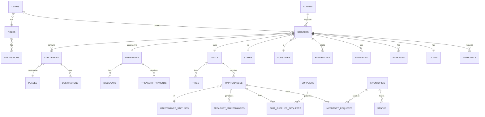

# 🗄️ Base de Datos

[← Volver al índice](context.md)

---

## 📋 Descripción General

El sistema TAG Logística utiliza **MySQL** como motor de base de datos. El esquema está compuesto por **48 tablas principales** organizadas en módulos funcionales.

### Características

- **Motor:** MySQL
- **Charset:** utf8mb4_unicode_ci
- **Timestamps:** Automáticos con `created_at` y `updated_at`
- **Soft Deletes:** Flag `zombie` (0=activo, 1=eliminado)
- **Foreign Keys:** Relaciones definidas entre tablas principales
- **Índices:** Optimizados para queries frecuentes

---

## 📊 Listado de Tablas

### Autenticación y Permisos (5 tablas)

| Tabla | Registros | Descripción |
|-------|-----------|-------------|
| users | ~15-30 | Usuarios del sistema |
| roles | 7 | Roles de usuario |
| permissions | ~50 | Permisos granulares |
| role_permission | ~200 | Pivot roles-permisos |
| password_resets | Variable | Tokens de reseteo de contraseña |

### Clientes (1 tabla)

| Tabla | Registros | Descripción |
|-------|-----------|-------------|
| clients | ~50-100 | Clientes de la empresa |

### Catálogos (3 tablas)

| Tabla | Registros | Descripción |
|-------|-----------|-------------|
| places | ~30-50 | Lugares de destino |
| booths | ~20-40 | Casetas de peaje |
| catalogs | ~100-200 | Catálogos dinámicos (terminales, contenedores, etc.) |

### Unidades (2 tablas)

| Tabla | Registros | Descripción |
|-------|-----------|-------------|
| units | ~20-40 | Tractocamiones, dollies, remolques |
| tires | ~200-400 | Llantas de las unidades |

### Operadores (2 tablas)

| Tabla | Registros | Descripción |
|-------|-----------|-------------|
| operators | ~30-50 | Choferes/operadores |
| discounts | Variable | Descuentos aplicados a operadores |

### Servicios (15 tablas)

| Tabla | Registros | Descripción |
|-------|-----------|-------------|
| services | ~1,000-5,000 | Servicios de transporte |
| service_operator_types | 7 | Catálogo de tipos de operador por tipo de operación |
| service_operator_type_substates | ~28 | Subestados habilitados por tipo de operador |
| service_operators | Variable | Operadores asignados por servicio |
| states | 6 | Estados principales (En Espera, Programado, etc.) |
| substates | ~20 | Subestados por tipo de operación |
| containers | ~2,000-10,000 | Contenedores por servicio |
| destinations | Variable | Destinos y casetas por contenedor |
| costs | ~1,000-5,000 | Costos de casetas por servicio |
| diesel | Variable | Diesel extra solicitado |
| diesel_cost | ~12 | Precios históricos del diesel |
| expenses | Variable | Gastos extras del servicio |
| evidences | Variable | Evidencias fotográficas |
| historicals | ~5,000-20,000 | Historial de cambios |
| substate_history | Variable | Historial de subestados |

### Mantenimientos (6 tablas)

| Tabla | Registros | Descripción |
|-------|-----------|-------------|
| maintenances | ~200-500 | Mantenimientos de unidades |
| maintenance_statuses | 4 | Estados de mantenimiento |
| type_maintenances | ~10 | Tipos de mantenimiento |
| inventories | ~50-100 | Inventario de refacciones |
| inventory_requests | Variable | Solicitudes de inventario |
| stocks | Variable | Movimientos de inventario |

### Proveedores (2 tablas)

| Tabla | Registros | Descripción |
|-------|-----------|-------------|
| suppliers | ~10-20 | Proveedores externos |
| part_supplier_requests | Variable | Solicitudes a proveedores |

### Tesorería (4 tablas)

| Tabla | Registros | Descripción |
|-------|-----------|-------------|
| treasury_services | Variable | Órdenes de pago de servicios |
| treasury_maintenances | Variable | Órdenes de pago de mantenimientos |
| treasury_payments | ~500-2,000 | Pagos semanales a operadores |
| payments | ~1,000-5,000 | Pagos individuales por servicio |

### Sistema (2 tablas)

| Tabla | Registros | Descripción |
|-------|-----------|-------------|
| approvals | Variable | Sistema de aprobaciones polimórfico |
| travel | Variable | Información adicional de viajes |

---

## 🔑 Relaciones Principales

### Diagrama ER Simplificado



---

## 📋 Tablas Detalladas

### users

**Descripción:** Usuarios del sistema con autenticación Sanctum

| Campo | Tipo | Constraints | Descripción |
|-------|------|-------------|-------------|
| id | bigint(20) | PK, AI | ID único |
| name | varchar(255) | NOT NULL | Nombre completo |
| email | varchar(255) | UNIQUE, NOT NULL | Email único |
| password | varchar(255) | NOT NULL | Hash de contraseña |
| role_id | bigint(20) | FK → roles.id | Rol del usuario |
| picture | text | NULL | URL avatar |
| active | tinyint(1) | DEFAULT 1 | 1=activo, 0=inactivo |
| fcm_token | text | NULL | Token FCM para push |
| zombie | tinyint(1) | DEFAULT 0 | Soft delete |
| created_at | timestamp | | Fecha de creación |
| updated_at | timestamp | | Fecha de actualización |

**Índices:**
- PRIMARY KEY (id)
- UNIQUE KEY (email)
- INDEX (role_id)

**Relaciones:**
- `role` → roles (belongsTo)
- `services` → services (hasMany, creador)
- `approvals_requested` → approvals (hasMany)

---

### roles

**Descripción:** Roles de usuario (7 roles fijos)

| Campo | Tipo | Constraints | Descripción |
|-------|------|-------------|-------------|
| id | bigint(20) | PK, AI | ID único |
| name | varchar(255) | NOT NULL | Nombre del rol |
| created_at | timestamp | | Fecha de creación |
| updated_at | timestamp | | Fecha de actualización |

**Roles del sistema:**
1. Administrador
2. Logística
3. Operaciones
4. Chofer
5. Documentación
6. Mantenimiento
7. Tesorería

**Relaciones:**
- `permissions` → permissions (belongsToMany via role_permission)
- `users` → users (hasMany)

---

### permissions

**Descripción:** Permisos granulares del sistema

| Campo | Tipo | Constraints | Descripción |
|-------|------|-------------|-------------|
| id | bigint(20) | PK, AI | ID único |
| name | varchar(255) | NOT NULL | Nombre del permiso (ej: services.view) |
| created_at | timestamp | | Fecha de creación |
| updated_at | timestamp | | Fecha de actualización |

**Relaciones:**
- `roles` → roles (belongsToMany via role_permission)

---

### role_permission

**Descripción:** Tabla pivot roles-permisos

| Campo | Tipo | Constraints | Descripción |
|-------|------|-------------|-------------|
| id | bigint(20) | PK, AI | ID único |
| role_id | bigint(20) | FK → roles.id | ID del rol |
| permission_id | bigint(20) | FK → permissions.id | ID del permiso |
| created_at | timestamp | | Fecha de creación |
| updated_at | timestamp | | Fecha de actualización |

---

### clients

**Descripción:** Clientes de la empresa

| Campo | Tipo | Constraints | Descripción |
|-------|------|-------------|-------------|
| id | bigint(20) | PK, AI | ID único |
| name | varchar(255) | NOT NULL | Razón social |
| company_type | int | NOT NULL | 1=Física, 2=Moral |
| RFC | varchar(15) | NOT NULL | RFC del cliente |
| zip | varchar(15) | NOT NULL | Código postal |
| contact_name | varchar(255) | NULL | Nombre de contacto |
| contact_phone | varchar(20) | NULL | Teléfono de contacto |
| contact_email | varchar(255) | NULL | Email de contacto |
| active | tinyint(1) | DEFAULT 1 | 1=activo, 0=inactivo |
| zombie | tinyint(1) | DEFAULT 0 | Soft delete |
| created_at | timestamp | | Fecha de creación |
| updated_at | timestamp | | Fecha de actualización |

**Relaciones:**
- `services` → services (hasMany)

---

### operators

**Descripción:** Choferes/operadores

| Campo | Tipo | Constraints | Descripción |
|-------|------|-------------|-------------|
| id | bigint(20) | PK, AI | ID único |
| name | varchar(255) | NOT NULL | Nombre completo |
| phone | varchar(20) | NULL | Teléfono |
| license | varchar(50) | NULL | Número de licencia |
| license_expiry | date | NULL | Vencimiento de licencia |
| active | tinyint(1) | DEFAULT 1 | 1=activo, 0=inactivo |
| zombie | tinyint(1) | DEFAULT 0 | Soft delete |
| created_at | timestamp | | Fecha de creación |
| updated_at | timestamp | | Fecha de actualización |

**Relaciones:**
- `services` → services (hasMany)
- `discounts` → discounts (hasMany)
- `payments` → treasury_payments (hasMany)

---

### units

**Descripción:** Unidades (tractocamiones, dollies, remolques)

| Campo | Tipo | Constraints | Descripción |
|-------|------|-------------|-------------|
| id | bigint(20) | PK, AI | ID único |
| econame | varchar(50) | NOT NULL | Nombre económico |
| plates | varchar(20) | NULL | Placas |
| brand | varchar(100) | NULL | Marca |
| model | varchar(100) | NULL | Modelo |
| year | int | NULL | Año |
| type | varchar(50) | NULL | Tipo (Tractocamión, Dolly, Remolque) |
| vin | varchar(100) | NULL | Número de serie |
| capacity | decimal(10,2) | NULL | Capacidad de carga |
| active | tinyint(1) | DEFAULT 1 | 1=activo, 0=inactivo |
| zombie | tinyint(1) | DEFAULT 0 | Soft delete |
| created_at | timestamp | | Fecha de creación |
| updated_at | timestamp | | Fecha de actualización |

**Relaciones:**
- `services` → services (hasMany)
- `tires` → tires (hasMany)
- `maintenances` → maintenances (hasMany)

---

### services

**Descripción:** Servicios de transporte (tabla principal)

| Campo | Tipo | Constraints | Descripción |
|-------|------|-------------|-------------|
| id | bigint(20) | PK, AI | ID único |
| folio | varchar(20) | NOT NULL | Folio TAG{AAMMDD}{###} |
| client_id | int | FK → clients.id | Cliente |
| type_operation | int | NOT NULL | 1=Import, 2=Export, 3=Suelta |
| terminal | varchar(100) | NOT NULL | Terminal marítima |
| type_unit | int | NULL | Tipo de unidad |
| dispatch_date | varchar(255) | NOT NULL | Fecha de despacho |
| delivery_date | varchar(255) | NOT NULL | Fecha de entrega |
| legacy | tinyint(1) | DEFAULT 1 | 1=usa columnas planas, 0=usa service_operators |
| diesel | varchar(255) | NULL | Litros de diesel |
| diesel_cost_id | int | DEFAULT 0 | FK → diesel_cost.id |
| IMO | int | DEFAULT 0 | 1=IMO, 0=No IMO |
| state_id | int | DEFAULT 1 | FK → states.id |
| substate_id | int | DEFAULT 0 | FK → substates.id |
| order_paid | int | DEFAULT 0 | 0=pendiente, 1=pagado |
| commission | decimal(10,2) | NULL | Comisión del operador |
| zombie | tinyint(1) | DEFAULT 0 | Soft delete |
| created_at | timestamp | useCurrent | Fecha de creación |
| updated_at | timestamp | useCurrent | Fecha de actualización |

**Nota legacy:** Las columnas `operator_id`, `unit_id`, `aux_operator_id`, `aux_unit_id`, `aux2_operator_id`, `aux2_unit_id` existen para compatibilidad con registros históricos (`legacy=1`). Los servicios nuevos o actualizados usan `service_operators`.

**Índices:**
- PRIMARY KEY (id)
- INDEX (client_id)
- INDEX (state_id)
- INDEX (folio)
- INDEX (legacy)

**Relaciones:**
- `client` → clients (belongsTo)
- `serviceOperators` → service_operators (hasMany)
- `state` → states (belongsTo)
- `substate` → substates (belongsTo)
- `containers` → containers (hasMany)
- `cost` → costs (hasOne)
- `expenses` → expenses (hasMany)
- `evidences` → evidences (hasMany)
- `historicals` → historicals (hasMany)
- `approvals` → approvals (morphMany)

---

### service_operator_types

**Descripción:** Catálogo de tipos de participación de operador en un servicio

| Campo | Tipo | Constraints | Descripción |
|-------|------|-------------|-------------|
| id | bigint(20) | PK, AI | ID único |
| name | varchar(100) | NOT NULL | Nombre visible del rol |
| code | varchar(50) | NOT NULL | Código estable (MAIN, AUX_PATIO, etc.) |
| type_operation | tinyint | NOT NULL | Tipo de operación (1, 2 o 3) |
| is_main | tinyint | DEFAULT 0 | 1=operador principal (nómina), 0=auxiliar |
| zombie | tinyint(1) | DEFAULT 0 | Soft delete |
| created_at | timestamp | | Fecha de creación |
| updated_at | timestamp | | Fecha de actualización |

---

### service_operator_type_substates

**Descripción:** Define en qué subestados cada tipo de operador es el operador activo

| Campo | Tipo | Constraints | Descripción |
|-------|------|-------------|-------------|
| id | bigint(20) | PK, AI | ID único |
| service_operator_type_id | bigint(20) | FK → service_operator_types.id | Tipo de operador |
| substate_id | int | NOT NULL | Subestado en que este tipo es activo |
| created_at | timestamp | | Fecha de creación |
| updated_at | timestamp | | Fecha de actualización |

**Índices:**
- UNIQUE (service_operator_type_id, substate_id)

---

### service_operators

**Descripción:** Asignación de operadores a servicios con su rol y unidad

| Campo | Tipo | Constraints | Descripción |
|-------|------|-------------|-------------|
| id | bigint(20) | PK, AI | ID único |
| service_id | bigint(20) | FK → services.id | Servicio |
| operator_id | bigint(20) | FK → users.id | Chofer asignado |
| unit_id | bigint(20) | FK → units.id | Unidad asignada |
| service_operator_type_id | bigint(20) | FK → service_operator_types.id | Tipo de rol |
| amount_bonus | decimal(10,2) | DEFAULT 0 | Monto adicional para auxiliares (uso futuro) |
| zombie | tinyint(1) | DEFAULT 0 | Soft delete |
| created_at | timestamp | | Fecha de creación |
| updated_at | timestamp | | Fecha de actualización |

**Índices:**
- PRIMARY KEY (id)
- UNIQUE (service_id, service_operator_type_id)
- INDEX (service_id)
- INDEX (operator_id)

---

### containers

**Descripción:** Contenedores asociados a servicios

| Campo | Tipo | Constraints | Descripción |
|-------|------|-------------|-------------|
| id | bigint(20) | PK, AI | ID único |
| service_id | bigint(20) | FK → services.id | Servicio |
| order_number | varchar(255) | NULL | Número de orden |
| container_number | varchar(255) | NULL | Número de contenedor |
| container_type | varchar(255) | NULL | Tipo (20 STD, 40 HC, etc.) |
| place_id | bigint(20) | FK → places.id | Lugar de destino |
| address | text | NULL | Dirección de entrega |
| zombie | tinyint(1) | DEFAULT 0 | Soft delete |
| created_at | timestamp | | Fecha de creación |
| updated_at | timestamp | | Fecha de actualización |

**Relaciones:**
- `service` → services (belongsTo)
- `place` → places (belongsTo)
- `destinations` → destinations (hasMany)

---

### approvals

**Descripción:** Sistema de aprobaciones polimórfico

| Campo | Tipo | Constraints | Descripción |
|-------|------|-------------|-------------|
| id | int | PK | ID único |
| approvable_type | varchar(255) | NOT NULL | Tipo (Service, Maintenance) |
| approvable_id | bigint(20) | NOT NULL | ID del modelo |
| kind | varchar(64) | NOT NULL | Tipo de aprobación |
| scope_id | bigint(20) | NULL | ID de alcance |
| status | varchar(20) | DEFAULT 'pending' | pending/approved/rejected |
| requested_by | bigint(20) | FK → users.id | Quien solicita |
| reviewed_by | bigint(20) | FK → users.id | Quien revisa |
| reviewed_at | timestamp | NULL | Fecha de revisión |
| review_comment | text | NULL | Comentario |
| snapshot | json | NULL | Snapshot de datos |
| metadata | json | NULL | Metadata adicional |
| is_open | tinyint(1) | VIRTUAL | 1 si status='pending' |
| created_at | timestamp | | Fecha de creación |
| updated_at | timestamp | | Fecha de actualización |

**Índices:**
- PRIMARY KEY (id)
- INDEX (status)
- INDEX (approvable_type, approvable_id)
- INDEX (kind)
- UNIQUE (approvable_type, approvable_id, kind, scope_id, is_open)

**Columna Virtual:**
```sql
is_open = CASE WHEN status = 'pending' THEN 1 ELSE NULL END
```

Esto garantiza que solo puede haber UNA aprobación pendiente por tipo.

**Tipos de aprobación:**
- `initial_diesel_required` - Diesel inicial de servicio
- `initial_expenses` - Gastos iniciales de servicio
- `extra_diesel` - Diesel extra durante viaje
- `extra_expenses` - Gastos extras durante viaje
- `extra_booth` - Caseta extra durante viaje
- `maintenance_expenses` - Gastos de mantenimiento

---

### maintenances

**Descripción:** Mantenimientos de unidades

| Campo | Tipo | Constraints | Descripción |
|-------|------|-------------|-------------|
| id | bigint(20) | PK, AI | ID único |
| folio | varchar(255) | NOT NULL | Folio MTT{YmdHis} |
| unit_id | bigint(20) | FK → units.id | Unidad |
| type_maintenance_id | bigint(20) | FK → type_maintenances.id | Tipo |
| description | text | NOT NULL | Descripción |
| kms | int | NOT NULL | Kilometraje |
| init_date | date | NOT NULL | Fecha de inicio |
| maintenance_status_id | bigint(20) | FK → maintenance_statuses.id | Estado |
| zombie | tinyint(1) | DEFAULT 0 | Soft delete |
| created_at | timestamp | | Fecha de creación |
| updated_at | timestamp | | Fecha de actualización |

**Relaciones:**
- `unit` → units (belongsTo)
- `type_maintenance` → type_maintenances (belongsTo)
- `status` → maintenance_statuses (belongsTo)
- `inventoryRequests` → inventory_requests (hasMany)
- `partsSupplierRequests` → part_supplier_requests (hasMany)
- `approvals` → approvals (morphMany)

---

### treasury_payments

**Descripción:** Pagos semanales a operadores

| Campo | Tipo | Constraints | Descripción |
|-------|------|-------------|-------------|
| id | bigint(20) | PK, AI | ID único |
| folio | varchar(255) | NOT NULL | Folio PAY{YmdHis} |
| operator_id | bigint(20) | FK → operators.id | Operador |
| user_id | bigint(20) | FK → users.id | Usuario que registra |
| start_date | date | NOT NULL | Inicio de semana (jueves) |
| end_date | date | NOT NULL | Fin de semana (miércoles) |
| total_services | int | DEFAULT 0 | Cantidad de servicios |
| gross_amount | decimal(10,2) | DEFAULT 0 | Monto bruto |
| total_discounts | decimal(10,2) | DEFAULT 0 | Total descuentos |
| net_amount | decimal(10,2) | DEFAULT 0 | Monto neto |
| payment_date | date | NULL | Fecha de pago |
| payment_method | varchar(50) | NULL | Método de pago |
| notes | text | NULL | Notas |
| created_at | timestamp | | Fecha de creación |
| updated_at | timestamp | | Fecha de actualización |

**Relaciones:**
- `operator` → operators (belongsTo)
- `user` → users (belongsTo)
- `services` → services (hasMany through payments)

---

## 🔧 Convenciones de la Base de Datos

### Nomenclatura

- **Tablas:** Minúsculas, plural, snake_case (`services`, `inventory_requests`)
- **Columnas:** Minúsculas, snake_case (`client_id`, `dispatch_date`)
- **Primary Keys:** `id` (bigint unsigned, auto-increment)
- **Foreign Keys:** `{tabla_singular}_id` (`client_id`, `operator_id`)
- **Timestamps:** `created_at`, `updated_at`
- **Soft Delete:** `zombie` (0=activo, 1=eliminado)

### Tipos de Datos

- **IDs:** `bigint(20)` unsigned
- **Strings cortos:** `varchar(255)`
- **Strings largos:** `text`
- **Números:** `int`, `decimal(10,2)`
- **Fechas:** `date`, `datetime`, `timestamp`
- **Booleanos:** `tinyint(1)` (0/1)
- **JSON:** `json`

### Valores por Defecto

- **zombie:** `0` (activo)
- **active:** `1` (activo)
- **order_paid:** `0` (no pagado)
- **state_id:** `1` (En Espera)
- **substate_id:** `0` (Sin asignar)

---

## 📊 Índices y Optimizaciones

### Índices Principales

**services:**
```sql
INDEX idx_client (client_id)
INDEX idx_operator (operator_id)
INDEX idx_state (state_id)
INDEX idx_folio (folio)
INDEX idx_zombie (zombie)
```

**approvals:**
```sql
INDEX idx_approvals_status (status)
INDEX idx_approvals_morph (approvable_type, approvable_id)
INDEX idx_approvals_kind (kind)
UNIQUE uniq_approvals_open (approvable_type, approvable_id, kind, scope_id, is_open)
```

**users:**
```sql
UNIQUE idx_email (email)
INDEX idx_role (role_id)
```

---

## 🔐 Foreign Keys

### Principales Relaciones

```sql
-- services
FK services.client_id → clients.id
FK services.operator_id → operators.id
FK services.unit_id → units.id
FK services.state_id → states.id

-- containers
FK containers.service_id → services.id
FK containers.place_id → places.id

-- approvals
FK approvals.requested_by → users.id
FK approvals.reviewed_by → users.id

-- maintenances
FK maintenances.unit_id → units.id
FK maintenances.type_maintenance_id → type_maintenances.id

-- treasury_payments
FK treasury_payments.operator_id → operators.id
FK treasury_payments.user_id → users.id
```

---

## 📝 Migraciones

### Total de Migraciones: 45

**Orden de ejecución:**
1. Tablas base (users, roles, permissions)
2. Catálogos (clients, places, booths)
3. Unidades y operadores
4. Servicios y relaciones
5. Mantenimientos
6. Tesorería
7. Sistema de aprobaciones

### Ejecutar Migraciones

```bash
# Ejecutar todas las migraciones
php artisan migrate

# Rollback última migración
php artisan migrate:rollback

# Rollback todas las migraciones
php artisan migrate:reset

# Refrescar base de datos
php artisan migrate:fresh

# Ver estado
php artisan migrate:status
```

---

## 🔄 Triggers y Eventos

### Columna Virtual en approvals

```sql
ALTER TABLE approvals 
ADD COLUMN is_open TINYINT(1) 
GENERATED ALWAYS AS (CASE WHEN status = 'pending' THEN 1 ELSE NULL END) 
VIRTUAL;

CREATE UNIQUE INDEX uniq_approvals_open 
ON approvals (approvable_type, approvable_id, kind, scope_id, is_open);
```

**Propósito:** Garantizar que solo exista UNA aprobación pendiente por tipo y alcance.

---

## 💾 Respaldos

### Estrategia Recomendada

1. **Backup diario completo** de la base de datos
2. **Backup incremental** cada 6 horas
3. **Retención:** 30 días mínimo
4. **Almacenamiento:** Fuera del servidor (S3, Google Cloud)

### Comando de Backup

```bash
# Backup completo
mysqldump -u usuario -p tag_logistica > backup_$(date +%Y%m%d_%H%M%S).sql

# Backup comprimido
mysqldump -u usuario -p tag_logistica | gzip > backup_$(date +%Y%m%d_%H%M%S).sql.gz

# Restaurar
mysql -u usuario -p tag_logistica < backup.sql
```

---

## 📊 Estadísticas Estimadas

| Tabla | Registros Actuales | Crecimiento Mensual | Tamaño Estimado |
|-------|-------------------|---------------------|-----------------|
| services | 1,000-5,000 | ~500 | 50-200 MB |
| containers | 2,000-10,000 | ~1,000 | 20-100 MB |
| historicals | 5,000-20,000 | ~2,000 | 10-50 MB |
| evidences | Variable | Variable | 1-10 GB (archivos) |
| approvals | 500-2,000 | ~100 | 5-20 MB |
| treasury_payments | 500-2,000 | ~50 | 5-20 MB |
| maintenances | 200-500 | ~30 | 5-10 MB |

**Total Base de Datos:** ~100-500 MB (sin archivos)  
**Total con Archivos:** ~2-15 GB

---

## 🔍 Queries Comunes

### Servicios del día

```sql
SELECT s.*, c.name as client_name, o.name as operator_name
FROM services s
LEFT JOIN clients c ON s.client_id = c.id
LEFT JOIN operators o ON s.operator_id = o.id
WHERE s.zombie = 0
  AND DATE(s.dispatch_date) = CURDATE()
ORDER BY s.id DESC;
```

### Aprobaciones pendientes

```sql
SELECT a.*, u.name as requester
FROM approvals a
LEFT JOIN users u ON a.requested_by = u.id
WHERE a.status = 'pending'
ORDER BY a.created_at ASC;
```

### Pagos de la semana

```sql
SELECT op.name, COUNT(s.id) as total_services, SUM(s.commission) as total_commission
FROM services s
JOIN operators op ON s.operator_id = op.id
WHERE s.state_id = 5
  AND s.order_paid = 0
  AND s.dispatch_date BETWEEN :start_date AND :end_date
GROUP BY op.id
ORDER BY op.name;
```

---

## 📝 Notas de Implementación

### Soft Deletes

El sistema NO usa el trait `SoftDeletes` de Laravel. En su lugar usa el flag `zombie`:

```php
// Eliminar
Model::find($id)->update(['zombie' => 1]);

// Filtrar activos
Model::where('zombie', 0)->get();
```

### Timestamps Automáticos

Laravel maneja automáticamente `created_at` y `updated_at`.

### Uppercase Attributes

El trait `UppercaseAttributes` convierte automáticamente campos de texto a mayúsculas en modelos específicos (Client, Operator, Service, etc.).

### Zona Horaria

El sistema usa `America/Mexico_City` mediante el trait `HasMexicoTimezone`.

---

## ⚠️ Consideraciones Importantes

### Integridad Referencial

- Las foreign keys NO están definidas a nivel de base de datos en todas las tablas
- La integridad se maneja a nivel de aplicación (Laravel)
- **Recomendación:** Agregar FKs para mayor integridad

### Performance

- **Índices:** Optimizados para queries frecuentes
- **N+1 Queries:** Usar `with()` para eager loading
- **Cacheo:** Implementar Redis para catálogos estáticos

### Seguridad

- **Contraseñas:** Hasheadas con bcrypt
- **Tokens:** Sanctum genera tokens de 40 caracteres
- **Permisos:** Verificados en middleware y controladores

---

**Última actualización:** Enero 23, 2026  
**Ver también:** [arquitectura.md](arquitectura.md) | [context.md](context.md)
