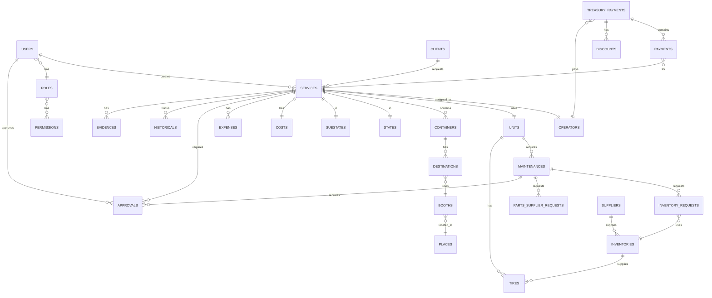
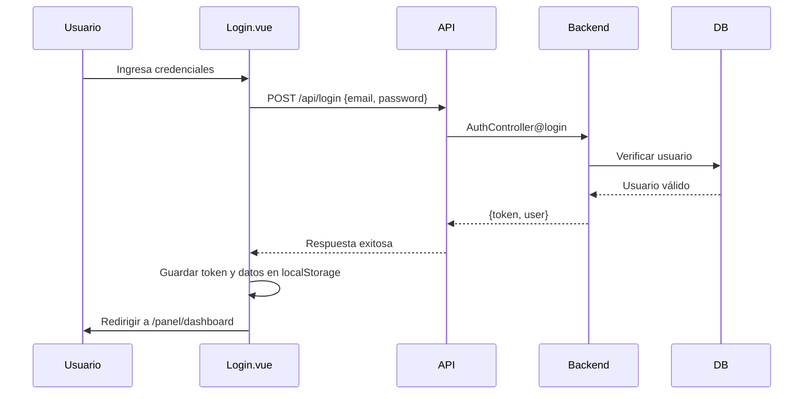
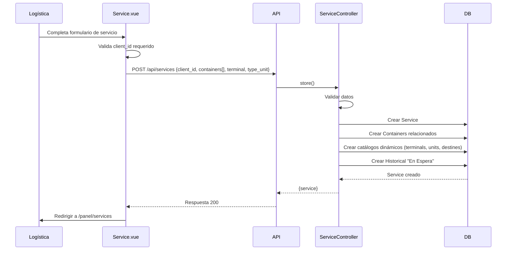
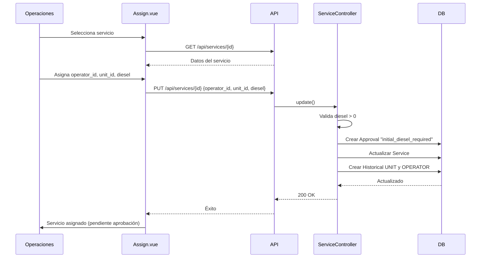
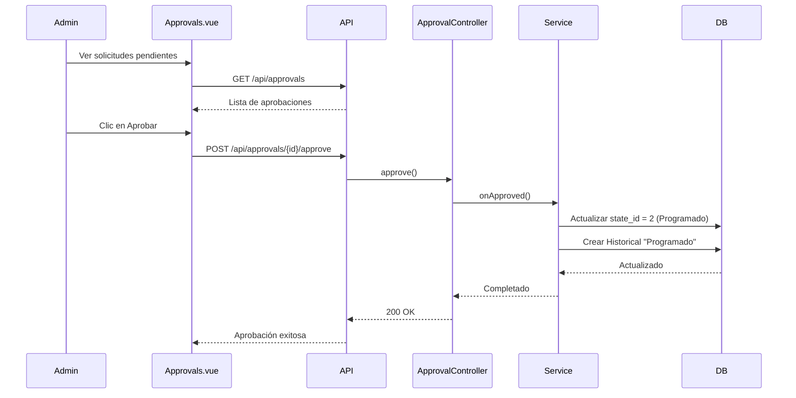
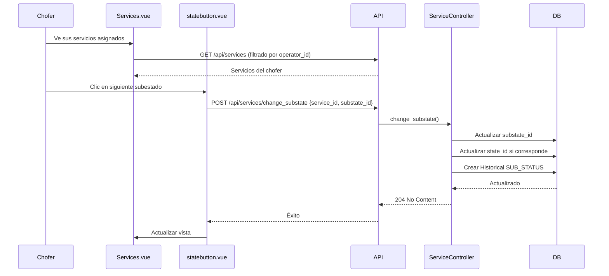
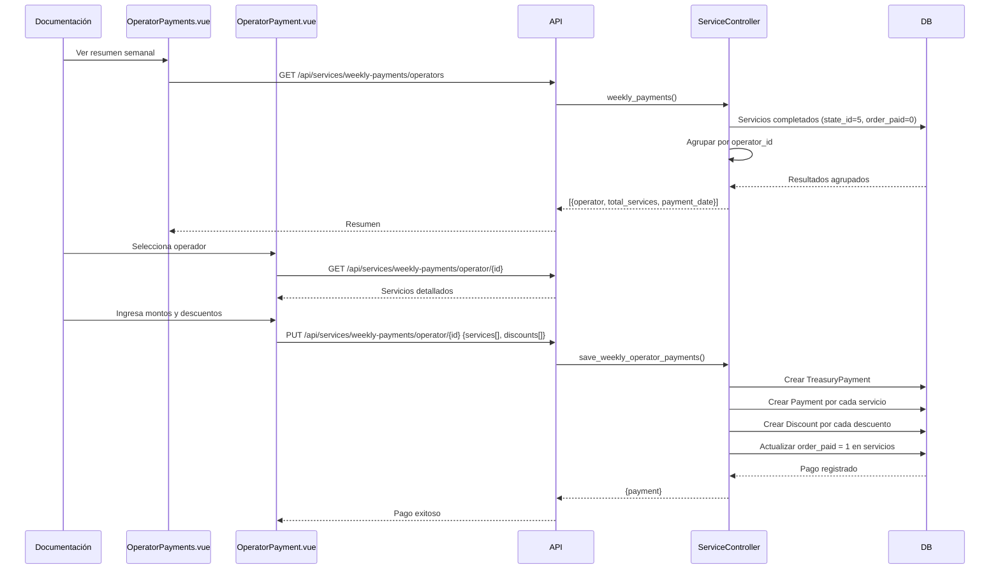

# 📦 Documentación TAG Logística - Sistema de Gestión de Viajes

## 🎯 Resumen del Proyecto

**Nombre:** TAG Logística  
**Stack Tecnológico:** Laravel 9 + Vue 3 + Vite + Tailwind CSS  
**Base de Datos:** MySQL  
**Autenticación:** Laravel Sanctum  
**Propósito:** Sistema de gestión integral de servicios logísticos, operadores, unidades, mantenimientos, inventarios y tesorería.

---

## 🏗️ Arquitectura del Proyecto

### Backend (Laravel 9)
- **Framework:** Laravel 9.19
- **PHP:** >= 8.0.2
- **Autenticación:** Laravel Sanctum 3.3 (API tokens)
- **Paquetes principales:**
  - `guzzlehttp/guzzle` ^7.2 - Cliente HTTP
  - `google/auth` ^1.48 - Autenticación Google
  - `laravel/tinker` ^2.7 - CLI REPL
  - `laravel-lang/lang` ^12.17 - Traducciones

### Frontend (Vue 3)
- **Framework:** Vue 3.2.25
- **Router:** Vue Router 4.5.0
- **Build Tool:** Vite 3.2.11
- **HTTP Client:** Axios 1.8.3
- **Estilos:** Tailwind CSS 3.3.3
- **Componentes UI:**
  - `sweetalert2` ^11.17.2 - Diálogos y alertas
  - `@vuepic/vue-datepicker` ^3.6.8 - Selector de fechas
  - `simple-vue-camera` ^1.1.3 - Captura de imágenes
  - `xlsx` ^0.18.5 - Exportación a Excel
  - `file-saver` ^2.0.5 - Descarga de archivos
  - `chart.js` ^4.5.1 + `vue-chart-3` ^3.1.8 - Gráficos
  - `jspdf` ^2.5.2 + `html2canvas` ^1.4.1 - Generación de PDFs
  - `vue3-html2pdf` ^1.1.2 - Conversión HTML a PDF
  - `sass` ^1.93.2 - Preprocesador CSS

### Base de Datos
- **Motor:** MySQL
- **Migraciones:** 12 tablas principales
- **Modelos:** 35 modelos Eloquent

---

## 📊 Estructura de la Base de Datos

### Tablas Principales

| Tabla | Descripción | Campos Clave |
|-------|-------------|--------------|
| `users` | Usuarios del sistema | id, name, email, password, role_id, fcm_token, active, zombie |
| `roles` | Roles de usuario | id, name |
| `permissions` | Permisos del sistema | id, name |
| `role_permission` | Relación roles-permisos | role_id, permission_id |
| `clients` | Clientes | id, name, company_type, RFC, zip, active, zombie |
| `suppliers` | Proveedores | id, name, contact_info, zombie |
| `operators` | Operadores/Choferes | id, name, license_info, zombie |
| `units` | Unidades de transporte | id, econame, brand, model, type, TAG, active, zombie |
| `services` | Servicios/Viajes | id, folio, client_id, operator_id, unit_id, state_id, substate_id, type_operation, diesel, delivery_date, order_paid, zombie |
| `containers` | Contenedores de servicios | id, service_id, container_type, container_number, reference, place_id, zombie |
| `destinations` | Destinos de contenedores | id, container_id, booth_id |
| `maintenances` | Mantenimientos | id, unit_id, type_maintenance_id, description, kms, init_date, maintenance_state_id, zombie |
| `maintenance_statuses` | Estados de mantenimiento | id, name |
| `type_maintenances` | Tipos de mantenimiento | id, name |
| `inventories` | Inventario de refacciones | id, name, presentation, brand, quantity, zombie |
| `inventory_requests` | Solicitudes de inventario | id, maintenance_id, inventory_id, quantity |
| `parts_supplier_requests` | Solicitudes a proveedores | id, maintenance_id, description, cost |
| `tires` | Llantas de unidades | id, unit_id, inventory_id, serial, position, date, zombie |
| `travel` | Viajes adicionales | id, unit_id, operator, date |
| `costs` | Costos de servicios | id, service_id, waybill, booth_costs, travel_cost |
| `expenses` | Gastos de servicios | id, service_id, type, concept, cost |
| `approvals` | Aprobaciones del sistema | id, approvable_type, approvable_id, kind, status, user_id, scope_id, snapshot, metadata |
| `historicals` | Historial de cambios | id, service_id, type, description |
| `states` | Estados de servicios | id, name |
| `substates` | Subestados de servicios | id, name, state_id |
| `booths` | Casetas | id, name, cost, place_id |
| `places` | Lugares | id, name |
| `treasury_services` | Órdenes de servicio tesorería | id, service_id, user_id, order_date, total, type_payment, paid |
| `treasury_maintenances` | Órdenes de mantenimiento tesorería | id, maintenance_id, user_id, order_date, total, description, paid |
| `treasury_payments` | Pagos de nómina | id, folio, user_id, operator_id, order_date, total |
| `payments` | Detalle de pagos por servicio | id, treasury_payment_id, service_id, total |
| `discounts` | Descuentos de pagos | id, treasury_payment_id, title, total |
| `evidences` | Evidencias fotográficas | id, service_id, path |
| `diesels` | Solicitudes de diesel | id, service_id, amount, type |
| `catalogs` | Catálogos dinámicos | id, type, value |
| `personal_access_tokens` | Tokens de Sanctum | tokenable_id, token, abilities |

### Relaciones Principales



---

## 🔐 Sistema de Autenticación y Autorización

### Roles del Sistema

1. **Administrador** - Acceso completo
2. **Logística** - Gestión de clientes y servicios
3. **Operaciones** - Asignación y seguimiento de viajes
4. **Chofer** - Vista de servicios asignados y actualización de estados
5. **Documentación** - Gestión de costos, gastos y lugares
6. **Mantenimiento** - Gestión de unidades, mantenimientos e inventarios
7. **Tesorería** - Gestión de pagos y finanzas

### Middleware
- **`auth:sanctum`** - Protege todas las rutas API excepto login y register

---

## 🛣️ API Endpoints (Backend)

### 🔓 Endpoints Públicos

| Método | Ruta | Controlador | Acción | Request | Respuesta |
|--------|------|-------------|---------|---------|-----------|
| POST | `/api/register` | AuthController@register | Registro de usuario | name, email, password, role_id | { token } |
| POST | `/api/login` | AuthController@login | Inicio de sesión | email, password | { token, user } |
| POST | `/api/fcm_token/register` | AuthController@fcm_token_register | Registrar token FCM | user_id, fcm_token | 200 OK |

### 🔒 Endpoints Protegidos (auth:sanctum)

#### Autenticación y Usuarios

| Método | Ruta | Controlador | Acción | Roles Permitidos |
|--------|------|-------------|---------|------------------|
| PUT | `/api/password/{user_id}` | AuthController@password | Cambiar contraseña | Administrador |
| GET | `/api/roles` | AuthController@roles | Listar roles | Todos |
| GET | `/api/users` | UserController@index | Listar usuarios | Administrador |
| POST | `/api/users` | UserController@store | Crear usuario | Administrador |
| GET | `/api/users/{id}` | UserController@show | Ver usuario | Administrador |
| PUT | `/api/users/{id}` | UserController@update | Actualizar usuario | Administrador |
| DELETE | `/api/users/{id}` | UserController@destroy | Eliminar usuario (soft) | Administrador |

#### Catálogos

| Método | Ruta | Controlador | Acción | Descripción |
|--------|------|-------------|---------|-------------|
| GET | `/api/catalog/units` | CatalogController@units | Listar tipos de unidades | Catálogo dinámico |
| GET | `/api/catalog/containers` | CatalogController@containers | Listar tipos de contenedores | Catálogo dinámico |
| GET | `/api/catalog/terminals` | CatalogController@terminals | Listar terminales | Catálogo dinámico |
| GET | `/api/catalog/destines` | CatalogController@destines | Listar destinos | Catálogo dinámico |
| GET | `/api/catalog/container-numbers` | CatalogController@container_numbers | Listar números de contenedor | Catálogo dinámico |

#### Clientes

| Método | Ruta | Controlador | Validaciones | Roles |
|--------|------|-------------|--------------|-------|
| GET | `/api/clients` | ClientController@index | - | Administrador, Logística |
| POST | `/api/clients` | ClientController@store | name, company_type, RFC, zip | Administrador, Logística |
| GET | `/api/clients/{id}` | ClientController@show | - | Administrador, Logística |
| PUT | `/api/clients/{id}` | ClientController@update | name, company_type, RFC, zip | Administrador, Logística |
| DELETE | `/api/clients/{id}` | ClientController@destroy | - | Administrador, Logística |

#### Proveedores

| Método | Ruta | Controlador | Roles |
|--------|------|-------------|-------|
| GET | `/api/suppliers` | SupplierController@index | Administrador |
| POST | `/api/suppliers` | SupplierController@store | Administrador |
| GET | `/api/suppliers/{id}` | SupplierController@show | Administrador |
| PUT | `/api/suppliers/{id}` | SupplierController@update | Administrador |
| DELETE | `/api/suppliers/{id}` | SupplierController@destroy | Administrador |

#### Unidades

| Método | Ruta | Controlador | Roles |
|--------|------|-------------|-------|
| GET | `/api/units` | UnitController@index | Administrador, Mantenimiento |
| POST | `/api/units` | UnitController@store | Administrador, Mantenimiento |
| GET | `/api/units/{id}` | UnitController@show | Administrador, Mantenimiento |
| PUT | `/api/units/{id}` | UnitController@update | Administrador, Mantenimiento |
| DELETE | `/api/units/{id}` | UnitController@destroy | Administrador, Mantenimiento |

#### Lugares y Casetas

| Método | Ruta | Controlador | Roles |
|--------|------|-------------|-------|
| GET/POST/PUT/DELETE | `/api/places` | PlaceController | Administrador, Documentación |
| GET/POST/PUT/DELETE | `/api/booths` | BoothController | Administrador, Documentación |

#### Operadores

| Método | Ruta | Controlador | Descripción | Roles |
|--------|------|-------------|-------------|-------|
| GET | `/api/operators` | OperatorController@index | Listar operadores | Administrador |
| POST | `/api/operators` | OperatorController@store | Crear operador | Administrador |
| GET | `/api/operators/{id}` | OperatorController@show | Ver operador | Administrador |
| PUT | `/api/operators/{id}` | OperatorController@update | Actualizar operador | Administrador |
| DELETE | `/api/operators/{id}` | OperatorController@destroy | Eliminar operador | Administrador |
| GET | `/api/operator/{id}/payments` | OperatorController@payments | Pagos del operador | Administrador |

#### Servicios/Viajes (MÓDULO PRINCIPAL)

| Método | Ruta | Controlador | Descripción | Roles |
|--------|------|-------------|-------------|-------|
| GET | `/api/services` | ServiceController@index | Listar servicios (filtrado por rol y estado) | Todos autenticados |
| POST | `/api/services` | ServiceController@store | Crear servicio | Administrador, Logística |
| GET | `/api/services/{id}` | ServiceController@show | Ver detalle del servicio | Todos autenticados |
| PUT | `/api/services/{id}` | ServiceController@update | Actualizar servicio | Administrador, Logística, Operaciones |
| DELETE | `/api/services/{id}` | ServiceController@destroy | Eliminar servicio (soft delete) | Administrador, Logística |
| POST | `/api/services/cancel/{id}` | ServiceController@cancel | Cancelar servicio | Operaciones |
| POST | `/api/services/reassign/{id}` | ServiceController@reassign | Reasignar operador/unidad | Operaciones |
| GET | `/api/services/historical/{id}` | ServiceController@historical | Historial del servicio | Operaciones, Administrador |
| POST | `/api/services/request_diesel/{id}` | ServiceController@request_diesel | Solicitar diesel extra | Operaciones |
|| POST | `/api/services/request_booth/{id}` | ServiceController@request_booth | Solicitar caseta extra | Documentación, Operador |
| POST | `/api/services/change_substate` | ServiceController@change_substate | Cambiar subestado | Chofer, Operaciones |
| GET | `/api/services/weekly-payments/operators` | ServiceController@weekly_payments | Resumen de pagos semanales | Documentación |
| GET | `/api/services/weekly-payments/operator/{id}` | ServiceController@weekly_operator_payments | Detalle de pagos del operador | Documentación |
| PUT | `/api/services/weekly-payments/operator/{id}` | ServiceController@save_weekly_operator_payments | Guardar pagos semanales | Documentación |
| GET | `/api/download/services` | ServiceController@download | Descargar servicios (Excel) | Todos autenticados |

#### Viajes

| Método | Ruta | Controlador | Validaciones |
|--------|------|-------------|--------------|
| GET/POST/PUT/DELETE | `/api/travels` | TravelController | unit_id, operator |

#### Inventarios

| Método | Ruta | Controlador | Roles |
|--------|------|-------------|-------|

#### Llantas

| Método | Ruta | Controlador | Roles |
|--------|------|-------------|-------|
| GET | `/api/tires` | TireController@index | Administrador, Mantenimiento |
| POST | `/api/tires` | TireController@store | Administrador, Mantenimiento |
| GET | `/api/tires/{id}` | TireController@show | Administrador, Mantenimiento |
| PUT | `/api/tires/{id}` | TireController@update | Administrador, Mantenimiento |
| DELETE | `/api/tires/{id}` | TireController@destroy | Administrador, Mantenimiento |
| GET/POST/PUT/DELETE | `/api/inventories` | InventoryController | Administrador, Mantenimiento |

#### Costos y Extras

| Método | Ruta | Controlador | Descripción | Roles |
|--------|------|-------------|-------------|-------|
| GET | `/api/costs/{id}` | CostController@show | Ver costos del servicio | Documentación |
| PUT | `/api/costs/{id}` | CostController@update | Actualizar costos | Documentación |
| GET | `/api/extras/{id}` | ExtrasController@show | Ver gastos extras | Documentación |
| PUT | `/api/extras/{id}` | ExtrasController@update | Actualizar gastos extras | Documentación |

#### Mantenimientos

| Método | Ruta | Controlador | Descripción |
|--------|------|-------------|-------------|
| GET/POST/PUT/DELETE | `/api/maintenances` | MaintenanceController | CRUD de mantenimientos |
| GET | `/api/types/maintenances` | MaintenanceController@maintenance_types | Tipos de mantenimiento |
| POST | `/api/maintenances/change_state` | MaintenanceController@change_state | Cambiar estado |

#### Tesorería

| Método | Ruta | Controlador | Descripción | Roles |
|--------|------|-------------|-------------|-------|
| GET | `/api/treasury/maintenances` | TreasuryController@maintenances | Mantenimientos pendientes de pago | Tesorería, Administrador |
| GET | `/api/treasury/services` | TreasuryController@services | Servicios pendientes de pago | Tesorería, Administrador |
| GET | `/api/treasury/payments` | TreasuryController@payments | Listado de pagos | Tesorería, Administrador |
| GET | `/api/treasury/payments/details/{id}` | TreasuryController@payments_details | Detalle de pago | Tesorería, Administrador |
| PUT | `/api/treasury/apply-payment` | TreasuryController@applyPayment | Aplicar pago | Tesorería, Administrador |
| GET | `/api/treasury/payments/pdf/{id}` | TreasuryController@payment_pdfhtml | PDF del pago | Tesorería, Administrador |
| GET | `/api/treasury/init/expenses/{id}` | TreasuryController@initExpenses | Gastos iniciales | Tesorería, Administrador |
| GET | `/api/treasury/ext/expenses/{id}` | TreasuryController@extExpenses | Gastos extras | Tesorería, Administrador |
| POST | `/api/treasury/upload-photos/{id}` | TreasuryController@upload | Subir evidencias fotográficas | Tesorería |

#### Aprobaciones

| Método | Ruta | Controlador | Descripción | Roles |
|--------|------|-------------|-------------|-------|
| GET | `/api/approvals` | ApprovalController@index | Listar aprobaciones pendientes | Administrador |
| POST | `/api/approvals/{id}/approve` | ApprovalController@approve | Aprobar solicitud | Administrador |
| POST | `/api/approvals/{id}/reject` | ApprovalController@reject | Rechazar solicitud | Administrador |

---

## 🎨 Frontend (Vue 3)

### Estructura de Rutas

#### Rutas Públicas

| Ruta | Componente | Descripción |
|------|------------|-------------|
| `/` | Redirect | Redirige a /panel/dashboard si autenticado, sino a /login |
| `/login` | Login.vue | Formulario de inicio de sesión |
| `/logout` | Redirect | Elimina token y redirige a /login |

#### Rutas Protegidas (Panel)

| Ruta | Componente | Roles Permitidos | Endpoints Consumidos |
|------|------------|------------------|---------------------|
| `/panel/dashboard` | Dashboard.vue | Todos | UNKNOWN |
| `/panel/unauthorized` | Unauthorized.vue | Todos | - |
| `/panel/clients` | Clients.vue | Administrador, Logística | GET /api/clients, DELETE /api/clients/{id} |
| `/panel/client/:id?` | Client.vue | Administrador, Logística | GET /api/clients/{id}, POST /api/clients, PUT /api/clients/{id} |
| `/panel/services` | Services.vue | Administrador, Logística, Operaciones, Chofer, Documentación | GET /api/services, POST /api/services/cancel/{id}, POST /api/services/request_diesel/{id}, POST /api/services/request_booth/{id}, GET /api/booths, GET /api/download/services |
| `/panel/service/:id?` | Service.vue / Assign.vue | Administrador, Logística, Operaciones | GET /api/services/{id}, POST /api/services, PUT /api/services/{id} |
| `/panel/service/historical/:id?` | Historical.vue | Administrador, Operaciones | GET /api/services/historical/{id} |
| `/panel/suppliers` | Suppliers.vue | Administrador | GET /api/suppliers, DELETE /api/suppliers/{id} |
| `/panel/supplier/:id?` | Supplier.vue | Administrador | GET /api/suppliers/{id}, POST /api/suppliers, PUT /api/suppliers/{id} |
| `/panel/units` | Units.vue | Administrador, Mantenimiento | GET /api/units, DELETE /api/units/{id} |
| `/panel/unit/:id?` | Unit.vue | Administrador, Mantenimiento | GET /api/units/{id}, POST /api/units, PUT /api/units/{id} |
| `/panel/users` | Users.vue | Administrador | GET /api/users, DELETE /api/users/{id} |
| `/panel/user/:id?` | User.vue | Administrador | GET /api/users/{id}, POST /api/users, PUT /api/users/{id}, GET /api/roles |
| `/panel/operators` | Operators.vue | Administrador | GET /api/operators, DELETE /api/operators/{id} |
| `/panel/operator/:id?` | Operator.vue | Administrador | GET /api/operators/{id}, POST /api/operators, PUT /api/operators/{id} |
| `/panel/places` | Places.vue | Administrador, Documentación | GET /api/places, DELETE /api/places/{id} |
| `/panel/place/:id?` | Place.vue | Administrador, Documentación | GET /api/places/{id}, POST /api/places, PUT /api/places/{id} |
| `/panel/booths` | Booths.vue | Administrador, Documentación | GET /api/booths, DELETE /api/booths/{id} |
| `/panel/booth/:id?` | Booth.vue | Administrador, Documentación | GET /api/booths/{id}, POST /api/booths, PUT /api/booths/{id} |
| `/panel/cost/:id?` | Cost.vue | Administrador, Documentación | GET /api/costs/{id}, PUT /api/costs/{id} |
| `/panel/extras/:id?` | Extras.vue | Administrador, Documentación | GET /api/extras/{id}, PUT /api/extras/{id} |
| `/panel/maintenances` | Maintenances.vue | Administrador, Mantenimiento | GET /api/maintenances, DELETE /api/maintenances/{id} |
| `/panel/maintenance/:id?` | Maintenance.vue | Administrador, Mantenimiento | GET /api/maintenances/{id}, POST /api/maintenances, PUT /api/maintenances/{id} |
| `/panel/inventories` | Inventories.vue | Administrador, Mantenimiento | GET /api/inventories, DELETE /api/inventories/{id} |
| `/panel/inventory/:id?` | Inventory.vue | Administrador, Mantenimiento | GET /api/inventories/{id}, POST /api/inventories, PUT /api/inventories/{id} |
| `/panel/profile/:id?` | Profile.vue | Administrador | PUT /api/password/{user_id} |
| `/panel/treasury/services` | TreasuryServices.vue | Administrador, Tesorería | GET /api/treasury/services, PUT /api/treasury/apply-payment |
| `/panel/treasury/maintenances` | TreasuryMaintenances.vue | Administrador, Tesorería | GET /api/treasury/maintenances |
| `/panel/treasury/nominas` | TreasuryNominas.vue | Administrador, Tesorería | GET /api/treasury/payments, GET /api/treasury/payments/pdf/{id} |
| `/panel/approvals` | Approvals.vue | Administrador | GET /api/approvals, POST /api/approvals/{id}/approve, POST /api/approvals/{id}/reject |
| `/panel/operators/payments` | OperatorPayments.vue | Administrador, Documentación | GET /api/services/weekly-payments/operators |
| `/panel/operators/operator_payment/:id?` | OperatorPayment.vue | Administrador, Documentación | GET /api/services/weekly-payments/operator/{id}, PUT /api/services/weekly-payments/operator/{id} |
| `/panel/nominas` | Nominas.vue | Chofer | GET /api/operator/{id}/payments |

### Configuración de Axios

- **Base URL:** `https://sistema.taglogistica.com/api/`
- **Interceptor de Request:** Agrega automáticamente el token Bearer desde localStorage
- **Token Storage:** `localStorage.getItem('token')`
- **User Data:** `user_id`, `user_name`, `user_role`, `user_avatar` en localStorage

### Componentes Reutilizables

| Componente | Ubicación | Propósito |
|------------|-----------|-----------|
| **DataTable.vue** | components/ | **Tabla avanzada con filtros tipo Excel, ordenamiento, paginación y resincronización** |
| `remoteselect.vue` | components/ | Select con carga remota de opciones |
| `suggestioninput.vue` | components/ | Input con autocompletado |
| `autocompleteinput.vue` | components/ | Input con sugerencias |
| `statebutton.vue` | components/ | Botón de cambio de estado para choferes |
| `manttostatebutton.vue` | components/ | Botón de estado para mantenimientos |
| `ExcelExport.vue` | components/ | Exportación a Excel |
| `CameraCapture.vue` | components/ | Captura de imágenes |
| `PdfGenerator.vue` | components/ | Generación de PDFs |
| `inventoryrequest.vue` | components/ | Solicitud de inventario para mantenimientos |
| `discountrequest.vue` | components/ | Solicitud de descuentos en pagos |
| `partssupplierrequest.vue` | components/ | Solicitud de refacciones a proveedores |
| `clientcontainers.vue` | components/ | Gestión de contenedores de clientes |
| `clientslistmodal.vue` | components/ | Modal de lista de clientes |
| `clientmodal.vue` | components/ | Modal de cliente |
| `destinocasetas.vue` | components/ | Gestión de destinos y casetas por contenedor |
| `travelcosts.vue` | components/ | Gestión de costos de viaje |
| `editabletable.vue` | components/ | Tabla editable |
| `breadcrumb.vue` | components/ | Navegación breadcrumb |
| `toolbar.vue` | components/ | Barra de herramientas |
| `Dropdown.vue` | components/ | Menú desplegable |
| `DropdownLink.vue` | components/ | Enlace de menú desplegable |
| **SegmentedControl.vue** | components/ | **Control segmentado (tabs) para filtros** |
| **TableAction.vue** | components/ | **Botón de acción para tablas (editar, eliminar, ver)** |
| `FormAction.vue` | components/ | Acciones de formulario |
| `GenericAction.vue` | components/ | Acciones genéricas |

### Componente DataTable (Destacado)

El **DataTable** es un componente reutilizable avanzado que ofrece:
- ✅ Filtrado tipo Excel por columna (dropdown con checkboxes)
- ✅ Ordenamiento ascendente/descendente por columna
- ✅ Paginación automática de 25 registros
- ✅ Botón de resincronización con spinner
- ✅ Responsive (tabla en desktop, cards en móvil)
- ✅ Slots para personalizar acciones
- ✅ Formatters personalizados por columna
- ✅ Soporte para propiedades anidadas (ej: `user.role.name`)
- ✅ Teleport para dropdowns (evita clipping por overflow)

**Documentación completa:** `resources/js/components/DataTable.README.md`

**Ejemplo de uso:**
```vue
<DataTable
  :data="items"
  :columns="columns"
  :onReload="loadItems"
>
  <template #actions="{ row }">
    <TableAction title="Editar" icon="edit.png" :route="`item/${row.id}`" />
    <TableAction title="Eliminar" icon="delete.png" @click="deleteItem(row.id)" />
  </template>
</DataTable>
```

---

## 🔄 Flujos Principales del Sistema

### 1. Flujo de Autenticación



### 2. Flujo de Creación de Servicio



### 3. Flujo de Asignación de Operador (Operaciones)



### 4. Flujo de Aprobación de Diesel (Administrador)



### 5. Flujo de Cambio de Subestado (Chofer)



### 6. Flujo de Pago Semanal de Operadores



---

## 📋 Matriz Vista ↔ Endpoint

### Login y Autenticación

| Vista | Endpoints Usados | Método | Propósito |
|-------|------------------|--------|-----------|
| login.vue | `/api/login` | POST | Autenticar usuario |

### Dashboard y Panel Principal

| Vista | Endpoints Usados | Método | Propósito |
|-------|------------------|--------|-----------|
| dashboard.vue | - | - | Dashboard principal (sin endpoints específicos, solo vista) |

### Clientes

| Vista | Endpoints Usados | Método | Propósito |
|-------|------------------|--------|-----------|
| clients.vue | `/api/clients` | GET | Listar clientes |
| clients.vue | `/api/clients/{id}` | DELETE | Eliminar cliente |
| client.vue | `/api/clients/{id}` | GET | Obtener cliente |
| client.vue | `/api/clients` | POST | Crear cliente |
| client.vue | `/api/clients/{id}` | PUT | Actualizar cliente |

### Servicios/Viajes

| Vista | Endpoints Usados | Método | Propósito |
|-------|------------------|--------|-----------|
| services.vue | `/api/services` | GET | Listar servicios |
| services.vue | `/api/services/cancel/{id}` | POST | Cancelar servicio |
| services.vue | `/api/services/reassign/{id}` | POST | Reasignar servicio |
| services.vue | `/api/services/request_diesel/{id}` | POST | Solicitar diesel |
|| services.vue | `/api/services/request_booth/{id}` | POST | Solicitar caseta extra |
|| services.vue | `/api/booths` | GET | Cargar catálogo de casetas || services.vue | `/api/download/services` | GET | Descargar Excel |
| service.vue | `/api/services/{id}` | GET | Obtener servicio |
| service.vue | `/api/services` | POST | Crear servicio |
| service.vue | `/api/services/{id}` | PUT | Actualizar servicio |
| service.vue | `/api/catalog/units` | GET | Catálogo de unidades |
| service.vue | `/api/catalog/containers` | GET | Catálogo de contenedores |
| service.vue | `/api/catalog/terminals` | GET | Catálogo de terminales |
| service.vue | `/api/catalog/destines` | GET | Catálogo de destinos |
| assign.vue | `/api/services/{id}` | GET, PUT | Asignar operador/unidad |
| historical.vue | `/api/services/historical/{id}` | GET | Ver historial |
| cost.vue | `/api/costs/{id}` | GET, PUT | Gestionar costos |
| extras.vue | `/api/extras/{id}` | GET, PUT | Gestionar gastos extras |

### Proveedores

| Vista | Endpoints Usados | Método | Propósito |
|-------|------------------|--------|-----------|
| suppliers.vue | `/api/suppliers` | GET, DELETE | Listar/eliminar proveedores |
| supplier.vue | `/api/suppliers/{id}` | GET, POST, PUT | CRUD proveedor |

### Unidades

| Vista | Endpoints Usados | Método | Propósito |
|-------|------------------|--------|-----------|
| units.vue | `/api/units` | GET, DELETE | Listar/eliminar unidades |
| unit.vue | `/api/units/{id}` | GET, POST, PUT | CRUD unidad |

### Usuarios

| Vista | Endpoints Usados | Método | Propósito |
|-------|------------------|--------|-----------|
| users.vue | `/api/users` | GET, DELETE | Listar/eliminar usuarios |
| user.vue | `/api/users/{id}` | GET, POST, PUT | CRUD usuario |
| user.vue | `/api/roles` | GET | Obtener roles |
| profile.vue | `/api/password/{user_id}` | PUT | Cambiar contraseña |

### Operadores

| Vista | Endpoints Usados | Método | Propósito |
|-------|------------------|--------|-----------|
| operators.vue | `/api/operators` | GET, DELETE | Listar/eliminar operadores |
| operator.vue | `/api/operators/{id}` | GET, POST, PUT | CRUD operador |
| operator_payments.vue | `/api/services/weekly-payments/operators` | GET | Resumen de pagos |
| operator_payment.vue | `/api/services/weekly-payments/operator/{id}` | GET, PUT | Detalle y registro de pago |
| nominas.vue | `/api/operator/{id}/payments` | GET | Ver nóminas (Chofer) |

### Lugares y Casetas

| Vista | Endpoints Usados | Método | Propósito |
|-------|------------------|--------|-----------|
| places.vue | `/api/places` | GET, DELETE | Listar/eliminar lugares |
| place.vue | `/api/places/{id}` | GET, POST, PUT | CRUD lugar |
| booths.vue | `/api/booths` | GET, DELETE | Listar/eliminar casetas |
| booth.vue | `/api/booths/{id}` | GET, POST, PUT | CRUD caseta |

### Mantenimientos

| Vista | Endpoints Usados | Método | Propósito |
|-------|------------------|--------|-----------|
| maintenances.vue | `/api/maintenances` | GET, DELETE | Listar/eliminar mantenimientos |
| maintenance.vue | `/api/maintenances/{id}` | GET, POST, PUT | CRUD mantenimiento |
| maintenance.vue | `/api/types/maintenances` | GET | Tipos de mantenimiento |

### Inventarios

| Vista | Endpoints Usados | Método | Propósito |
|-------|------------------|--------|-----------|
| inventories.vue | `/api/inventories` | GET, DELETE | Listar/eliminar inventarios |
| inventory.vue | `/api/inventories/{id}` | GET, POST, PUT | CRUD inventario |

### Tesorería

| Vista | Endpoints Usados | Método | Propósito |
|-------|------------------|--------|-----------|
| TreasuryServices.vue | `/api/treasury/services` | GET | Servicios pendientes de pago |
| TreasuryServices.vue | `/api/treasury/apply-payment` | PUT | Aplicar pago |
| TreasuryMaintenances.vue | `/api/treasury/maintenances` | GET | Mantenimientos pendientes |
| TreasuryNominas.vue | `/api/treasury/payments` | GET | Listado de pagos |
| TreasuryNominas.vue | `/api/treasury/payments/pdf/{id}` | GET | PDF de pago |

### Aprobaciones

| Vista | Endpoints Usados | Método | Propósito |
|-------|------------------|--------|-----------|
| approvals.vue | `/api/approvals` | GET | Listar aprobaciones |
| approvals.vue | `/api/approvals/{id}/approve` | POST | Aprobar solicitud |
| approvals.vue | `/api/approvals/{id}/reject` | POST | Rechazar solicitud |

---

## 🏷️ Tipos de Operaciones

1. **Importación (type_operation = 1)** - Entrada de contenedores
2. **Exportación (type_operation = 2)** - Salida de contenedores
3. **Carga Suelta (type_operation = 3)** - Transporte de carga sin contenedor

---

## 📊 Estados y Subestados de Servicios

### Estados Principales (state_id)

1. **En Espera** - Servicio creado, pendiente de asignación
2. **Programado** - Operador y unidad asignados, diesel aprobado
3. **En Ruta** - Servicio en proceso
4. **En Destino** - Llegó al destino
5. **Terminado** - Servicio completado
6. **Cancelado** - Servicio cancelado

### Subestados (substate_id)

#### Importación:
- 0: Sin asignar
- 1: En terminal (state_id → 3)
- 2-4: Progreso de ruta
- 5: Subir fotos (state_id → 4)
- 6-7: Finalización
- 8: Completado (state_id → 5)

#### Exportación:
- 0: Sin asignar
- 10: Recoger contenedor (state_id → 3)
- 11-13: Progreso de ruta
- 14: En aduana (state_id → 4)
- 15-17: Finalización
- 18: Completado (state_id → 5)

---

## 🎯 Características Especiales

### 1. Sistema de Aprobaciones (Trait HasApproval)

- **Tipos de aprobación:**
  - `initial_diesel_required` - Aprobación de diesel inicial
  - `extra_diesel` - Aprobación de diesel extra
  - `extra_expenses` - Aprobación de gastos extras
  - `extra_booth` - Aprobación de caseta extra

- **Flujo:**
  1. Servicio solicita aprobación: `$service->requestApproval()`
  2. Administrador aprueba/rechaza
  3. Se ejecuta `onApproved()` o `onRejected()` en el modelo

### 2. Catálogos Dinámicos

Los catálogos se crean automáticamente cuando se ingresan nuevos valores:
- Tipos de unidades
- Tipos de contenedores
- Terminales
- Destinos
- Números de contenedor

### 3. Historial de Cambios (Historical)

Se registra automáticamente:
- Cambios de estado (STATUS)
- Cambios de unidad (UNIT)
- Cambios de operador (OPERATOR)
- Cambios de subestado (SUB_STATUS)

### 4. Soft Deletes (zombie flag)

En lugar de eliminar físicamente, se marca como `zombie = 1`:
- Servicios
- Clientes
- Proveedores
- Unidades
- Usuarios
- Otros recursos

### 5. Generación Automática de Folios

Formato: `TAG{AAMMDD}{###}`
- Prefijo: TAG
- Fecha: año-mes-día (6 dígitos)
- Consecutivo: 3 dígitos (001-999)

Ejemplo: `TAG250311001` = Primer servicio del 11 de marzo de 2025

### 6. Trait UppercaseAttributes

Convierte automáticamente a mayúsculas ciertos campos al guardar:
- Aplicado en: Client, User, Service

### 7. Notificaciones FCM (Firebase Cloud Messaging)

- Registro de tokens: `POST /api/fcm_token/register`
- Campo: `fcm_token` en tabla `users`
- Permite enviar notificaciones push a la app móvil Android

### 8. Pagos Semanales (Jueves a Miércoles)

El sistema calcula automáticamente periodos de pago:
- Inicio: Jueves anterior de la semana pasada
- Fin: Miércoles de la semana pasada
- Solo servicios completados (state_id = 5) y no pagados (order_paid = 0)

---

## 🔒 Seguridad

### Validaciones de Request

#### AuthController
- **register:** name, email (unique), password (min:6), role_id (exists)
- **login:** email, password
- **password:** password (min:8, regex complejo, confirmed)
- **fcm_token_register:** user_id, fcm_token

#### ServiceController
- **store/update:** client_id (required)
- **request_diesel:** amount (numeric, min:0)
- **request_booth:** booth_id (required, exists:booths)

#### TravelController
- **store/update:** unit_id, operator (required)

### Middleware
- **auth:sanctum** protege todas las rutas excepto login, register y fcm_token/register

### Control de Acceso por Rol
- Frontend: Guards en Vue Router con `requiresRole`
- Backend: Lógica de filtrado en controladores según `auth()->user()->role_id`

---

## 🧪 Puntos de Modificación Segura

### ✅ Bajo Riesgo

1. **Agregar nuevos catálogos** en CatalogController
2. **Modificar validaciones** en FormRequest (crear clases dedicadas)
3. **Agregar nuevos estados/subestados** en tablas `states` y `substates`
4. **Crear nuevos reportes** sin modificar lógica existente
5. **Agregar campos opcionales** a modelos existentes (migrations + fillable)

### ⚠️ Riesgo Medio

1. **Modificar flujo de aprobaciones** - Requiere actualizar `onApproved()` y `onRejected()`
2. **Cambiar lógica de estados** - Afecta múltiples flujos
3. **Modificar cálculo de pagos semanales** - Verificar impacto en tesorería
4. **Agregar nuevos roles** - Actualizar guards en router y controladores

### 🔴 Alto Riesgo

1. **Modificar estructura de tabla `services`** - Tabla central del sistema
2. **Cambiar sistema de autenticación** - Afecta toda la aplicación
3. **Modificar generación de folios** - Riesgo de duplicados
4. **Cambiar relaciones entre modelos** - Puede romper eager loading

---

## 🎨 Sistema de Estilos (Tailwind CSS)

El proyecto utiliza **Tailwind CSS 3.3.3** como framework de estilos principal:

### Configuración
- **Archivo de configuración:** `tailwind.config.js`
- **Estilos personalizados:** `resources/css/app.css`
- **Variables CSS customizadas:**
  - `--primarycolor: #18364a`
  - `--secondarycolor: #234053`
  - `--darkcolor: #091b27`
  - `--tintcolor: #2691e4`

### Clases Personalizadas
- `.logotype` - Logo de la aplicación
- `.sidebar` - Barra lateral de navegación
- `.table` - Tablas responsivas con estilos personalizados
- `.button`, `.form-button`, `.float-button` - Botones con estilos corporativos
- `.form-item` - Campos de formulario
- `.tabbar` - Barra de pestañas
- `.menu-app` - Menú de aplicación móvil

### Responsive Design
- Mobile-first approach
- Breakpoints: `sm`, `md`, `lg`, `xl`
- Tablas adaptativas que se convierten en cards en móvil (<768px)
- Sidebar oculta en dispositivos pequeños (<1024px)

---

## 📝 Recomendaciones de Desarrollo

### Para agregar un nuevo módulo CRUD:

1. **Backend:**
   - Crear migración: `php artisan make:migration create_{table}_table`
   - Crear modelo: `php artisan make:model {Model}`
   - Crear controlador: `php artisan make:controller {Model}Controller --api`
   - Agregar rutas en `routes/api.php`
   - Agregar validaciones

2. **Frontend:**
   - Crear vista de listado en `resources/js/pages/{module}.vue`
   - Crear vista de formulario en `resources/js/pages/forms/{module}.vue`
   - Agregar rutas en `resources/js/router.js`
   - Configurar roles permitidos
   - Aplicar clases de Tailwind CSS para consistencia visual

### Para agregar un nuevo tipo de aprobación:

1. Agregar caso en `Service::onApproved()` y `Service::onRejected()`
2. Crear método `snapshotFor{Type}()` en modelo
3. Llamar a `$model->requestApproval()` en el controlador
4. Actualizar vista de aprobaciones si es necesario

### Para agregar un nuevo rol:

1. Insertar en tabla `roles`
2. Asignar permisos en `role_permission`
3. Actualizar guards en `resources/js/router.js`
4. Actualizar lógica de filtrado en controladores si aplica

---

## 🧪 Testing Sugerido

### Flujos Críticos a Probar

1. **Autenticación:**
   - Login exitoso
   - Login fallido
   - Acceso sin token
   - Expiración de token

2. **Creación de Servicio:**
   - Crear servicio completo
   - Validaciones de campos requeridos
   - Creación de contenedores relacionados

3. **Asignación de Operador:**
   - Asignar con diesel
   - Crear aprobación automática
   - Actualizar historial

4. **Aprobación de Diesel:**
   - Aprobar solicitud
   - Cambio de estado a Programado
   - Rechazo de solicitud

5. **Cambio de Subestado (Chofer):**
   - Actualizar subestado
   - Cambio automático de estado principal
   - Registro en historial

6. **Pagos Semanales:**
   - Cálculo de periodo correcto
   - Agrupación por operador
   - Creación de pago con descuentos
   - Actualización de flag order_paid

---

## 📁 Estructura de Archivos

```
_tag/
├── app/
│   ├── Http/
│   │   ├── Controllers/      (19 controladores)
│   │   │   ├── ApprovalController.php
│   │   │   ├── AuthController.php
│   │   │   ├── BoothController.php
│   │   │   ├── CatalogController.php
│   │   │   ├── ClientController.php
│   │   │   ├── CostController.php
│   │   │   ├── ExtrasController.php
│   │   │   ├── InventoryController.php
│   │   │   ├── MaintenanceController.php
│   │   │   ├── OperatorController.php
│   │   │   ├── PlaceController.php
│   │   │   ├── ServiceController.php
│   │   │   ├── SupplierController.php
│   │   │   ├── TireController.php
│   │   │   ├── TravelController.php
│   │   │   ├── TreasuryController.php
│   │   │   ├── UnitController.php
│   │   │   └── UserController.php
│   │   └── Kernel.php
│   ├── Models/                (34 modelos)
│   │   ├── Approval.php, Booth.php, Catalog.php
│   │   ├── Client.php, Container.php, Cost.php
│   │   ├── Destination.php, Diesel.php, Discount.php
│   │   ├── Evidence.php, Expense.php, Historical.php
│   │   ├── Inventory.php, InventoryRequest.php
│   │   ├── Maintenance.php, MaintenanceStatus.php
│   │   ├── Operator.php, PartSupplierRequest.php
│   │   ├── Payment.php, Permission.php, Place.php
│   │   ├── Role.php, Service.php, State.php
│   │   ├── Stock.php, Substate.php, Supplier.php
│   │   ├── Travel.php, TreasuryMaintenance.php
│   │   ├── TreasuryPayment.php, TreasuryService.php
│   │   ├── TypeMaintenance.php, Unit.php, User.php
│   │   ├── Tire.php
│   ├── Services/
│   │   ├── ApprovalService.php
│   │   └── FcmService.php
│   ├── Traits/
│   │   ├── HasApproval.php
│   │   └── UppercaseAttributes.php
│   └── Providers/
├── database/
│   ├── migrations/            (12 migraciones principales)
│   ├── seeders/
│   └── factories/
├── routes/
│   ├── api.php               (Rutas API - 96 líneas)
│   ├── web.php               (SPA catch-all)
│   └── channels.php
├── resources/
│   ├── js/
│   │   ├── pages/            (Páginas principales)
│   │   │   ├── login.vue, dashboard.vue
│   │   │   ├── clients.vue, services.vue
│   │   │   ├── suppliers.vue, units.vue
│   │   │   ├── users.vue, operators.vue
│   │   │   ├── places.vue, booths.vue
│   │   │   ├── maintenances.vue, inventories.vue
│   │   │   ├── approvals.vue, nominas.vue
│   │   │   ├── operator_payments.vue
│   │   │   ├── historical.vue
│   │   │   ├── forms/           (Formularios)
│   │   │   │   ├── client.vue, service.vue, assign.vue
│   │   │   │   ├── supplier.vue, unit.vue, user.vue
│   │   │   │   ├── operator.vue, place.vue, booth.vue
│   │   │   │   ├── cost.vue, extras.vue
│   │   │   │   ├── maintenance.vue, inventory.vue
│   │   │   │   ├── operator_payment.vue
│   │   │   │   ├── profile.vue, travel.vue
│   │   │   │   └── ClientListModal.vue
│   │   │   ├── treasury/        (Módulo tesorería)
│   │   │   │   ├── services.vue
│   │   │   │   ├── maintenances.vue
│   │   │   │   └── nominas.vue
│   │   │   └── formats/         (Formatos)
│   │   │       └── PdfNomina.vue
│   │   ├── components/       (25+ componentes reutilizables)
│   │   │   ├── breadcrumb.vue, toolbar.vue
│   │   │   ├── statebutton.vue, manttostatebutton.vue
│   │   │   ├── ExcelExport.vue, PdfGenerator.vue
│   │   │   ├── CameraCapture.vue
│   │   │   ├── remoteselect.vue, suggestioninput.vue
│   │   │   ├── Dropdown.vue, DropdownLink.vue
│   │   │   ├── TableAction.vue, FormAction.vue
│   │   │   └── ... (más componentes)
│   │   ├── layouts/          (Layout principal)
│   │   │   └── layout.vue
│   │   ├── assets/           (Assets)
│   │   │   └── logo.vue
│   │   ├── router.js         (Vue Router - 166 líneas)
│   │   ├── app.js            (Entry point)
│   │   └── App.vue
│   ├── views/
│   │   └── app.blade.php     (SPA shell)
│   └── css/
│       └── app.css           (Tailwind + estilos custom)
├── config/               (Configuración Laravel)
├── storage/              (Archivos y logs)
├── public/               (Assets públicos)
├── tests/                (Tests)
├── .env.example
├── .gitignore
├── composer.json
├── package.json
├── tailwind.config.js    (Configuración Tailwind)
├── postcss.config.js
├── vite.config.js
├── README.md
└── context.md            (Este archivo)
```

---

## 🚀 Comandos de Desarrollo

### Backend
```bash
# Instalar dependencias
composer install

# Ejecutar migraciones
php artisan migrate

# Ejecutar seeders
php artisan db:seed

# Limpiar caché
php artisan config:clear
php artisan cache:clear

# Iniciar servidor
php artisan serve
```

### Frontend
```bash
# Instalar dependencias
npm install

# Desarrollo
npm run dev

# Build para producción
npm run build
```

---

## 📞 Endpoints de Producción

- **API Base URL:** `https://sistema.taglogistica.com/api/`
- **Frontend:** `https://sistema.taglogistica.com/`

---

## ⚠️ Información Faltante y Áreas sin Implementar

1. **Dashboard:** Vista simple sin endpoints específicos - es un placeholder
2. **Stores de Pinia:** No se implementaron stores globales, se usa localStorage para estado
3. **Blade vs Inertia:** Se usa Blade como shell SPA simple, no Inertia
4. **Políticas de Laravel:** No se detectaron clases de Policy - autorización por roles en controladores
5. **FormRequests dedicados:** Se usan validaciones inline en lugar de clases FormRequest
6. **Tests:** No se encontraron tests automatizados en el proyecto (PHPUnit configurado pero sin tests)
7. **Seeders de Datos:** Solo existe `DatabaseSeeder.php` básico
8. **API de Documentación:** No existe documentación OpenAPI/Swagger generada
9. **Composables:** Directorio mencionado pero no se encontró contenido
10. **Plugins:** Directorio mencionado pero no se encontró contenido específico

---

## 🎯 Conclusiones

Este es un **sistema robusto de gestión logística** con arquitectura Laravel 9 + Vue 3 + Tailwind CSS, que maneja:

### Funcionalidades Implementadas
- ✅ Autenticación y autorización por roles (7 roles diferentes)
- ✅ CRUD completo de 10+ entidades principales
- ✅ Sistema de aprobaciones customizado con Trait HasApproval
- ✅ Flujo complejo de estados (6) y subestados (18+)
- ✅ Pagos semanales automatizados (ciclo jueves-miércoles)
- ✅ Historial automático de cambios en servicios
- ✅ Catálogos dinámicos (terminales, contenedores, destinos)
- ✅ Soft deletes mediante flag `zombie`
- ✅ Notificaciones push (FCM para Android)
- ✅ Exportación a Excel (xlsx)
- ✅ Generación de PDFs (jspdf + html2canvas)
- ✅ Captura de evidencias fotográficas
- ✅ Diseño responsive con Tailwind CSS
- ✅ Interfaz moderna con componentes reutilizables (25+)
- ✅ Sistema de costos y gastos extras
- ✅ Módulo de mantenimiento de unidades
- ✅ Módulo de inventario de refacciones
- ✅ Módulo de gestión de llantas
- ✅ Módulo de tesorería completo

### Stack Tecnológico Actual
**Backend:**
- Laravel 9.19 + PHP 8.0.2+
- Laravel Sanctum 3.3 para API tokens
- MySQL para persistencia
- 19 controladores, 35 modelos
- 2 Services (ApprovalService, FcmService)
- 2 Traits (HasApproval, UppercaseAttributes)

**Frontend:**
- Vue 3.2.25 + Vue Router 4.5.0
- Vite 3.2.11 para build
- Tailwind CSS 3.3.3
- Axios 1.8.3 para HTTP
- Chart.js 4.5.1 para gráficos
- 25+ componentes reutilizables
- SPA con arquitectura por módulos

### Puntos Fuertes
1. **Arquitectura limpia:** Separación clara Backend/Frontend con API RESTful
2. **Sistema de roles robusto:** 7 roles con permisos granulares
3. **Traits reutilizables:** HasApproval y UppercaseAttributes
4. **UI moderna:** Tailwind CSS con diseño responsive
5. **Componentes reutilizables:** Más de 25 componentes Vue
6. **Sistema de aprobaciones flexible:** Soporta múltiples tipos de aprobaciones
7. **Historial completo:** Tracking automático de cambios
8. **Catálogos dinámicos:** Se crean automáticamente según necesidad
9. **Generación automática de folios:** Formato TAG{AAMMDD}{###}
10. **Exportaciones:** Excel y PDF integrados

### Áreas de Mejora Recomendadas
1. **Testing:** Implementar tests unitarios y de integración (PHPUnit/Pest)
2. **FormRequests:** Crear clases FormRequest dedicadas para validaciones
3. **Policies:** Implementar Laravel Policies para autorización más granular
4. **Documentación API:** Generar documentación OpenAPI/Swagger
5. **State Management:** Considerar Pinia para estado global en lugar de localStorage
6. **Dashboard:** Implementar métricas y gráficos (ya tiene Chart.js instalado)
7. **Seeders:** Crear seeders completos para datos de prueba
8. **Composables:** Implementar composables Vue para lógica reutilizable
9. **Error Handling:** Centralizar manejo de errores en frontend
10. **Performance:** Implementar caché en endpoints de catálogos

### Seguridad
- ✅ Autenticación mediante tokens Sanctum
- ✅ Middleware `auth:sanctum` en todas las rutas protegidas
- ✅ Validación de roles en frontend y backend
- ✅ Soft deletes para preservar integridad referencial
- ⚠️ Considerar implementar rate limiting
- ⚠️ Considerar implementar CORS más estricto
- ⚠️ Implementar sanitización de inputs en formularios

---

## 📊 Estadísticas del Proyecto

- **Líneas de código (estimado):** ~15,000+
- **Controladores:** 19
- **Modelos Eloquent:** 35
- **Vistas Vue:** 40+ (páginas + formularios)
- **Componentes reutilizables:** 25+
- **Endpoints API:** 60+ (protegidos por Sanctum)
- **Rutas frontend:** 30+
- **Roles de usuario:** 7
- **Migraciones:** 12 principales
- **Services:** 2 (ApprovalService, FcmService)
- **Traits:** 2 (HasApproval, UppercaseAttributes)

---

## 🔄 Historial de Actualizaciones

### Versión 2.0 (Noviembre 2025)
- ✅ Actualización completa de dependencias frontend
- ✅ Integración de Tailwind CSS 3.3.3
- ✅ Actualización de Vue Router a 4.5.0
- ✅ Integración de Chart.js para gráficos
- ✅ Mejoras en sistema de PDFs (jspdf + html2canvas)
- ✅ Sass integrado para estilos avanzados
- ✅ 25+ componentes reutilizables documentados
- ✅ Estructura de carpetas organizada por módulos
- ✅ Sistema de breadcrumbs implementado
- ✅ Modales y dropdowns mejorados

### Versión 1.0 (2025)
- Versión inicial del sistema
- Laravel 9 + Vue 3 + Vite
- Sistema básico de gestión logística

---

**Generado por:** Sistema de Análisis de Proyectos AI  
**Última Actualización:** Diciembre 12, 2025  
**Versión del Documento:** 2.1  
**Estado del Proyecto:** �︢ Activo y en Producción  
**URL Producción:** https://sistema.taglogistica.com/

---

## 🆕 Actualizaciones Recientes (Diciembre 2025)

### 1. Componente DataTable Avanzado

**Ubicación:** `resources/js/components/DataTable.vue`  
**Documentación:** `resources/js/components/DataTable.README.md`

Se implementó un componente de tabla reutilizable con funcionalidades avanzadas:

**Características:**
- ✅ Filtrado tipo Excel por columna (dropdown con checkboxes y búsqueda interna)
- ✅ Ordenamiento ascendente/descendente por columna
- ✅ Paginación automática de 25 registros por página
- ✅ Botón de resincronización con spinner animado
- ✅ Responsive (tabla en desktop ≥768px, cards en móvil <768px)
- ✅ Slots para personalizar acciones por fila
- ✅ Formatters personalizados por columna
- ✅ Soporte para propiedades anidadas (ej: `user.role.name`)
- ✅ Vue 3 Teleport para dropdowns (evita clipping por overflow)
- ✅ Badge contador de filtros activos por columna
- ✅ Botón "Limpiar todos los filtros" cuando hay filtros activos

**Uso:**
```vue
<DataTable :data="items" :columns="columns" :onReload="loadItems">
  <template #actions="{ row }">
    <TableAction title="Editar" icon="edit.png" :route="`item/${row.id}`" />
  </template>
</DataTable>
```

**Vistas que lo usan:**
- `operator_payments.vue` - Pagos de operadores con DataTable

---

### 2. Sistema de Redirección por Rol

**Ubicación:** `resources/js/utils/redirectByRole.js`

Se implementó un sistema centralizado de redirección basado en roles:

**Rutas iniciales por rol:**
| Rol | Ruta Inicial |
|-----|---------------|
| Administrador | `/panel/dashboard/services` |
| Logística | `/panel/services` |
| Operaciones | `/panel/services` |
| Chofer | `/panel/services` |
| Documentación | `/panel/services` |
| Mantenimiento | `/panel/maintenances` |
| Tesorería | `/panel/treasury/services` |
| Desconocido | `/panel/unauthorized` |

**Implementación:**
- **Login:** Redirige según rol después de autenticación exitosa
- **Router:** Redirige `/` según rol si usuario está autenticado
- **Router:** Redirige `/login` según rol si usuario ya está autenticado

---

### 3. Endpoint `authorized_expenses`

**Ruta:** `GET /api/services/authorized_expenses/{id}`  
**Controlador:** `ServiceController@authorized_expenses`  
**Roles:** Chofer, Operaciones

Nuevo endpoint que devuelve gastos autorizados para choferes/operadores:

**Respuesta:**
```json
{
  "expenses": [
    {"concept": "Diesel", "cost": 500},
    {"concept": "Caseta Puebla", "cost": 120},
    {"concept": "Caseta CDMX", "cost": 85}
  ],
  "total_authorized": 705,
  "folio": "TAG251211001"
}
```

**Características:**
- Mezcla gastos iniciales (`formatted_booth_costs` de `costs`) con casetas de contenedores
- Extrae casetas de `service->containers->destinations->booth`
- Formato consistente: `{concept, cost}`
- Usado por choferes para conocer gastos aprobados del viaje

---

### 4. Fix Timezone en VueDatePicker

**Archivos afectados:**
- `resources/js/pages/forms/service.vue`
- `resources/js/pages/forms/maintenance.vue`
- `resources/js/pages/treasury/services.vue`
- `resources/js/pages/treasury/maintenances.vue`

**Problema:** VueDatePicker convertía fechas a UTC al enviar al backend, causando diferencias de día.

**Solución:** Agregar props a todos los componentes VueDatePicker:
```vue
<VueDatePicker
  v-model="form.date"
  model-type="yyyy-MM-dd"
  utc="preserve"
  :enable-time-picker="false"
/>
```

**Resultado:**
- `model-type="yyyy-MM-dd"` hace que v-model sea string en lugar de Date object
- `utc="preserve"` evita conversión automática de timezone
- Axios envía la fecha como string `"2025-12-11"` sin conversión a UTC

---

### 5. Validación Única de Carta Porte (waybill)

**Ubicación:** `app/Http/Controllers/CostController.php`

**Validación agregada:**
```php
'waybill' => 'nullable|unique:costs,waybill,' . $id
```

**Mensaje personalizado:**
```php
'waybill.unique' => 'La carta porte ya está registrada en otro servicio'
```

**Comportamiento:**
- Campo `waybill` debe ser único en la tabla `costs`
- Permite null (no es obligatorio)
- Al actualizar, excluye el registro actual de la validación

---

### 6. Sistema de Aprobaciones para Mantenimientos

**Trait aplicado:** `HasApproval` en modelo `Maintenance`

**Nuevas tablas:**
- `inventory_requests` - Solicitudes de refacciones del inventario
- `parts_supplier_requests` - Solicitudes de refacciones a proveedores

**Flujo:**

1. **Crear mantenimiento** con solicitudes:
   - `inventoryrequest.vue` component para solicitar del inventario
   - `partssupplierrequest.vue` component para solicitar a proveedor

2. **Solicitar aprobación:**
   ```php
   $maintenance->requestApproval(
       kind: 'maintenance_expenses',
       userId: auth()->id(),
       snapshot: $maintenance->snapshotForMaintenanceExpenses($totalServices, $totalProducts),
       meta: [
           'total_services' => $totalServices,
           'total_products' => $totalProducts
       ],
       scopeId: $maintenance->id
   );
   ```

3. **Administrador aprueba** en `approvals.vue`:
   - Vista muestra snapshot con detalles del mantenimiento
   - **Nueva tabla:** "Solicitud a Inventario" muestra `inventory_requests`
   - Tabla existente: "Solicitud a Proveedor" muestra `parts_supplier_requests`

4. **`Maintenance::onApproved()`** se ejecuta:
   ```php
   case "maintenance_expenses":
       $this->update(["maintenance_state_id" => 2]);
       
       // Crear 2 órdenes en treasury_maintenances
       TreasuryMaintenance::create([
           'maintenance_id' => $this->id,
           'total' => $metadata["total_products"],
           'description' => '[productos]'
       ]);
       
       TreasuryMaintenance::create([
           'maintenance_id' => $this->id,
           'total' => $metadata["total_services"],
           'description' => '[servicios]'
       ]);
   ```

**Vista `approvals.vue` actualizada:**
- Muestra 2 tablas para `maintenance_expenses`:
  1. **Solicitud a Proveedor** (`parts_supplier_requests`): Concepto y Costo
  2. **Solicitud a Inventario** (`inventory_requests`): Producto y Cantidad

---

### 7. Helper de Notificaciones FCM

**Ubicación:** `app/Helpers/NotificationHelper.php`

**Fix aplicado:** `app/Services/FcmService.php` (líneas 104-106)

**Problema:** FCM rechazaba mensajes con `data: []` (array vacío) con error 400:
```
FCM error 400: Invalid value at 'message' (Map), Cannot bind a list to map for field 'data'.
```

**Causa:** JSON serializa arrays vacíos PHP `[]` como listas `[]` en lugar de objetos `{}`.

**Solución:**
```php
// Solo incluir 'data' si tiene contenido
if (!empty($stringData)) {
    $message['data'] = $stringData;
}
```

**Helper `NotificationHelper::notifyAdmins()`:**
- Envía notificaciones push a todos los usuarios Administrador (role_id=1) y Dirección (role_id=7)
- Solo a usuarios activos con `fcm_token` registrado
- Devuelve estadísticas: `{success, failed, total, errors[]}`

**Uso:**
```php
use App\Helpers\NotificationHelper;

$result = NotificationHelper::notifyAdmins(
    'Nuevo Servicio',
    'Se ha creado TAG251211001',
    ['service_id' => 123]
);
```

---

### 8. Modelos y Relaciones Actualizados

**Total de modelos:** 36 modelos Eloquent

**Nuevos modelos:**
- `Approval` - Aprobaciones polimórficas
- `InventoryRequest` - Solicitudes de inventario para mantenimientos
- `PartSupplierRequest` - Solicitudes de refacciones a proveedores
- `TreasuryMaintenance` - Órdenes de pago de mantenimientos
- `TreasuryService` - Órdenes de pago de servicios
- `TreasuryPayment` - Pagos de nómina a operadores
- `Payment` - Detalle de pagos por servicio
- `Discount` - Descuentos aplicados a pagos
- `Evidence` - Evidencias fotográficas
- `Destination` - Destinos de contenedores con casetas
- `DieselCost` - Costos de diesel

**Relaciones destacadas:**

```php
// Service
public function cost() { return $this->hasOne(Cost::class); }
public function expenses() { return $this->hasMany(Expense::class); }
public function containers() { return $this->hasMany(Container::class); }
public function approvals() { return $this->morphMany(Approval::class, 'approvable'); }
public function historicals() { return $this->hasMany(Historical::class); }
public function evidences() { return $this->hasMany(Evidence::class); }

// Maintenance  
public function inventoryRequests() { return $this->hasMany(InventoryRequest::class); }
public function partsSupplierRequests() { return $this->hasMany(PartSupplierRequest::class); }
public function approvals() { return $this->morphMany(Approval::class, 'approvable'); }

// Container
public function destinations() { return $this->hasMany(Destination::class); }

// Destination
public function booth() { return $this->belongsTo(Booth::class); }
public function container() { return $this->belongsTo(Container::class); }

// TreasuryPayment
public function payments() { return $this->hasMany(Payment::class); }
public function discounts() { return $this->hasMany(Discount::class); }
public function operator() { return $this->belongsTo(Operator::class); }
```

---

### 9. Estructura de Archivos Actualizada

**Nuevos archivos:**
```
app/
├── Helpers/
│   └── NotificationHelper.php          # Helper de notificaciones FCM

resources/js/
├── components/
│   ├── DataTable.vue                     # Tabla avanzada con filtros
│   └── DataTable.README.md               # Documentación completa
├── utils/
│   └── redirectByRole.js                 # Utilidad de redirección por rol
```

---

### 10. Características Especiales Actualizadas

**Tipos de aprobación actualizados:**
- `initial_diesel_required` - Aprobación de diesel inicial (Service)
- `extra_diesel` - Aprobación de diesel extra (Service)
- `initial_expenses` - Aprobación de gastos iniciales (Service) - Auto-aprobada
- `extra_expenses` - Aprobación de gastos extras (Service)
- `extra_booth` - Aprobación de caseta extra (Service)
- **`maintenance_expenses`** - Aprobación de gastos de mantenimiento (Maintenance) - **NUEVO**

**Modelos con HasApproval trait:**
1. `Service` - Servicios/Viajes
2. **`Maintenance`** - Mantenimientos - **NUEVO**

---

## 📋 Resumen de Cambios Diciembre 2025

| Categoría | Cambio | Impacto |
|-----------|--------|----------|
| **UI/UX** | DataTable component | �︢ Alto - Mejora experiencia en todas las listas |
| **UI/UX** | Redirección por rol | �︡ Medio - Mejor flujo inicial por usuario |
| **UI/UX** | Fix timezone VueDatePicker | �︢ Alto - Corrige bug crítico de fechas |
| **Backend** | authorized_expenses endpoint | �︡ Medio - Facilita acceso a gastos para choferes |
| **Backend** | Validación waybill unique | �︡ Medio - Previene duplicados |
| **Backend** | Sistema aprobaciones mantenimientos | �︢ Alto - Nueva funcionalidad completa |
| **Backend** | Fix FCM arrays vacíos | �︢ Alto - Corrige bug crítico de notificaciones |
| **Helpers** | NotificationHelper | �︡ Medio - Simplifica envío de notificaciones |
| **Docs** | DataTable.README.md | 🜢 Bajo - Documentación para developers |

---
