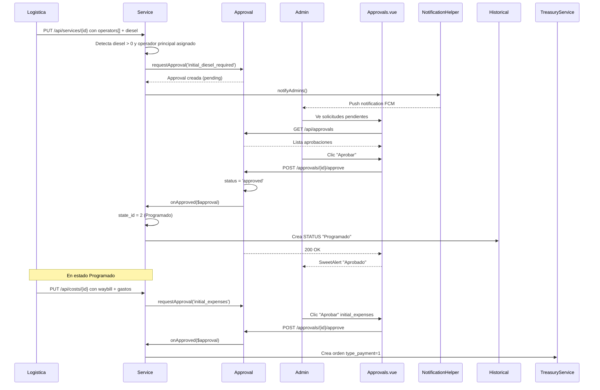

# ✅ Módulo de Aprobaciones

[← Volver al índice](context.md)

---

## 📋 Descripción General

El módulo de aprobaciones es un sistema flexible y reutilizable que permite solicitar, aprobar o rechazar diferentes tipos de operaciones en el sistema. Utiliza relaciones polimórficas para aplicarse a múltiples modelos.

**Modelos que implementan aprobaciones:**
- `Service` - Servicios/Viajes
- `Maintenance` - Mantenimientos

---

## 🗂️ Modelo: Approval

**Ubicación:** `app/Models/Approval.php`

### Campos de la Tabla `approvals`

| Campo | Tipo | Descripción | Valores |
|-------|------|-------------|---------|
| `id` | BIGINT | ID único | Auto |
| `approvable_type` | VARCHAR(255) | Tipo de modelo (polimórfico) | `App\Models\Service`, `App\Models\Maintenance` |
| `approvable_id` | BIGINT | ID del modelo relacionado | - |
| `kind` | VARCHAR(100) | Tipo de aprobación | Ver tipos abajo |
| `status` | VARCHAR(50) | Estado de la aprobación | `pending`, `approved`, `rejected` |
| `requested_by` | BIGINT | ID del usuario que solicitó | FK users |
| `approved_by` | BIGINT | ID del usuario que aprobó/rechazó | FK users |
| `scope_id` | BIGINT | ID de alcance (opcional) | - |
| `snapshot` | JSON | Snapshot de datos al solicitar | - |
| `metadata` | JSON | Metadatos adicionales | - |
| `created_at` | TIMESTAMP | Fecha de solicitud | Auto |
| `updated_at` | TIMESTAMP | Fecha de aprobación/rechazo | Auto |

### Relaciones

```php
// Relación polimórfica
public function approvable() {
    return $this->morphTo();
}

// Usuario que solicitó
public function requester() {
    return $this->belongsTo(User::class, 'requested_by');
}

// Usuario que aprobó/rechazó
public function approver() {
    return $this->belongsTo(User::class, 'approved_by');
}
```

---

## 🔧 Trait: HasApproval

**Ubicación:** `app/Traits/HasApproval.php`

### Métodos Públicos

#### `requestApproval()`

Crea una solicitud de aprobación.

```php
public function requestApproval(
    string $kind, 
    int $userId, 
    ?array $snapshot = null, 
    ?array $meta = null, 
    ?int $scopeId = null
): Approval
```

**Parámetros:**
- `$kind` - Tipo de aprobación (ver tipos abajo)
- `$userId` - ID del usuario que solicita
- `$snapshot` - Array con datos relevantes para mostrar
- `$meta` - Metadatos adicionales para lógica de aprobación
- `$scopeId` - ID de alcance opcional

**Ejemplo:**
```php
$service->requestApproval(
    kind: 'initial_diesel_required',
    userId: auth()->id(),
    snapshot: ['diesel' => 500, 'folio' => 'TAG260123001'],
    meta: ['diesel_amount' => 500]
);
```

#### `approvalOf()`

Obtiene la aprobación más reciente de un tipo específico.

```php
public function approvalOf(string $kind, ?int $scopeId = null)
```

**Ejemplo:**
```php
$dieselApproval = $service->approvalOf('initial_diesel_required');
if ($dieselApproval && $dieselApproval->status === 'approved') {
    // Diesel aprobado
}
```

#### `approvals()`

Relación polimórfica con todas las aprobaciones.

```php
public function approvals() {
    return $this->morphMany(Approval::class, 'approvable');
}
```

#### `getApprovalsMapAttribute()`

Obtiene un mapa de estados de aprobación por tipo.

```php
// Accesible como: $service->approvals_map
// Retorna: ['initial_diesel_required' => 'approved', 'extra_diesel' => 'pending']
```

### Métodos Abstractos (Deben implementarse)

#### `onApproved(Approval $approval): void`

Se ejecuta cuando una aprobación es aprobada.

```php
public function onApproved(Approval $approval): void {
    switch ($approval->kind) {
        case "initial_diesel_required":
            // Lógica específica
            break;
    }
}
```

#### `onRejected(Approval $approval): void`

Se ejecuta cuando una aprobación es rechazada.

```php
public function onRejected(Approval $approval): void {
    switch ($approval->kind) {
        case "initial_diesel_required":
            // Lógica de limpieza
            break;
    }
}
```

---

## 📝 Tipos de Aprobación

### Para Servicios (Service)

#### 1. `initial_diesel_required`

**Cuándo:** Al asignar operador principal (`is_main = 1`) con `diesel > 0` mientras el servicio está en estado 1 (En Espera)  
**Snapshot:** `['DIESEL REQUERIDO' => '<amount> LITROS']`  
**Metadata:** `[]`

**onApproved:**
- Cambia `state_id = 2` (Programado)
- Crea registro en `Historical` tipo STATUS con "Programado"

**onRejected:**
- No realiza ninguna acción

#### 2. `initial_expenses`

**Cuándo:** Al guardar los gastos iniciales en `PUT /api/costs/{id}` por primera vez (estados 1 o 2), independientemente de si el operador principal está asignado. Solo se crea una solicitud; si ya existe una pendiente o aprobada, no se duplica.  
**Snapshot:** Mapa de gastos iniciales + total de casetas  
**Metadata:** `['total' => suma_casetas + suma_gastos_iniciales]`

**onApproved:**
- Crea orden en `treasury_services`:
  - `type_payment = 1` (gastos iniciales)
  - `total` tomado de `metadata['total']`
  - `reviewed_by` = ID del aprobador
- Invoca `checkAndTransitionToEnRuta()`: si el `substate_id` del servicio ya alcanzó el umbral del tipo de operación (substate 1 para impo/carga suelta, substate 10 para expo), cambia automáticamente `state_id = 3` (En Ruta) y registra `Historical` tipo STATUS "En Ruta"

**onRejected:**
- No realiza ninguna acción

#### 3. `extra_diesel`

**Cuándo:** Chofer solicita diesel adicional durante el viaje  
**Endpoint:** `POST /api/services/request_diesel/{id}`  
**Permiso:** `services.request_diesel`  
**Snapshot:** `['DIESEL INICIAL' => '<n> LITROS', 'DIESEL EXTRA' => '<n> LITROS', 'DESCRIPCIÓN' => '...']`  
**Metadata:** `[]`
**Nota:** Se crea un registro en la tabla `diesels` (`scope_id` de la aprobación apunta a ese registro). Solo se permite una solicitud pendiente a la vez por servicio.

**onApproved:**
- No implementado aún

**onRejected:**
- No realiza ninguna acción

#### 4. `extra_expenses`

**Cuándo:** Se agregan gastos extras al servicio  
**Snapshot:** Mapa de gastos extras con sus costos  
**Metadata:** `['total' => suma_gastos]`

**onApproved:**
- Crea orden en `treasury_services`:
  - `type_payment = 2`
  - `total` de `metadata['total']`
  - `reviewed_by` = ID del aprobador

**onRejected:**
- Elimina todos los registros en `expenses` del servicio donde `type = 'EXTRAS'`

#### 5. `extra_booth`

**Cuándo:** Chofer solicita caseta extra durante el viaje  
**Endpoint:** `POST /api/services/request_booth/{id}`  
**Permiso:** `services.request_booth`  
**Snapshot:** `['COSTO CASETA' => '$<cost> - <name>']`  
**Metadata:** `['booth_id' => id, 'booth_name' => name, 'booth_cost' => cost]`

**onApproved:**
- Crea orden en `treasury_services`:
  - `type_payment = 2`
  - `total` de `metadata['booth_cost']`
  - `reviewed_by` = ID del aprobador

**onRejected:**
- Elimina registros en `expenses` donde `type = 'EXTRAS'` y `concept LIKE 'CASETA EXTRA:%'`

### Para Mantenimientos (Maintenance)

#### 6. `maintenance_expenses`

**Cuándo:** Al crear mantenimiento con solicitudes a proveedores  
**Requiere:** Gastos de mantenimiento aprobados  
**Snapshot:** Ver método `snapshotForMaintenanceExpenses()`  
**Metadata:** `['supplier_data' => datos_por_proveedor, 'description' => descripcion]`

**onApproved:**
- Cambia `maintenance_status_id = 2` (En Proceso)
- Por cada proveedor con solicitudes:
  - Agrupa solicitudes por `supplier_id`
  - Calcula totales de productos y servicios
  - Crea orden en `treasury_maintenances`:
    - `maintenance_id`
    - `user_id`
    - `order_date`
    - `total` (suma productos + servicios)
    - `description` (nombre proveedor + conteo items)
    - `paid = 0`

**onRejected:**
- No realiza ninguna acción

---

## 🔌 API Endpoints

### Listar Aprobaciones Pendientes

**Endpoint:** `GET /api/approvals`  
**Permiso:** `approvals.view`  
**Controlador:** `ApprovalController@index`

**Respuesta:**
```json
[
  {
    "id": 1,
    "approvable_type": "App\\Models\\Service",
    "approvable_id": 42,
    "kind": "initial_diesel_required",
    "status": "pending",
    "requested_by": 3,
    "snapshot": {
      "diesel": 500,
      "folio": "TAG260123001"
    },
    "metadata": {
      "diesel_amount": 500
    },
    "created_at": "2026-01-23T10:00:00.000000Z",
    "approvable": {
      "id": 42,
      "folio": "TAG260123001",
      "client": {"name": "CLIENTE XYZ"}
    }
  }
]
```

### Aprobar Solicitud

**Endpoint:** `POST /api/approvals/{id}/approve`  
**Permiso:** `approvals.approve`  
**Controlador:** `ApprovalController@approve`

**Comportamiento:**
1. Cambia `status = 'approved'`
2. Registra `approved_by = auth()->id()`
3. Ejecuta `$approvable->onApproved($approval)`
4. Envía notificación al solicitante (si implementado)

### Rechazar Solicitud

**Endpoint:** `POST /api/approvals/{id}/reject`  
**Permiso:** `approvals.reject`  
**Controlador:** `ApprovalController@reject`

**Comportamiento:**
1. Cambia `status = 'rejected'`
2. Registra `approved_by = auth()->id()`
3. Ejecuta `$approvable->onRejected($approval)`
4. Envía notificación al solicitante (si implementado)

---

## 🎨 Frontend - Vistas

### Vista: `approvals.vue`

**Ruta:** `/panel/approvals`  
**Ubicación:** `resources/js/pages/approvals.vue`  
**Permisos:** `approvals.view`

**Funcionalidades:**
- Listado de aprobaciones pendientes
- Tabs por tipo de aprobación
- Vista de snapshot con información relevante
- Botón "Aprobar" (verde)
- Botón "Rechazar" (rojo)
- Confirmación con SweetAlert2

**Endpoints Consumidos:**
- `GET /api/approvals` - Listar pendientes
- `POST /api/approvals/{id}/approve` - Aprobar
- `POST /api/approvals/{id}/reject` - Rechazar

**Visualización por Tipo:**

- **initial_diesel_required:** Muestra folio, diesel solicitado, operador, unidad
- **extra_diesel:** Muestra folio, cantidad extra, razón
- **extra_expenses:** Tabla de gastos extras con conceptos y montos
- **extra_booth:** Muestra caseta, costo
- **maintenance_expenses:** 
  - Tabla "Solicitud a Proveedor" (concepto, costo)
  - Tabla "Solicitud a Inventario" (producto, cantidad)
  - Conteo total de piezas

---

## 💡 Flujo de Aprobación Completo

### Ejemplo: Diesel Inicial



---

## 🔧 Helper: NotificationHelper

**Ubicación:** `app/Helpers/NotificationHelper.php`

### Método `notifyAdmins()`

Envía notificaciones push a todos los administradores y dirección.

```php
NotificationHelper::notifyAdmins(
    string $title,
    string $body,
    array $data = []
): array
```

**Parámetros:**
- `$title` - Título de la notificación
- `$body` - Cuerpo del mensaje
- `$data` - Datos adicionales (opcional)

**Retorna:**
```php
[
    'success' => 3,  // Notificaciones enviadas exitosamente
    'failed' => 0,   // Notificaciones fallidas
    'total' => 3,    // Total de usuarios notificados
    'errors' => []   // Array de errores si los hay
]
```

**Ejemplo de uso:**
```php
NotificationHelper::notifyAdmins(
    'Nueva solicitud de Mantenimiento',
    'Se requiere de su aprobación (MTT20260123120000)',
    ['maintenance_id' => 15]
);
```

**Usuarios notificados:**
- Rol Administrador (role_id = 1)
- Rol Dirección (role_id = 7)
- Solo usuarios activos (active = 1)
- Solo usuarios con fcm_token registrado

### Fix FCM Arrays Vacíos

El helper evita el error 400 de FCM al enviar data vacío:

```php
// Solo incluir 'data' si tiene contenido
if (!empty($stringData)) {
    $message['data'] = $stringData;
}
```

**Error que se evita:**
```
FCM error 400: Invalid value at 'message' (Map), 
Cannot bind a list to map for field 'data'.
```

---

## 🔒 Seguridad

### Control de Acceso

**Roles con acceso:**
- Administrador (aprobar/rechazar todo)
- Dirección (aprobar/rechazar todo - role_id 7)

**Permisos:**
- `approvals.view` - Ver listado de aprobaciones pendientes
- `approvals.approve` - Aprobar solicitudes
- `approvals.reject` - Rechazar solicitudes

---

## 📝 Implementación en Modelos

### Service

```php
use App\Traits\HasApproval;

class Service extends Model {
    use HasApproval;
    
    public function onApproved(Approval $approval): void {
        switch ($approval->kind) {
            case "initial_diesel_required":
                // Aprobación del diesel es suficiente para pasar a Programado
                $dieselApproval = $this->approvalOf('initial_diesel_required');
                if ($dieselApproval?->status === 'approved') {
                    $this->update(['state_id' => 2]);
                    Historical::create([...STATUS 'Programado'...]);
                }
                break;

            case "initial_expenses":
                // Crea orden de tesorería; no cambia el estado
                $expensesApproval = $this->approvalOf('initial_expenses');
                if ($expensesApproval?->status === 'approved') {
                    TreasuryService::create([
                        'type_payment' => 1,
                        'total'        => $approval->metadata['total'],
                        'reviewed_by'  => $approval->reviewed_by,
                        ...
                    ]);
                }
                break;
                
            case "extra_expenses":
                TreasuryService::create(['type_payment' => 2, 'reviewed_by' => $approval->reviewed_by, ...]);
                break;
                
            case "extra_booth":
                TreasuryService::create(['type_payment' => 2, 'total' => $approval->metadata['booth_cost'], 'reviewed_by' => $approval->reviewed_by, ...]);
                break;
        }
    }
    
    public function onRejected(Approval $approval): void {
        switch ($approval->kind) {
            case "extra_expenses":
                Expense::where('service_id', $this->id)
                    ->where('type', 'EXTRAS')
                    ->delete();
                break;
                
            case "extra_booth":
                Expense::where('service_id', $this->id)
                    ->where('type', 'EXTRAS')
                    ->where('concept', 'like', 'CASETA EXTRA:%')
                    ->delete();
                break;
        }
    }
}
```

### Maintenance

```php
use App\Traits\HasApproval;

class Maintenance extends Model {
    use HasApproval;
    
    public function onApproved(Approval $approval): void {
        switch ($approval->kind) {
            case "maintenance_expenses":
                $this->update(["maintenance_status_id" => 2]);
                
                // Agrupar solicitudes por proveedor
                $supplierTotals = $this->partsSupplierRequests
                    ->groupBy('supplier_id')
                    ->map(function($items, $supplierId) {
                        // Calcular totales
                    });
                
                // Crear orden por proveedor
                foreach ($supplierTotals as $data) {
                    TreasuryMaintenance::create([...]);
                }
                break;
        }
    }
    
    public function snapshotForMaintenanceExpenses($supplierData) {
        $snapshot = [];
        
        foreach ($supplierData as $data) {
            $snapshot[$data['supplier_name']] = sprintf(
                'Productos: $%s | Servicios: $%s | Total: $%s',
                number_format($data['products'], 2),
                number_format($data['services'], 2),
                number_format($data['total'], 2)
            );
        }
        
        $inventoryCount = $this->inventoryRequests()->sum('quantity');
        $snapshot['INVENTARIO'] = (string)$inventoryCount;
        $snapshot['DESCRIPCIÓN'] = $this->description;
        
        return $snapshot;
    }
}
```

---

## 🔗 Relaciones con Otros Módulos

### Con Servicios
- Aprobaciones de diesel y gastos
- Ver: [modulo-servicios.md](modulo-servicios.md)

### Con Mantenimientos
- Aprobaciones de gastos de mantenimiento
- Ver: [modulo-mantenimientos.md](modulo-mantenimientos.md)

### Con Tesorería
- Creación de órdenes de pago al aprobar
- Ver: [modulo-tesoreria.md](modulo-tesoreria.md)

---

## 📋 Mejoras Sugeridas

1. Implementar notificaciones al solicitante cuando se aprueba/rechaza
2. Agregar campo de comentario/razón al rechazar
3. Dashboard de métricas de aprobaciones (tiempo promedio, etc.)
4. Historial de aprobaciones por usuario
5. Sistema de aprobaciones en cadena (múltiples niveles)
6. Alertas de aprobaciones pendientes por email
7. API para consultar estado de aprobación por tipo
8. Exportación de reportes de aprobaciones
9. Logs detallados de cambios en aprobaciones
10. Sistema de delegación de aprobaciones

---

**Última actualización:** Enero 23, 2026  
**Ver también:** [modulo-servicios.md](modulo-servicios.md) | [modulo-mantenimientos.md](modulo-mantenimientos.md) | [context.md](context.md)
