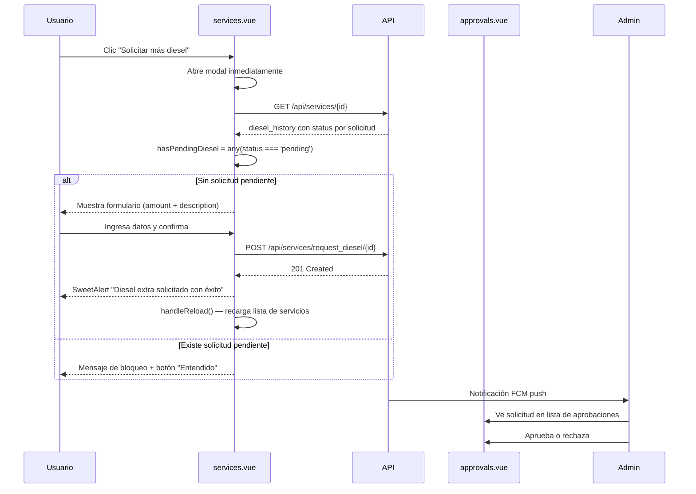

# ⛽ Módulo de Diesel Extra

[← Volver al índice](context.md)

---

## 📋 Descripción General

El módulo de **Diesel Extra** permite a los usuarios con permiso `services.request_diesel` solicitar litros adicionales de diesel durante un viaje activo. La solicitud pasa por el sistema de aprobaciones para que un administrador la autorice.

---

## 🗄️ Tabla: `diesel`

| Campo | Tipo | Constraints | Descripción |
|-------|------|-------------|-------------|
| id | bigint | PK, AI | ID único |
| service_id | bigint | FK → services.id | Servicio al que pertenece |
| amount | decimal(10,2) | NOT NULL | Litros de diesel extra solicitados |
| description | varchar(255) | NOT NULL | Motivo o justificación de la solicitud |
| created_at | timestamp | | Fecha de creación |
| updated_at | timestamp | | Fecha de actualización |

> **Nota:** El nombre de la tabla es `diesel` (singular), no `diesels`.

---

## 🧩 Modelo: `App\Models\Diesel`

**Ubicación:** `app/Models/Diesel.php`

```php
protected $table = 'diesel';

protected $fillable = [
    'service_id',
    'amount',
    'description',
];

protected $casts = [
    'amount' => 'decimal:2',
];
```

**Traits:**
- `UppercaseAttributes` - Campos en mayúsculas
- `HasMexicoTimezone` - Zona horaria America/Mexico_City

**Relaciones:**
```php
public function service()
{
    return $this->belongsTo(Service::class);
}
```

### Relación inversa en `Service`

```php
public function extra_diesel()
{
    return $this->hasMany(Diesel::class);
}
```

---

## 🔌 Endpoint

### POST `/api/services/request_diesel/{service_id}`

Registra una solicitud de diesel extra para un servicio.

**Permiso:** `services.request_diesel`

**Request:**
```json
{
  "amount": 80.00,
  "description": "Se requiere diesel extra por desvío de ruta"
}
```

**Validaciones:**
- `amount`: required, numeric, decimal:0,2, min:0
- `description`: required, string, max:255

**Proceso:**
1. Crea un registro en la tabla `diesel` con `amount`, `description` y `service_id`
2. Solicita aprobación de tipo `extra_diesel` con snapshot del servicio
3. Envía notificación push FCM a administradores

**Response 201:**
```json
{
  "message": "Diesel registrado correctamente",
  "data": {
    "id": 12,
    "service_id": 145,
    "amount": "80.00",
    "description": "SE REQUIERE DIESEL EXTRA POR DESVÍO DE RUTA",
    "created_at": "2026-01-23T15:00:00.000000Z",
    "updated_at": "2026-01-23T15:00:00.000000Z"
  }
}
```

---

## ✅ Integración con Aprobaciones

La solicitud de diesel extra usa el tipo `extra_diesel` del sistema de aprobaciones polimórfico.

**Snapshot generado:**
```php
public function snapshotForExtraDiesel($amount, $description = null) {
    $snapshot = [
        'DIESEL INICIAL' => $this->diesel . ' LITROS',
        'DIESEL EXTRA'   => $amount . ' LITROS',
    ];

    if ($description) {
        $snapshot['DESCRIPCIÓN'] = $description;
    }

    return $snapshot;
}
```

**Cómo se visualiza en `approvals.vue`:**
- Muestra el folio del servicio
- Muestra litros de diesel inicial vs. diesel extra solicitado
- Muestra la descripción/justificación del chofer

**Scope:** Se usa `scopeId = $diesel->id` (ID del registro recién creado en la tabla `diesel`). Esto permite correlacionar de forma exacta cada solicitud con su aprobación individual, y habilita mostrar el estado histórico de cada solicitud en el frontend.

**Regla de una pendiente a la vez:** La validación se hace explícitamente en el controlador antes de crear el registro. Si ya existe una aprobación `extra_diesel` con `status = pending` para el servicio, se rechaza con 422. No depende del índice único de `approvals` para esto, ya que el `scope_id` distinto por solicitud lo permitiría.

**`onApproved`:** Vacío, no hay acción por realizar al aprobar.

**`onRejected`:** No realiza ninguna acción.

Ver: [modulo-aprobaciones.md](modulo-aprobaciones.md)

---

## 🔌 Endpoint adicional: `GET /api/services/{id}`

El endpoint de detalle del servicio incluye `diesel_history` en su respuesta, un array con cada solicitud de diesel extra y el estado de su aprobación correspondiente, ordenado de más reciente a más antiguo.

```json
{
  "diesel_history": [
    { "id": 15, "amount": "50.00", "description": "DESVÍO DE RUTA", "status": "pending" },
    { "id": 11, "amount": "80.00", "description": "TANQUE VACÍO",  "status": "approved" },
    { "id": 8,  "amount": "100.00","description": "RUTA LARGA",    "status": "rejected" }
  ]
}
```

La correlación entre cada registro `diesel` y su aprobación se hace por `scope_id = diesel.id` dentro de las aprobaciones cargadas para el servicio.

> **Nota sobre datos históricos:** Solicitudes creadas antes de que se implementara `scope_id = $diesel->id` tendrán `status: null` en el historial, ya que sus aprobaciones usaban `scope_id = $service->id` y no pueden correlacionarse individualmente.

---

## 📱 Frontend

### Botón en `services.vue`

El botón "Solicitar más diesel" aparece en la tabla de servicios bajo las siguientes condiciones:

```vue
<TableAction
    v-if="hasPermission('services.request_diesel') && row.state_id < 5"
    title="Solicitar mas diesel"
    icon="diesel.png"
    @click.prevent="openDieselModal(row)"
/>
```

| Condición | Detalle |
|-----------|---------|
| `hasPermission('services.request_diesel')` | El usuario debe tener el permiso asignado |
| `row.state_id < 5` | El servicio no debe estar Terminado ni Cancelado |

### Modal de solicitud

El modal tiene un layout de **dos columnas**:

**Columna izquierda (30%) — Solicitudes anteriores:**
- Lista las solicitudes previas de diesel extra del servicio, ordenadas de más reciente a más antigua
- Muestra `cantidad (L) → estado` por cada ítem
- El estado se colorea: verde (Aprobada), rojo (Rechazada), amarillo (Pendiente)
- Si no hay solicitudes anteriores muestra "Sin solicitudes anteriores"
- Mientras carga muestra "Cargando..."

**Columna derecha (70%) — Nueva solicitud:**
- Si no hay una solicitud `pending`: muestra el formulario con campos `amount` y `description`
- Si hay una solicitud `pending`: muestra el mensaje de bloqueo

**Bloqueo por solicitud pendiente:**

El bloqueo se evalúa con el computed `hasPendingDiesel`:

```js
const hasPendingDiesel = computed(() =>
  dieselHistory.value.some(d => d.status === 'pending')
);
```

Solo bloquea cuando existe un ítem con `status === 'pending'`. Si la última solicitud fue `approved` o `rejected`, el formulario se habilita para una nueva solicitud.

**Al abrir el modal** (`openDieselModal`), se hace un fetch a `GET /api/services/{id}` para obtener `diesel_history` con el estado de cada solicitud. El modal se abre inmediatamente y la lista carga en paralelo.

**Al confirmar exitosamente**, después de cerrar el SweetAlert de éxito, se recarga la lista de servicios con `handleReload()` para actualizar el `approvals_map` del servicio en la tabla.

### Flujo en el frontend



---

## 🔐 Permisos

| Permiso | Descripción |
|---------|-------------|
| `services.request_diesel` | Permite solicitar diesel extra en un servicio |
| `approvals.view` | Ver solicitudes de diesel extra en aprobaciones |
| `approvals.approve` | Aprobar solicitudes de diesel extra |
| `approvals.reject` | Rechazar solicitudes de diesel extra |

---

## 📊 Uso en Dashboard

El dashboard de servicios (`GET /api/dashboard/services-details`) incluye el diesel extra al calcular costos:

```php
$extra_diesel = $item->extra_diesel?->sum('amount') ?? 0;
$diesel_cost  = ($item->diesel + $extra_diesel) * $item->diesel_cost->price;
```

Esto suma los litros del diesel inicial más todos los registros extra para calcular el costo total de combustible por servicio.

---

## 📝 Notas de Implementación

- Un servicio puede tener **múltiples registros** en la tabla `diesel` (uno por cada solicitud realizada a lo largo del viaje).
- Solo puede haber **una aprobación `pending` de tipo `extra_diesel` por servicio** a la vez. Esta regla se valida en el controlador (`request_diesel()`) antes de crear el registro.
- Cada registro de diesel tiene su propia aprobación identificada por `scope_id = diesel.id`, lo que permite correlacionar y mostrar el estado individual de cada solicitud en el historial del modal.
- El campo `description` se guarda en mayúsculas por el trait `UppercaseAttributes`.
- El `onApproved` para `extra_diesel` está vacío — no hay acción definida al aprobar.
- El `diesel_history` que devuelve `GET /api/services/{id}` viene ordenado de más reciente a más antiguo.

---

**Ver también:** [modulo-servicios.md](modulo-servicios.md) | [modulo-aprobaciones.md](modulo-aprobaciones.md) | [modulo-tesoreria.md](modulo-tesoreria.md) | [context.md](context.md)
