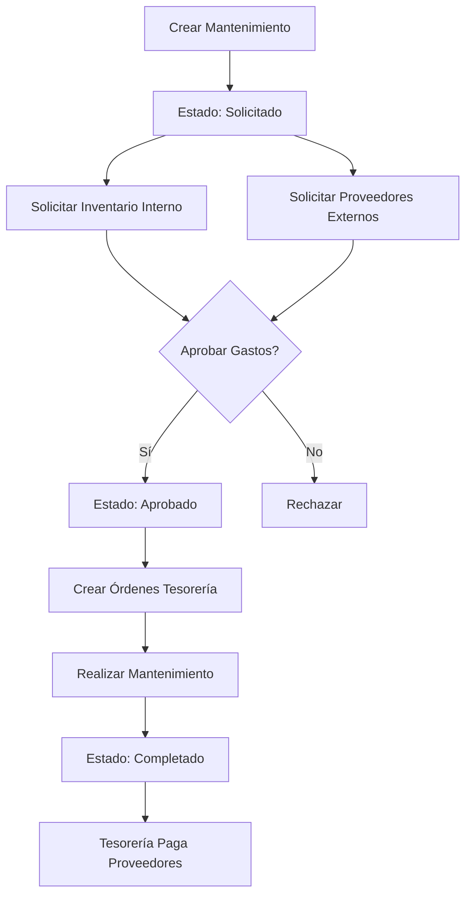

# 🔧 Módulo de Mantenimientos

[← Volver al índice](context.md)

---

## 📋 Descripción General

El módulo de **Mantenimientos** gestiona el mantenimiento preventivo y correctivo de las unidades (tractocamiones, dollies, remolques). Incluye gestión de inventario de refacciones y solicitudes a proveedores externos.

---

## 🗄️ Modelo Principal: Maintenance

### Tabla `maintenances`

| Campo | Tipo | Descripción |
|-------|------|-------------|
| id | bigint | PK |
| folio | varchar(255) | Folio único formato MTT{YmdHis} |
| unit_id | bigint | FK a `units` |
| type_maintenance_id | bigint | FK a `type_maintenances` |
| description | text | Descripción del mantenimiento |
| kms | int | Kilometraje actual de la unidad |
| init_date | date | Fecha de inicio del mantenimiento |
| maintenance_status_id | bigint | FK a `maintenance_statuses` |
| zombie | tinyint(1) | 0=activo, 1=eliminado |
| created_at | timestamp | Fecha de creación |
| updated_at | timestamp | Fecha de actualización |

### Relaciones

```php
unit()                    → belongsTo(Unit)
type_maintenance()        → belongsTo(TypeMaintenance)
status()                  → belongsTo(MaintenanceStatus)
inventoryRequests()       → hasMany(InventoryRequest)
partsSupplierRequests()   → hasMany(PartSupplierRequest)
approvals()               → morphMany(Approval) [Trait HasApproval]
```

---

## 📊 Estados de Mantenimiento

### Tabla `maintenance_statuses`

| ID | Nombre | Descripción | Color |
|----|--------|-------------|-------|
| 1 | **Solicitado** | Mantenimiento creado, pendiente aprobación | Amarillo |
| 2 | **Aprobado** | Aprobado, en proceso | Azul |
| 3 | **Completado** | Mantenimiento finalizado | Verde |
| 4 | **Cancelado** | Mantenimiento cancelado | Rojo |

---

## 🛠️ Tipos de Mantenimiento

### Tabla `type_maintenances`

| Campo | Tipo | Descripción |
|-------|------|-------------|
| id | bigint | PK |
| name | varchar(255) | Nombre del tipo |
| zombie | tinyint(1) | 0=activo, 1=eliminado |
| created_at | timestamp | Fecha de creación |
| updated_at | timestamp | Fecha de actualización |

**Ejemplos:**
- Preventivo
- Correctivo
- Cambio de aceite
- Reparación de motor
- Cambio de llantas
- Servicio general

---

## 📦 Inventario de Refacciones

### Tabla `inventories`

| Campo | Tipo | Descripción |
|-------|------|-------------|
| id | bigint | PK |
| name | varchar(255) | Nombre de la refacción |
| brand | varchar(255) | Marca |
| presentation | varchar(255) | Presentación/Especificación |
| quantity | int | Cantidad en stock |
| zombie | tinyint(1) | 0=activo, 1=eliminado |
| created_at | timestamp | Fecha de creación |
| updated_at | timestamp | Fecha de actualización |

**Relación:**
```php
stocks() → hasMany(Stock)
```

### Tabla `stocks` (Historial de Movimientos)

| Campo | Tipo | Descripción |
|-------|------|-------------|
| id | bigint | PK |
| inventory_id | bigint | FK a `inventories` |
| type | varchar(255) | IN=entrada, OUT=salida |
| quantity | int | Cantidad del movimiento |
| description | text | Descripción del movimiento |
| date | date | Fecha del movimiento |
| created_at | timestamp | Fecha de creación |
| updated_at | timestamp | Fecha de actualización |

---

## 🧩 Solicitudes de Inventario

### Tabla `inventory_requests`

| Campo | Tipo | Descripción |
|-------|------|-------------|
| id | bigint | PK |
| maintenance_id | bigint | FK a `maintenances` |
| inventory_id | bigint | FK a `inventories` |
| quantity | int | Cantidad solicitada |
| created_at | timestamp | Fecha de creación |
| updated_at | timestamp | Fecha de actualización |

**Relación:**
```php
maintenance() → belongsTo(Maintenance)
inventory()   → belongsTo(Inventory)
```

**Uso:** Cuando se utiliza refacción del inventario propio.

---

## 🏢 Solicitudes a Proveedores

### Tabla `part_supplier_requests`

| Campo | Tipo | Descripción |
|-------|------|-------------|
| id | bigint | PK |
| maintenance_id | bigint | FK a `maintenances` |
| supplier_id | bigint | FK a `suppliers` |
| request_type | int | 1=servicio, 2=producto |
| concept | varchar(255) | Concepto/Descripción |
| cost | decimal(10,2) | Costo |
| created_at | timestamp | Fecha de creación |
| updated_at | timestamp | Fecha de actualización |

**Relaciones:**
```php
maintenance() → belongsTo(Maintenance)
supplier()    → belongsTo(Supplier)
```

**Tipos:**
- `1` - **Servicio** (mano de obra, soldadura, pintura, etc.)
- `2` - **Producto** (refacciones, materiales, etc.)

---

## 🔌 Endpoints de API

### GET `/api/maintenances`

Lista mantenimientos con filtros.

**Query Parameters:**
- `estado` - ID del estado (`1`, `2`, `3`, `4`, `todos`, o múltiples separados por coma)
- `start_date` - Fecha inicio (YYYY-MM-DD)
- `end_date` - Fecha fin (YYYY-MM-DD)

**Permisos:** `maintenances.view`

**Response 200:**
```json
[
  {
    "id": 45,
    "folio": "MTT20260123142530",
    "unit_id": 3,
    "type_maintenance_id": 1,
    "description": "CAMBIO DE ACEITE Y FILTROS",
    "kms": 85000,
    "init_date": "2026-01-23",
    "maintenance_status_id": 1,
    "unit": {
      "id": 3,
      "econame": "T-001",
      "plates": "ABC-123-XY"
    },
    "type_maintenance": {
      "id": 1,
      "name": "PREVENTIVO"
    },
    "status": {
      "id": 1,
      "name": "SOLICITADO"
    }
  }
]
```

### POST `/api/maintenances`

Crea un nuevo mantenimiento.

**Permisos:** `maintenances.create`

**Request:**
```json
{
  "unit_id": 3,
  "type_maintenance_id": 1,
  "description": "CAMBIO DE ACEITE Y FILTROS",
  "kms": 85000,
  "init_date": "2026-01-23",
  "inventory_requests": [
    {
      "inventory_id": 12,
      "quantity": 4
    },
    {
      "inventory_id": 15,
      "quantity": 1
    }
  ],
  "parts_supplier_requests": [
    {
      "supplier_id": 5,
      "request_type": 2,
      "concept": "ACEITE 15W40 CASTROL",
      "cost": 850.00
    },
    {
      "supplier_id": 5,
      "request_type": 1,
      "concept": "MANO DE OBRA",
      "cost": 500.00
    }
  ]
}
```

**Validaciones:**
- `unit_id`: required, exists:units,id
- `init_date`: required, date
- `kms`: required, integer
- `description`: required, string
- `type_maintenance_id`: required, exists:type_maintenances,id

**Proceso:**
1. Crea el mantenimiento con folio autogenerado (`MTT{YmdHis}`)
2. Crea solicitudes de inventario
3. Crea solicitudes a proveedores
4. Calcula totales por proveedor
5. Solicita aprobación `maintenance_expenses`
6. Envía notificación FCM a administradores

**Response 200:**
```json
{
  "id": 45,
  "folio": "MTT20260123142530",
  "maintenance_status_id": 1
}
```

### GET `/api/maintenances/{id}`

Obtiene detalles de un mantenimiento.

**Permisos:** `maintenances.view`

**Response 200:**
```json
{
  "id": 45,
  "folio": "MTT20260123142530",
  "unit": { ... },
  "type_maintenance": { ... },
  "status": { ... },
  "inventoryRequests": [
    {
      "id": 78,
      "inventory_id": 12,
      "quantity": 4,
      "inventory": {
        "id": 12,
        "name": "FILTRO DE ACEITE",
        "brand": "BALDWIN",
        "presentation": "B7",
        "quantity": 25
      }
    }
  ],
  "partsSupplierRequests": [
    {
      "id": 123,
      "supplier_id": 5,
      "request_type": 2,
      "concept": "ACEITE 15W40 CASTROL",
      "cost": 850.00,
      "supplier": {
        "id": 5,
        "name": "REFACCIONARIA LÓPEZ"
      }
    }
  ],
  "approvals": [ ... ]
}
```

### PUT `/api/maintenances/{id}`

Actualiza un mantenimiento existente.

**Permisos:** `maintenances.edit`

**Request:** (Mismo formato que POST)

**Proceso:**
- Actualiza datos generales
- Gestiona solicitudes de inventario (crea/actualiza/elimina)
- Gestiona solicitudes a proveedores

**Response 200:**
```json
null
```

### DELETE `/api/maintenances/{id}`

Elimina lógicamente un mantenimiento.

**Permisos:** `maintenances.delete`

**Proceso:**
- Marca `zombie = 1`

**Response 204**

### GET `/api/types/maintenances`

Lista tipos de mantenimiento disponibles.

**Response 200:**
```json
[
  { "id": 1, "name": "PREVENTIVO" },
  { "id": 2, "name": "CORRECTIVO" },
  { "id": 3, "name": "CAMBIO DE ACEITE" }
]
```

---

## 📦 Endpoints de Inventario

### GET `/api/inventories`

Lista refacciones en inventario.

**Permisos:** `inventory.view`

**Response 200:**
```json
[
  {
    "id": 12,
    "name": "FILTRO DE ACEITE",
    "brand": "BALDWIN",
    "presentation": "B7",
    "quantity": 25
  }
]
```

### POST `/api/inventories`

Crea un nuevo item de inventario.

**Permisos:** `inventory.create`

**Request:**
```json
{
  "name": "FILTRO DE ACEITE",
  "brand": "BALDWIN",
  "presentation": "B7",
  "quantity": 25
}
```

**Response 200:**
```json
{
  "id": 12,
  "name": "FILTRO DE ACEITE"
}
```

### PUT `/api/inventories/{id}`

Actualiza un item de inventario.

**Permisos:** `inventory.edit`

**Request:**
```json
{
  "name": "FILTRO DE ACEITE",
  "brand": "BALDWIN",
  "presentation": "B7",
  "quantity": 30
}
```

**Response 200:**
```json
null
```

### DELETE `/api/inventories/{id}`

Elimina lógicamente un item de inventario.

**Permisos:** `inventory.delete`

**Response 204**

---

## ✅ Sistema de Aprobaciones

El modelo `Maintenance` utiliza el trait `HasApproval`.

### Tipo de Aprobación

**maintenance_expenses** - Gastos de mantenimiento

Ver: [modulo-aprobaciones.md](modulo-aprobaciones.md)

### Flujo de Aprobación

```php
public function onApproved(Approval $approval): void {
    switch ($approval->kind) {
        case "maintenance_expenses":
            // 1. Cambiar estado a Aprobado
            $this->update(["maintenance_status_id" => 2]);
            
            // 2. Agrupar solicitudes por proveedor
            $supplierTotals = $this->partsSupplierRequests
                ->groupBy('supplier_id')
                ->map(function($items) {
                    $totalProducts = $items->where('request_type', 2)->sum('cost');
                    $totalServices = $items->where('request_type', 1)->sum('cost');
                    return [
                        'total' => $totalProducts + $totalServices,
                        'supplier_name' => $supplier->name
                    ];
                });
            
            // 3. Crear órdenes de tesorería (una por proveedor)
            foreach ($supplierTotals as $data) {
                TreasuryMaintenance::create([
                    'maintenance_id' => $this->id,
                    'total' => $data['total'],
                    'description' => sprintf(
                        '%s - %d productos, %d servicios',
                        $data['supplier_name'],
                        $countProducts,
                        $countServices
                    ),
                    'paid' => 0
                ]);
            }
            break;
    }
}
```

---

## 💰 Integración con Tesorería

### Tabla `treasury_maintenances`

| Campo | Tipo | Descripción |
|-------|------|-------------|
| id | bigint | PK |
| maintenance_id | bigint | FK a `maintenances` |
| user_id | bigint | FK a `users` (quien creó la orden) |
| order_date | date | Fecha de la orden |
| total | decimal(10,2) | Monto total |
| description | text | Descripción del pago |
| paid | tinyint(1) | 0=pendiente, 1=pagado |
| created_at | timestamp | Fecha de creación |
| updated_at | timestamp | Fecha de actualización |

**Relaciones:**
```php
maintenance() → belongsTo(Maintenance)
user()        → belongsTo(User)
```

Ver: [modulo-tesoreria.md](modulo-tesoreria.md)

---

## 🎯 Generación Automática de Folios

### Formato

`MTT{YmdHis}`

**Ejemplo:** `MTT20260123142530`
- `MTT` - Prefijo fijo (MainTenance TAG)
- `20260123142530` - Timestamp completo: 23 enero 2026, 14:25:30

### Implementación

```php
$newFolio = strtoupper("MTT") . now('America/Mexico_City')->format('YmdHis');
$data['folio'] = $newFolio;
```

---

## 📱 Vistas Frontend

### Páginas

| Vista | Ruta | Roles Permitidos | Descripción |
|-------|------|------------------|-------------|
| maintenances.vue | `/maintenances` | Admin, Mantenimiento | Lista de mantenimientos |
| forms/maintenance.vue | `/maintenance/:id?` | Admin, Mantenimiento | Crear/editar mantenimiento |

### Componentes Especiales

#### inventoryrequest.vue

Componente para solicitar refacciones del inventario:

```vue
<inventoryrequest 
  v-model="inventoryRequests"
  :inventories="availableInventories"
/>
```

**Características:**
- Búsqueda de refacciones
- Selección de cantidad
- Validación de stock disponible
- Lista de items seleccionados

#### partssupplierrequest.vue

Componente para solicitar productos/servicios a proveedores:

```vue
<partssupplierrequest 
  v-model="partsSupplierRequests"
  :suppliers="suppliers"
/>
```

**Características:**
- Selección de proveedor
- Tipo: Producto o Servicio
- Concepto y costo
- Agrupación por proveedor
- Cálculo de totales

#### manttostatebutton.vue

Botón de cambio de estado para mantenimientos:

```vue
<manttostatebutton 
  :maintenance="maintenance"
  @updated="loadMaintenance"
/>
```

---

## 🔄 Flujo Completo de un Mantenimiento

### Diagrama



### Flujo Detallado

**1. Creación (Mantenimiento)**
```
POST /api/maintenances
→ maintenance_status_id = 1 (Solicitado)
→ Crear inventory_requests
→ Crear parts_supplier_requests
→ Solicitar aprobación: maintenance_expenses
→ Notificar administradores (FCM)
```

**2. Aprobación (Administrador)**
```
POST /api/approvals/{id}/approve
→ maintenance_status_id = 2 (Aprobado)
→ Agrupar solicitudes por proveedor
→ Crear TreasuryMaintenance por cada proveedor
→ Ejemplo: 
  - Proveedor A: $1,350 (2 productos, 1 servicio)
  - Proveedor B: $2,500 (3 productos)
```

**3. Ejecución (Mantenimiento)**
```
- Realizar trabajo físico
- Descontar inventario interno (si aplica)
- Registrar evidencias
```

**4. Completado (Mantenimiento)**
```
PUT /api/maintenances/{id}
→ maintenance_status_id = 3 (Completado)
```

**5. Pago (Tesorería)**
```
PUT /api/treasury/maintenances/{id}/pay
→ paid = 1
→ Registrar pago en sistema contable
```

---

## 🔐 Seguridad y Permisos

### Matriz de Permisos

| Acción | Admin | Mantenimiento | Otros |
|--------|-------|---------------|-------|
| Ver mantenimientos | ✅ | ✅ | ❌ |
| Crear mantenimiento | ✅ | ✅ | ❌ |
| Editar mantenimiento | ✅ | ✅ | ❌ |
| Eliminar mantenimiento | ✅ | ✅ | ❌ |
| Aprobar gastos | ✅ | ❌ | ❌ |
| Ver inventario | ✅ | ✅ | ❌ |
| Gestionar inventario | ✅ | ✅ | ❌ |

---

## 📊 Estadísticas

- **Promedio de mantenimientos mensuales:** 20-40
- **Costo promedio por mantenimiento:** $2,000 - $8,000 MXN
- **Inventario de refacciones:** 50-100 items diferentes
- **Proveedores activos:** 10-15

---

## 📝 Notas de Implementación

### Traits Utilizados

- `HasApproval` - Sistema de aprobaciones polimórficas
- `UppercaseAttributes` - Campos en mayúsculas
- `HasMexicoTimezone` - Zona horaria America/Mexico_City

### Soft Deletes

No se eliminan físicamente, se marca `zombie = 1`:

```php
Maintenance::find($id)->update(['zombie' => 1]);
```

### Snapshot de Aprobación

```php
public function snapshotForMaintenanceExpenses($supplierData) {
    $snapshot = [];
    
    foreach ($supplierData as $data) {
        $snapshot[$data['supplier_name']] = sprintf(
            'Productos: $%s | Servicios: $%s | Total: $%s',
            number_format($data['products'], 2),
            number_format($data['services'], 2),
            number_format($data['total'], 2)
        );
    }
    
    $inventoryCount = $this->inventoryRequests()->sum('quantity');
    $snapshot['INVENTARIO'] = (string)$inventoryCount;
    $snapshot['DESCRIPCIÓN'] = $this->description;
    
    return $snapshot;
}
```

### Agrupación por Proveedor

El sistema agrupa automáticamente las solicitudes por proveedor para:
1. Crear órdenes de tesorería consolidadas
2. Facilitar el pago
3. Optimizar la gestión de proveedores

### Inventario vs Proveedores

- **Inventario interno:** Refacciones ya compradas, en almacén
- **Proveedores externos:** Productos/servicios a comprar

Un mantenimiento puede usar ambos simultáneamente.

---

**Última actualización:** Enero 23, 2026  
**Ver también:** [modulo-unidades.md](modulo-unidades.md) | [modulo-aprobaciones.md](modulo-aprobaciones.md) | [modulo-tesoreria.md](modulo-tesoreria.md) | [context.md](context.md)
