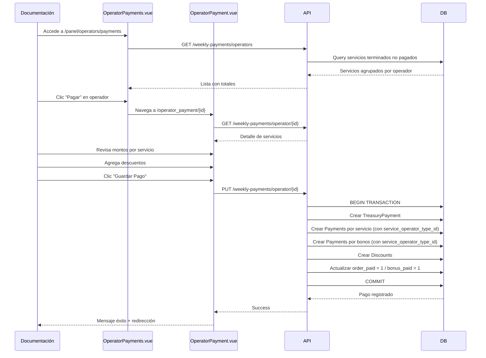

# 👥 Módulo de Operadores

[← Volver al índice](context.md)

---

## 📋 Descripción General

El módulo de operadores gestiona los choferes que ejecutan los servicios de transporte, incluyendo información personal, asignación de servicios y sistema completo de pagos semanales con descuentos.

---

## 🗂️ Modelo: Operator

**Ubicación:** `app/Models/Operator.php`

**Nota:** El modelo `Operator` es un alias de `User` con `role_id = 4` (Chofer).

### Campos de la Tabla `users` (como Operator)

| Campo | Tipo | Descripción | Requerido |
|-------|------|-------------|-----------|
| `id` | BIGINT | ID único del operador | Auto |
| `name` | VARCHAR(255) | Nombre completo del operador | ✅ |
| `email` | VARCHAR(255) | Email (usado para login) | ✅ |
| `password` | VARCHAR(255) | Contraseña encriptada | ✅ |
| `role_id` | BIGINT | Siempre 4 (Chofer) | ✅ |
| `picture` | VARCHAR(255) | Foto de perfil | ❌ |
| `fcm_token` | VARCHAR(255) | Token para notificaciones push | ❌ |
| `active` | BOOLEAN | Operador activo | ❌ |
| `zombie` | BOOLEAN | Soft delete | ❌ |
| `created_at` | TIMESTAMP | Fecha de creación | Auto |
| `updated_at` | TIMESTAMP | Fecha de actualización | Auto |

### Traits Aplicados

- **`HasFactory`** - Permite crear factories
- **`UppercaseAttributes`** - Convierte `name` a mayúsculas
- **`HasMexicoTimezone`** - Maneja fechas en zona horaria México

### Relaciones

```php
// Relación con rol
public function role() {
    return $this->belongsTo(Role::class);
}

// Pagos recibidos
public function treasuryPayments() {
    return $this->hasMany(TreasuryPayment::class, 'operator_id');
}
```

Los servicios en los que participa un operador se consultan a través de `service_operators` por su `operator_id`.

---

## 🔌 API Endpoints

### Gestión de Operadores

#### Listar Operadores

**Endpoint:** `GET /api/operators`  
**Permiso:** `operators.view` o `operators.consult`  
**Controlador:** `OperatorController@index`

**Respuesta:**
```json
[
  {
    "id": 5,
    "name": "JUAN PEREZ GARCIA",
    "email": "juan.perez@taglogistica.com",
    "role_id": 4,
    "picture": null,
    "active": 1,
    "zombie": 0
  }
]
```

#### Crear Operador

**Endpoint:** `POST /api/operators`  
**Permiso:** `operators.create`  
**Controlador:** `OperatorController@store`

**Request Body:**
```json
{
  "name": "PEDRO LOPEZ MARTINEZ",
  "email": "pedro.lopez@taglogistica.com",
  "password": "password123",
  "role_id": 4,
  "active": 1
}
```

**Validaciones:**
- `name`: requerido, string
- `email`: requerido, email, único
- `password`: requerido, min:6
- `role_id`: requerido (siempre 4 para operadores)

#### Ver Operador

**Endpoint:** `GET /api/operators/{id}`  
**Permiso:** `operators.view`  
**Controlador:** `OperatorController@show`

#### Actualizar Operador

**Endpoint:** `PUT /api/operators/{id}`  
**Permiso:** `operators.edit`  
**Controlador:** `OperatorController@update`

#### Eliminar Operador (Soft Delete)

**Endpoint:** `DELETE /api/operators/{id}`  
**Permiso:** `operators.delete`  
**Controlador:** `OperatorController@destroy`

#### Ver Nóminas del Operador

**Endpoint:** `GET /api/operator/{id}/payments`  
**Permiso:** `operators.view_payments`  
**Controlador:** `OperatorController@payments`

**Descripción:** Vista para que el chofer vea sus propios pagos históricos.

**Respuesta:**
```json
[
  {
    "id": 1,
    "folio": "PAY20260120001",
    "order_date": "2026-01-20",
    "total": 8500.00,
    "payments": [
      {
        "service_id": 42,
        "total": 3000.00,
        "service": {"folio": "TAG260115001"}
      }
    ],
    "discounts": [
      {
        "title": "Seguro",
        "total": 500.00
      }
    ]
  }
]
```

### Sistema de Pagos Semanales

#### Resumen de Pagos Pendientes

**Endpoint:** `GET /api/services/weekly-payments/operators`  
**Permiso:** `operator_payments.view`  
**Controlador:** `ServiceController@weekly_payments`

**Descripción:** Lista todos los operadores con servicios terminados y sin pagar, sin restricción de periodo. Incluye tanto operadores principales (con servicios pendientes de pago) como operadores auxiliares con bonos pendientes (`bonus_paid = 0`, `amount_bonus > 0`).

**Criterios de inclusión:**
- Servicios con `state_id = 5` (Terminado) y `order_paid = 0`
- Servicios `legacy = 0`: se busca por `service_operators` donde el tipo tenga `is_main = 1`
- Servicios `legacy = 1`: se busca por `services.operator_id`
- Bonos auxiliares: `service_operators` con `is_main = 0`, `bonus_paid = 0`, `amount_bonus > 0`

**Respuesta:**
```json
[
  {
    "operator_id": 5,
    "operator": "JUAN PEREZ GARCIA",
    "total_services": 12,
    "total_bonuses": 2,
    "payment_date": "Todos los pendientes"
  }
]
```

#### Detalle de Pagos Pendientes por Operador

**Endpoint:** `GET /api/services/weekly-payments/operator/{operator_id}`  
**Permiso:** `operator_payments.view`  
**Controlador:** `ServiceController@weekly_operator_payments`

**Respuesta:**
```json
{
  "services": [
    {
      "id": 42,
      "folio": "TAG260115001",
      "waybill": "CCP123",
      "type_operation": 1,
      "client": "CLIENTE XYZ",
      "delivery_date": "2026-01-15",
      "destines": [{"name": "GUADALAJARA, JAL"}],
      "amount": 3000.00
    }
  ],
  "bonuses": [
    {
      "service_operator_id": 10,
      "id": 43,
      "folio": "TAG260116001",
      "operator_role": "Entrega de Vacío",
      "amount": 500.00
    }
  ],
  "discounts": []
}
```

#### Guardar Pago Semanal

**Endpoint:** `PUT /api/services/weekly-payments/operator/{operator_id}`  
**Permiso:** `operator_payments.create` o `operator_payments.edit`  
**Controlador:** `ServiceController@save_weekly_operator_payments`

**Request Body:**
```json
{
  "services": [
    {
      "service_id": 42,
      "amount": 3000.00
    },
    {
      "service_id": 43,
      "amount": 2800.00
    }
  ],
  "discounts": [
    {
      "title": "Seguro Social",
      "amount": 500.00
    },
    {
      "title": "Préstamo",
      "amount": 1000.00
    }
  ]
}
```

**Comportamiento:**
1. Crea registro en `treasury_payments`:
   - `operator_id`
   - `folio` generado como `TAG{YmdHis}` (ej. `TAG20260120120000`)
   - `order_date`
   - `total` = suma(services) + suma(bonuses) - suma(discounts)
   - `user_id` (quien registra el pago)

2. Por cada servicio en `services[]`:
   - Crea registro en `payments` con `treasury_payment_id`, `service_id`, `total`
   - Actualiza `order_paid = 1` en el servicio

3. Por cada bono en `bonuses[]`:
   - Crea registro en `payments` con `treasury_payment_id`, `service_id`, `total`
   - Actualiza `bonus_paid = 1` en el registro de `service_operators` correspondiente

4. Por cada descuento en `discounts[]`:
   - Crea registro en `discounts` con `treasury_payment_id`, `title`, `total`

**Respuesta:**
```json
{
  "id": 15,
  "folio": "TAG20260120120000",
  "total": 34500.00
}
```

---

## 🎨 Frontend - Vistas

### Gestión de Operadores

#### Listado: `operators.vue`

**Ruta:** `/panel/operators`  
**Ubicación:** `resources/js/pages/operators.vue`  
**Permisos:** `operators.view`

**Funcionalidades:**
- Listado de operadores con DataTable
- Filtros por estado (activo/inactivo)
- Búsqueda por nombre, email
- Botón "Nuevo Operador"
- Botón "Editar" por fila
- Botón "Eliminar" con confirmación

**Endpoints Consumidos:**
- `GET /api/operators`
- `DELETE /api/operators/{id}`

#### Formulario: `operator.vue`

**Rutas:** 
- `/panel/operator` (crear)
- `/panel/operator/{id}` (editar)

**Ubicación:** `resources/js/pages/forms/operator.vue`  
**Permisos:** `operators.view`, `operators.create`, `operators.edit`

**Funcionalidades:**
- Formulario de creación/edición
- Campos: Nombre, Email, Contraseña (solo crear)
- Toggle "Operador Activo"
- Botón "Guardar"

**Endpoints Consumidos:**
- `GET /api/operators/{id}`
- `POST /api/operators`
- `PUT /api/operators/{id}`

### Sistema de Pagos Semanales

#### Resumen: `operator_payments.vue`

**Ruta:** `/panel/operators/payments`  
**Ubicación:** `resources/js/pages/operator_payments.vue`  
**Permisos:** `operator_payments.view`

**Funcionalidades:**
- Listado de operadores con servicios pendientes de pago
- Muestra total de servicios y monto por operador
- Usa componente **DataTable** avanzado
- Filtros tipo Excel por columna
- Botón "Pagar" por fila (redirecciona a detalle)

**Endpoints Consumidos:**
- `GET /api/services/weekly-payments/operators`

**Ejemplo de uso del DataTable:**
```vue
<DataTable
  :data="operators"
  :columns="columns"
  :onReload="loadOperators"
>
  <template #actions="{ row }">
    <TableAction 
      title="Pagar" 
      icon="pay.png" 
      :route="`operators/operator_payment/${row.operator.id}`" 
    />
  </template>
</DataTable>
```

#### Detalle y Registro: `operator_payment.vue`

**Ruta:** `/panel/operators/operator_payment/{id}`  
**Ubicación:** `resources/js/pages/forms/operator_payment.vue`  
**Permisos:** `operator_payments.view`, `operator_payments.create`, `operator_payments.edit`

**Funcionalidades:**
- Muestra información del operador
- Lista de servicios completados del periodo
- Campos editables de monto por servicio
- Sección de descuentos (dinámicos)
  - Botón "Agregar Descuento"
  - Campos: Concepto, Monto
  - Botón "Eliminar" por descuento
- Cálculo automático de total (servicios - descuentos)
- Botón "Guardar Pago"

**Endpoints Consumidos:**
- `GET /api/services/weekly-payments/operator/{id}`
- `PUT /api/services/weekly-payments/operator/{id}`

#### Vista del Chofer: `nominas.vue`

**Ruta:** `/panel/nominas`  
**Ubicación:** `resources/js/pages/nominas.vue`  
**Permisos:** `operators.view_payments`

**Funcionalidades:**
- Vista exclusiva para operadores (rol Chofer)
- Listado de pagos históricos recibidos
- Detalle de servicios pagados
- Detalle de descuentos aplicados
- Sin opciones de edición (solo lectura)

**Endpoints Consumidos:**
- `GET /api/operator/{id}/payments` (con id del operador logueado)

---

## 💡 Sistema de Pagos

### Criterios de Servicios Pagables

Se listan todos los servicios pendientes sin restricción de periodo:
1. `state_id = 5` (Terminado)
2. `order_paid = 0` (No pagado)
3. `zombie = 0` (No eliminado)
4. Servicios `legacy = 0`: el operador debe tener un registro en `service_operators` con tipo `is_main = 1`
5. Servicios `legacy = 1`: se usa `services.operator_id`

Además se incluyen **bonos de operadores auxiliares**: registros en `service_operators` donde `is_main = 0`, `bonus_paid = 0` y `amount_bonus > 0`, vinculados a servicios terminados.

### Estructura de Pago

```
TreasuryPayment (Pago Registrado)
├── operator_id (Operador)
├── folio (TAG{YmdHis})
├── order_date (Fecha de pago)
├── total (Suma servicios + bonos - descuentos)
├── user_id (Quien registra)
│
├── Payments (Detalle por servicio o bono)
│   ├── service_id
│   ├── total
│   └── ...
│
└── Discounts (Descuentos)
    ├── title (Concepto)
    ├── total (Monto)
    └── ...
```

### Flujo Completo de Pago



---

## 🔒 Seguridad

### Control de Acceso

**Roles con acceso a gestión:**
- Administrador (todos los permisos)

**Roles con acceso a pagos:**
- Administrador (todos los permisos)
- Documentación (registrar pagos semanales)

**Roles con vista de nóminas:**
- Chofer (solo sus propios pagos)

**Permisos:**

**Operadores:**
- `operators.view` - Ver listado y detalles
- `operators.consult` - Consultar para asignación
- `operators.create` - Crear nuevos operadores
- `operators.edit` - Editar operadores
- `operators.delete` - Eliminar operadores (soft delete)
- `operators.view_payments` - Ver nóminas (chofer)

**Pagos:**
- `operator_payments.view` - Ver resumen de pagos pendientes
- `operator_payments.create` - Registrar nuevos pagos
- `operator_payments.edit` - Editar pagos

---

## 📊 Modelos Relacionados

### TreasuryPayment

**Tabla:** `treasury_payments`

| Campo | Tipo | Descripción |
|-------|------|-------------|
| `id` | BIGINT | ID único |
| `folio` | VARCHAR(50) | Folio del pago |
| `operator_id` | BIGINT | ID del operador |
| `user_id` | BIGINT | ID de quien registra |
| `order_date` | DATE | Fecha del pago |
| `total` | DECIMAL(10,2) | Total del pago |

### Payment

**Tabla:** `payments`

| Campo | Tipo | Descripción |
|-------|------|-------------|
| `id` | BIGINT | ID único |
| `treasury_payment_id` | BIGINT | ID del pago semanal |
| `service_id` | BIGINT | ID del servicio |
| `service_operator_type_id` | BIGINT | FK a `service_operator_types` (nullable) |
| `total` | DECIMAL(10,2) | Monto pagado |

### Discount

**Tabla:** `discounts`

| Campo | Tipo | Descripción |
|-------|------|-------------|
| `id` | BIGINT | ID único |
| `treasury_payment_id` | BIGINT | ID del pago semanal |
| `title` | VARCHAR(255) | Concepto del descuento |
| `total` | DECIMAL(10,2) | Monto del descuento |

---

## 🔗 Relaciones con Otros Módulos

### Con Servicios
- Operadores son asignados a servicios a través de `service_operators` con un tipo de rol (`service_operator_type_id`)
- Cada tipo de operación tiene sus propios roles definidos en `service_operator_types`:
  - **Importación/Carga Suelta:** Flete + Entrega de Vacío
  - **Exportación:** Flete + Recolección de Vacío + Ingreso de Lleno
- El operador con `is_main = 1` es el que aparece en el sistema de pagos semanales
- Ver: [modulo-servicios.md](modulo-servicios.md)

### Con Tesorería
- Pagos semanales generan órdenes de tesorería
- Ver: [modulo-tesoreria.md](modulo-tesoreria.md)

---

## 📝 Notas de Implementación

### Consideraciones

1. **Modelo Operator** - Es un alias de User con role_id = 4
2. **Sin periodo fijo** - Los pagos listan todos los servicios terminados pendientes sin restricción de fechas
3. **Folios de Pago** - Formato `TAG{YmdHis}` (ej. `TAG20260120120000`)
4. **Descuentos** - Dinámicos, se pueden agregar N descuentos
5. **Bonos auxiliares** - Los operadores con `is_main = 0` cobran a través de `amount_bonus` en `service_operators`; se marcan con `bonus_paid = 1` al registrar el pago
6. **Tipo de operador en pagos** - Cada registro en `payments` guarda `service_operator_type_id` para saber en qué rol participó el operador en ese viaje; esto permite mostrarlo en el modal de detalles de nómina y en el PDF de comprobante

### Mejoras Sugeridas

1. Validación de licencia de conducir vigente
2. Agregar foto de operador
3. Dashboard de desempeño por operador (servicios, puntualidad)
4. Sistema de bonificaciones por desempeño
5. Historial de incidentes/multas
6. Alertas de vencimiento de documentos
7. Exportación de nóminas a PDF
8. Firma digital en recibos de nómina
9. Integración con sistema de nómina externo
10. Configuración de porcentajes de descuento automáticos

---

**Última actualización:** Enero 23, 2026  
**Ver también:** [modulo-servicios.md](modulo-servicios.md) | [modulo-tesoreria.md](modulo-tesoreria.md) | [context.md](context.md)
