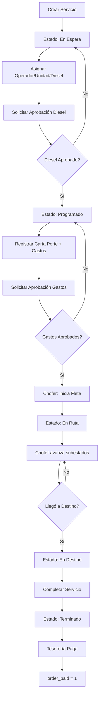

# 🚚 Módulo de Servicios

[← Volver al índice](context.md)

---

## 📋 Descripción General

El módulo de **Servicios** es el núcleo del sistema TAG Logística. Gestiona todo el ciclo de vida de los servicios de transporte de contenedores, desde su creación hasta su finalización y pago.

### Tipos de Operación

| ID | Tipo | Descripción |
|----|------|-------------|
| 1 | **Importación** | Entrada de contenedores desde terminal marítima |
| 2 | **Exportación** | Salida de contenedores hacia terminal marítima |
| 3 | **Carga Suelta** | Transporte de carga sin contenedor |

---

## 🗄️ Modelo Principal: Service

### Tabla `services`

| Campo | Tipo | Descripción |
|-------|------|-------------|
| id | bigint | PK |
| folio | varchar(255) | Folio único formato TAG{AAMMDD}{###} |
| client_id | bigint | FK a `clients` |
| type_operation | int | 1=Importación, 2=Exportación, 3=Carga Suelta |
| terminal | varchar(255) | Nombre de la terminal |
| type_unit | varchar(255) | Tipo de unidad (FULL/SENCILLO) |
| IMO | tinyint(1) | 1=contenedor IMO, 0=No IMO |
| dispatch_date | date | Fecha de despacho |
| delivery_date | date | Fecha de entrega |
| legacy | tinyint(1) | 1=registro antiguo (columnas planas), 0=usa `service_operators` |
| diesel | decimal(10,2) | Litros de diesel inicial |
| diesel_cost_id | bigint | FK a `diesel_costs` |
| state_id | bigint | FK a `states` |
| substate_id | bigint | FK a `substates` |
| order_paid | tinyint(1) | 0=pendiente pago, 1=pagado |
| commission | decimal(10,2) | Comisión del operador |
| zombie | tinyint(1) | 0=activo, 1=eliminado |
| created_at | timestamp | Fecha de creación |
| updated_at | timestamp | Fecha de actualización |

**Nota sobre columnas legacy:** Los campos `operator_id`, `unit_id`, `aux_operator_id`, `aux_unit_id`, `aux2_operator_id`, `aux2_unit_id` existen en la tabla para compatibilidad con registros históricos (`legacy = 1`). Los registros nuevos y actualizados usan exclusivamente la tabla `service_operators`.

### Relaciones

```php
// Relaciones del modelo Service
client()           → belongsTo(Client)
serviceOperators() → hasMany(ServiceOperator) // operadores asignados al viaje
state()            → belongsTo(State)
substate()         → belongsTo(Substate)
diesel_cost()      → belongsTo(DieselCost)
containers()       → hasMany(Container)
cost()             → hasOne(Cost)
expenses()         → hasMany(Expense)
extra_diesel()     → hasMany(Diesel)
payment()          → hasOne(Payment)
evidences()        → hasMany(Evidence)
approvals()        → morphMany(Approval) [Trait HasApproval]
substateHistory()  → hasMany(SubstateHistory)

// Relaciones legacy (solo para servicios con legacy=1, compatibilidad histórica)
operator()         → belongsTo(Operator)
unit()             → belongsTo(Unit)
auxOperator()      → belongsTo(Operator, 'aux_operator_id')
auxUnit()          → belongsTo(Unit, 'aux_unit_id')
aux2Operator()     → belongsTo(Operator, 'aux2_operator_id')
aux2Unit()         → belongsTo(Unit, 'aux2_unit_id')
```

### Accessor: `is_assigned_operator`

Bool que indica si el usuario autenticado es alguno de los operadores del servicio. Incluido en `$appends`. Discrimina automáticamente por `legacy`:
- `legacy = 1`: verifica `operator_id`, `aux_operator_id`, `aux2_operator_id`
- `legacy = 0`: verifica contra `service_operators`

---

## 📊 Estados del Servicio

### Estados Principales (state_id)

| ID | Nombre | Descripción | Color |
|----|--------|-------------|-------|
| 1 | **En Espera** | Servicio creado, sin asignar | Gris |
| 2 | **Programado** | Diesel y gastos aprobados, listo para iniciar | Amarillo |
| 3 | **En Ruta** | Servicio en proceso de transporte | Azul |
| 4 | **En Destino** | Llegó al destino final | Naranja |
| 5 | **Terminado** | Servicio completado, pendiente de pago | Verde |
| 6 | **Cancelado** | Servicio cancelado | Rojo |

---

## 🔄 Subestados (Flujo Detallado)

### Importación (type_operation = 1)

| ID | Nombre | Descripción | state_id resultante |
|----|--------|-------------|---------------------|
| 0 | Sin asignar | Estado inicial | 1 |
| 1 | Cargar en Puerto | 3 |
| 2 | Inicia flete | 3 |
| 3 | Llegada a Cliente | 3 |
| 4 | Inicio descarga | 3 |
| 5 | Termino descarga | 4 |
| 6 | Salida de Cliente | 4 |
| 7 | Llegada a patio TAG | 4 |
| 8 | Entrega de vacio | 5 |

### Exportación (type_operation = 2)

| ID | Nombre | state_id resultante |
|----|--------|---------------------|
| 0 | Sin asignar | 1 |
| 9 | Recolección de Vacío | 3 |
| 10 | Vacío Cargado | 3 |
| 11 | Inicia Flete | 3 |
| 12 | Llegada a Cliente | 3 |
| 13 | Inicia Carga | 3 |
| 14 | Finaliza Carga | 4 |
| 15 | Salida de Cliente | 4 |
| 16 | Llegada a Patio TAG | 4 |
| 17 | Inicia Ingreso de Carga | 4 |
| 18 | Ingreso de Carga Concluido | 5 |

### Carga Suelta (type_operation = 3)

Utiliza los mismos subestados que **Importación** (0-8).

---

## 🔌 Endpoints de API

### GET `/api/services`

Lista servicios con filtros.

**Query Parameters:**
- `estado` - ID del estado (o múltiples separados por coma: `1,2,3`)
- `operation` - Tipo de operación (1, 2, 3)
- `start_date` - Fecha inicio (YYYY-MM-DD)
- `end_date` - Fecha fin (YYYY-MM-DD)

**Permisos:** `services.view`

**Lógica especial:**
- **Chofer:** Solo ve sus servicios asignados (state_id > 1 y < 5)
- **Otros roles:** Ven todos los servicios según filtros

**Response 200:**
```json
[
  {
    "id": 145,
    "folio": "TAG260123001",
    "client_id": 12,
    "type_operation": 1,
    "terminal": "HUTCHISON PORTS",
    "dispatch_date": "2026-01-23",
    "delivery_date": "2026-01-24",
    "state_id": 2,
    "substate_id": 0,
    "operator_id": 8,
    "diesel": 150.00,
    "client": { "id": 12, "name": "MAERSK MEXICO" },
    "operator": { "id": 8, "name": "JUAN PÉREZ" },
    "unit": { "id": 3, "econame": "T-001" },
    "containers": [
      {
        "id": 234,
        "container_number": "TCLU1234567",
        "container_type": "20 STD",
        "place": { "id": 5, "name": "GUADALAJARA, JAL" }
      }
    ]
  }
]
```

### POST `/api/services`

Crea un nuevo servicio.

**Permisos:** `services.create`

**Request:**
```json
{
  "client_id": 12,
  "type_operation": 1,
  "terminal": "HUTCHISON PORTS",
  "type_unit": "FULL",
  "IMO": 0,
  "dispatch_date": "2026-01-23",
  "delivery_date": "2026-01-24",
  "containers": [
    {
      "order_number": "ORD-123",
      "container_number": "TCLU1234567",
      "container_type": "20 STD",
      "place_id": 5,
      "address": "AV. INDUSTRIA #123"
    }
  ]
}
```

**Validaciones:**
- `client_id`: required, exists:clients,id
- `type_operation`: required, in:1,2,3
- `terminal`: required, string
- `dispatch_date`: required, date
- `delivery_date`: required, date, after_or_equal:dispatch_date
- `containers`: required, array, min:1
- `containers.*.place_id`: required, exists:places,id

**Proceso:**
1. Crea el servicio con folio autogenerado
2. Crea contenedores asociados
3. Registra catálogos dinámicos (terminales, contenedores, destinos)
4. Crea registro en historial (STATUS: "En Espera")
5. Asigna `diesel_cost_id` actual

**Response 200:**
```json
{
  "id": 145,
  "folio": "TAG260123001",
  "state_id": 1,
  "substate_id": 0
}
```

### GET `/api/services/{id}`

Obtiene detalles de un servicio.

**Permisos:** `services.view`

**Response 200:**
```json
{
  "id": 145,
  "folio": "TAG260123001",
  "client": { ... },
  "serviceOperators": [
    {
      "id": 10,
      "operator_id": 8,
      "unit_id": 3,
      "service_operator_type_id": 1,
      "rate_id": null,
      "amount_bonus": "0.00",
      "bonus_paid": 0,
      "operator": { "id": 8, "name": "JUAN PÉREZ" },
      "unit": { "id": 3, "econame": "T-001" },
      "type": { "id": 1, "name": "Flete", "is_main": 1 },
      "rate": null
    }
  ],
  "containers": [ ... ],
  "cost": { ... },
  "approvals": [ ... ],
  "evidences": [ ... ],
  "diesel_history": [ ... ]
}
```
**Nota:** Para servicios `legacy = 1` (históricos), el controlador construye `serviceOperators` de forma virtual a partir de las columnas planas (`operator_id`, `aux_operator_id`, `aux2_operator_id`) para que el frontend siempre reciba el mismo contrato. Los campos `operator`, `unit`, `auxOperator`, `auxUnit`, `aux2Operator`, `aux2Unit` siguen presentes en la respuesta por compatibilidad.

### PUT `/api/services/{id}`

Actualiza un servicio existente.

**Permisos:**
- `services.edit` - Editar datos generales y contenedores
- `services.assign` - Asignar operadores, unidades y diesel
- `services.assign_diesel` - Editar únicamente el campo diesel (sin poder tocar operadores ni unidades)

**Request:**
```json
{
  "client_id": 12,
  "dispatch_date": "2026-01-24",
  "operators": [
    { "service_operator_type_id": 1, "operator_id": 8, "unit_id": 3, "rate_id": null },
    { "service_operator_type_id": 2, "operator_id": 9, "unit_id": 4, "rate_id": 2 }
  ],
  "diesel": 150.00,
  "containers": [ ... ]
}
```

`rate_id` es opcional y solo aplica a operadores auxiliares (`is_main = 0`). Cuando se envía, el backend resuelve `amount_bonus` desde la tarifa correspondiente en `service_operator_type_rates`.

**Lógica especial:**

1. **Filtro por permisos:**
   - Sin `services.edit`: No puede modificar datos generales ni contenedores
   - Sin `services.assign`: No puede modificar asignaciones de operadores

2. **Asignación de operadores (`operators[]`):**
   - Escribe cada entrada en `service_operators` via `updateOrCreate`
   - Resuelve `amount_bonus` desde `rate_id` si se provee
   - Flipa `legacy = 0` en el servicio
   - Registra historial tipo OPERATOR por cada operador (incluye nombre del rol en `second_details`)

3. **Aprobación automática de diesel:**
   - Si `state_id = 1` (En Espera)
   - Y se asigna `diesel > 0`
   - Y el operador principal (`is_main = 1`) está asignado
   - Crea aprobación `initial_diesel_required`
   - Envía notificación FCM a administradores

4. **Gestión de contenedores** (requiere `services.edit`):
   - Actualiza contenedores existentes
   - Crea nuevos contenedores
   - Elimina contenedores no presentes en el request

5. **Registro en historial:**
   - Cambios de unidad (`legacy=1`) → Historial tipo UNIT
   - Cambios de operador → Historial tipo OPERATOR con `second_details = nombre_del_rol`

**Response 200:**
```json
null
```

### DELETE `/api/services/{id}`

Elimina lógicamente un servicio (soft delete).

**Permisos:** `services.delete`

**Proceso:**
- Marca `zombie = 1`

**Response 204**

### PUT `/api/services/{id}/cancel`

Cancela un servicio.

**Permisos:** `services.delete`

**Proceso:**
1. Actualiza `state_id = 6` (Cancelado)
2. Registra en historial (STATUS: "Cancelado")

**Response 204**

### PUT `/api/services/{id}/reassign`

Reasigna el operador y unidad **principal** en un servicio activo (operación de emergencia).

**Permiso:** `services.reassign`

**Request:**
```json
{
  "operator_id": 10,
  "unit_id": 5,
  "payment": "1"
}
```

`payment` indica si el nuevo operador recibirá pago por el viaje (`"1"` = sí, `"0"` = no); se registra en el historial como `second_details`.

**Comportamiento diferenciado por `legacy`:**
- `legacy = 1`: actualiza directamente `services.operator_id` y `services.unit_id`
- `legacy = 0`: actualiza el registro en `service_operators` del tipo con `code = 'MAIN'`

En ambos casos registra historial UNIT y OPERATOR.

**Response 204**

### POST `/api/services/change_substate`

Actualiza el subestado de un servicio (usado por choferes).

**Permiso:** `services.change_substate`

**Request:**
```json
{
  "service_id": 145,
  "substate_id": 2
}
```

**Lógica especial:**
- Subestados 2 y 11 ("Inicia Flete") requieren que `initial_expenses` esté aprobado **y** que el campo `waybill` de `costs` esté asignado; si falta alguna condición devuelve 422 con descripción de lo que falta.
- Actualiza `state_id` automáticamente según subestados puntuales (ver tabla de cambios de estado).
- Registra el cambio en `historicals` (tipo `SUB_STATUS`, `first_details` = nombre del operador, `second_details` = nombre del subestado) y en `substate_history` con `operator_id`, `substate_id` y `state_id`.

**Response 200:**
```json
{ "operator_changed": true }
```
`operator_changed` es `true` cuando el operador actual ya no verá el servicio tras el cambio (pasó la estafeta según `service_operator_type_substates`).

### GET `/api/services/weekly-payments/operators`

Lista operadores con servicios terminados y sin pagar.

Ver: [modulo-operadores.md](modulo-operadores.md)

---

## 🗂️ Sistema Dinámico de Operadores por Servicio

Cada servicio puede tener hasta 3 operadores, cuya cantidad y roles dependen del `type_operation`. Los tipos de operador, sus nombres y los subestados en que cada uno es el operador activo están configurados en base de datos, no en código.

### Tabla `service_operator_types`

Catálogo de tipos de participación de operador.

| Campo | Tipo | Descripción |
|-------|------|-------------|
| id | bigint | PK |
| name | varchar(100) | Nombre visible (ej. "Flete", "Entrega de Vacío") |
| code | varchar(50) | Código estable para lógica interna |
| type_operation | tinyint | Tipo de operación al que aplica (1, 2 o 3) |
| is_main | tinyint | 1=operador principal (nómina semanal), 0=auxiliar |
| zombie | tinyint | Soft delete |

**Registros semilla:**

| id | name | code | type_operation | is_main |
|----|------|------|----------------|---------|
| 1 | Flete | MAIN | 1 (Importación) | 1 |
| 2 | Entrega de Vacío | AUX_PATIO | 1 | 0 |
| 3 | Flete | MAIN | 2 (Exportación) | 1 |
| 4 | Recolección de Vacío | AUX_INICIO | 2 | 0 |
| 5 | Ingreso de Lleno | AUX_FIN | 2 | 0 |
| 6 | Flete | MAIN | 3 (Carga Suelta) | 1 |
| 7 | Entrega de Vacío | AUX_PATIO | 3 | 0 |

### Tabla `service_operator_type_substates`

Define en qué subestados cada tipo de operador es el operador activo (visible para el chofer).

| Campo | Tipo | Descripción |
|-------|------|-------------|
| id | bigint | PK |
| service_operator_type_id | bigint | FK a `service_operator_types` |
| substate_id | int | Subestado en que este tipo es activo |

**Restricción:** `UNIQUE (service_operator_type_id, substate_id)`

**Mapeo actual:**
- Tipo 1 (Flete Importación): substates 0,1,2,3,4,5,6,8
- Tipo 2 (Entrega de Vacío Importación): substate 7
- Tipo 3 (Flete Exportación): substates 9,10,11,12,13,14,15,16,18
- Tipo 4 (Recolección de Vacío Exportación): substate 0
- Tipo 5 (Ingreso de Lleno Exportación): substate 17
- Tipo 6 (Flete Carga Suelta): substates 0,1,2,3,4,5,6,8
- Tipo 7 (Entrega de Vacío Carga Suelta): substate 7

### Tabla `service_operators`

Asignación concreta de operador+unidad a un servicio con un rol determinado.

| Campo | Tipo | Descripción |
|-------|------|-------------|
| id | bigint | PK |
| service_id | bigint | FK a `services` |
| operator_id | bigint | FK a `users` (chofer) |
| unit_id | bigint | FK a `units` |
| service_operator_type_id | bigint | FK a `service_operator_types` |
| rate_id | bigint | FK a `service_operator_type_rates` (nullable) |
| amount_bonus | decimal(10,2) | Monto de bono resuelto desde la tarifa al asignar |
| bonus_paid | tinyint | 0=bono pendiente de pago, 1=bono pagado |
| zombie | tinyint | Soft delete |

**Restricciones:**
- `UNIQUE (service_id, service_operator_type_id)` — un servicio no puede tener dos operadores del mismo tipo

### Tabla `service_operator_type_rates`

Tarifas configurables por tipo de operador. Al asignar un operador se puede seleccionar una tarifa; el sistema calcula `amount_bonus` a partir de ella.

| Campo | Tipo | Descripción |
|-------|------|-------------|
| id | bigint | PK |
| service_operator_type_id | bigint | FK a `service_operator_types` |
| name | varchar(100) | Nombre de la tarifa |
| amount | decimal(10,2) | Monto del bono |
| zombie | tinyint | Soft delete |

### Visibilidad para Choferes

Un chofer ve un servicio si está asignado en `service_operators` con un tipo cuyo `service_operator_type_id` tiene el `substate_id` actual del servicio en `service_operator_type_substates`. Sin fallback implícito.

Para servicios con `legacy = 1` (históricos), se mantiene la lógica original por columnas planas.

### Endpoints relacionados

**`GET /api/service-operator-types?type_operation={id}`**
Retorna los tipos de operador para un tipo de operación, incluyendo sus tarifas disponibles (`rates[]`). Usado por `assign.vue` para renderizar dinámicamente las secciones del formulario y popular el selector de tarifa por cada tipo auxiliar.

Cada elemento del array tiene la forma:
```json
{
  "id": 2,
  "name": "Entrega de Vacío",
  "code": "AUX_PATIO",
  "type_operation": 1,
  "is_main": 0,
  "rates": [
    { "id": 1, "name": "Tarifa Estándar", "amount": "500.00" }
  ]
}
```

**`GET /api/service-operator-type-rates`** *(opcional, `?service_operator_type_id={id}`)*
Listado de tarifas. También soporta `POST` para crear y `DELETE /{id}` para soft-delete.

**`GET /api/substates/for-service/{id}`**
Retorna la lista de subestados del tipo de operación del servicio. Usado por `statebutton.vue` para cargar la secuencia de estados sin hardcodeo.

---

## 🧩 Modelo Container

### Tabla `containers`

| Campo | Tipo | Descripción |
|-------|------|-------------|
| id | bigint | PK |
| service_id | bigint | FK a `services` |
| order_number | varchar(255) | Número de orden del cliente |
| container_number | varchar(255) | Número de contenedor |
| container_type | varchar(255) | Tipo (20 STD, 40 STD, 40 HC, etc.) |
| place_id | bigint | FK a `places` |
| address | text | Dirección de entrega |
| zombie | tinyint(1) | 0=activo, 1=eliminado |
| created_at | timestamp | Fecha de creación |
| updated_at | timestamp | Fecha de actualización |

### Relaciones

```php
service()      → belongsTo(Service)
place()        → belongsTo(Place)
destinations() → hasMany(Destination)
```

---

## 🎯 Generación Automática de Folios

### Formato

`TAG{AAMMDD}{###}`

**Ejemplo:** `TAG260123001`
- `TAG` - Prefijo fijo
- `260123` - Fecha 23 enero 2026 (AAMMDD)
- `001` - Consecutivo del día (001-999)

### Implementación

```php
public static function generarFolio()
{
    $prefijo = 'TAG';
    $fecha = now()->format('ymd'); // AAMMDD

    // Buscar el último folio generado hoy
    $ultimoFolio = self::where('folio', 'like', "{$prefijo}{$fecha}%")
        ->orderByDesc('folio')
        ->value('folio');

    // Extraer el consecutivo numérico (últimos 3 dígitos)
    $consecutivo = $ultimoFolio
        ? (int)substr($ultimoFolio, -3) + 1
        : 1;

    // Asegurar formato de 3 dígitos (001, 002, ..., 999)
    $consecutivo = str_pad($consecutivo, 3, '0', STR_PAD_LEFT);

    return "{$prefijo}{$fecha}{$consecutivo}";
}

// Evento para asignar el folio automáticamente al crear
protected static function booted()
{
    static::creating(function ($servicio) {
        if (empty($servicio->folio)) {
            $servicio->folio = self::generarFolio();
        }
    });
}
```

---

## 📄 Sistema de Historial

### Tabla `historicals`

Registra cambios de estado, unidad y operador de forma legible.

| Campo | Tipo | Descripción |
|-------|------|-------------|
| id | bigint | PK |
| service_id | bigint | FK a `services` |
| type | varchar(255) | STATUS, UNIT, OPERATOR, SUB_STATUS |
| date | date | Fecha del cambio |
| first_details | text | Detalle principal |
| second_details | text | Detalle secundario (nullable) |
| created_at | timestamp | Fecha de creación |
| updated_at | timestamp | Fecha de actualización |

### Tipos de Registro

| Tipo | first_details | second_details |
|------|--------------|----------------|
| STATUS | Nombre del estado ("Programado", "Terminado") | — |
| UNIT | Econombre de la unidad | — |
| OPERATOR | Nombre del operador | Nombre del rol (ej. "Flete") |
| SUB_STATUS | Nombre del operador que hizo el cambio | Nombre del subestado |

### Tabla `substate_history`

Registro granular de cada cambio de subestado con el operador responsable.

| Campo | Tipo | Descripción |
|-------|------|-------------|
| id | bigint | PK |
| service_id | bigint | FK a `services` |
| operator_id | bigint | FK a `users` (quien hizo el cambio) |
| substate_id | int | Subestado al que se avanzó |
| state_id | bigint | Estado principal resultante |
| created_at | timestamp | Fecha y hora del cambio |

### Creación Automática

```php
// Al crear servicio
Historical::create([
    'type' => 'STATUS',
    'service_id' => $service->id,
    'date' => date('Y-m-d'),
    'first_details' => 'En Espera'
]);

// Al cambiar unidad
if ($unitChanged) {
    Historical::create([
        'type' => 'UNIT',
        'service_id' => $id,
        'date' => date('Y-m-d'),
        'first_details' => $unit->econame
    ]);
}
```

---

## ✅ Sistema de Aprobaciones

El modelo `Service` utiliza el trait `HasApproval` para gestionar aprobaciones.

### Tipos de Aprobación

1. **initial_diesel_required** - Diesel inicial (solicitado al asignar operador principal + diesel en estado 1)
2. **initial_expenses** - Gastos iniciales de casetas (solicitado desde `CostController` cuando el servicio ya está en estado 2)
3. **extra_diesel** - Diesel extra durante el viaje
4. **extra_expenses** - Gastos extras durante el viaje
5. **extra_booth** - Caseta extra durante el viaje

Ver: [modulo-aprobaciones.md](modulo-aprobaciones.md)

### Transición En Espera → Programado

Un servicio pasa a **Programado** (state_id = 2) al aprobar únicamente `initial_diesel_required`.

### Transición Programado → En Ruta

El paso a **En Ruta** (state_id = 3) es automático y ocurre en cuanto se cumplen **ambas** condiciones, sin importar el orden en que sucedan:

1. `initial_expenses` aprobado
2. `substate_id` ≥ substate umbral según el tipo de operación:

| type_operation | Substate umbral | Nombre |
|----------------|-----------------|--------|
| 1 (Importación) | 1 | Cargar en Puerto |
| 2 (Exportación) | 10 | Vacío Cargado |
| 3 (Carga Suelta) | 1 | Cargar en Puerto |

El sistema evalúa la transición en dos puntos: al aprobar `initial_expenses` (`Service::onApproved`) y al avanzar el chofer un substate (`ServiceController::change_substate`), llamando en ambos al método `checkAndTransitionToEnRuta()` del modelo.

La aprobación de `initial_expenses` sigue creando una orden en `treasury_services` (`type_payment = 1`) independientemente del resultado de la transición de estado.

---

## 💰 Integración con Tesorería

### Órdenes de Pago en `treasury_services`

Distintos eventos de aprobación crean registros en `treasury_services`:

| Tipo de aprobación | type_payment | Cuándo |
|--------------------|-------------|--------|
| `initial_expenses` | 1 | Al aprobar gastos iniciales (desde state = 2) |
| `extra_expenses` | 2 | Al aprobar gastos extras durante el viaje |
| `extra_booth` | 2 | Al aprobar caseta extra durante el viaje |

Todos los registros incluyen `reviewed_by` (ID del aprobador) además de `user_id` (ID del solicitante).

Ver: [modulo-tesoreria.md](modulo-tesoreria.md)

---

## 🖼️ Evidencias Fotográficas

### Tabla `evidences`

| Campo | Tipo | Descripción |
|-------|------|-------------|
| id | bigint | PK |
| service_id | bigint | FK a `services` |
| type | varchar(255) | Tipo de evidencia |
| url | text | URL de la imagen |
| zombie | tinyint(1) | 0=activo, 1=eliminado |
| created_at | timestamp | Fecha de creación |

**Relación:**
```php
evidences() → hasMany(Evidence)->where('zombie', 0)
```

---

## 📱 Vistas Frontend

### Páginas

| Vista | Ruta | Roles Permitidos | Descripción |
|-------|------|------------------|-------------|
| services.vue | `/services` | Admin, Logística, Operaciones | Lista de servicios |
| forms/service.vue | `/service/:id?` | Admin, Logística (sin `services.assign`) | Crear/editar servicio |
| forms/assign.vue | `/service/:id?` | Admin, Logística (con `services.assign` o `services.assign_diesel`) | Asignar operador y diesel |
| forms/cost.vue | `/cost/:id` | Admin, Logística | Gestionar costos de casetas |
| forms/extras.vue | `/extras/:id` | Chofer | Reportar gastos extras |
| historical.vue | `/historical/:id` | Todos | Ver historial del servicio |

> **Nota de enrutamiento:** `forms/service.vue` y `forms/assign.vue` comparten la misma ruta `/panel/service/:id`. El router carga uno u otro en tiempo de ejecución según los permisos del usuario: si tiene `services.assign` o `services.assign_diesel` carga `assign.vue`; de lo contrario carga `service.vue`.

### Componente statebutton.vue

Botón especial para que choferes cambien el subestado:

```vue
<statebutton 
  :service="service" 
  @updated="loadService"
/>
```

**Características:**
- Muestra subestados disponibles según `type_operation` (obtenidos de `GET /api/substates/for-service/{id}`)
- Actualiza `substate_id` vía API
- Cambia automáticamente `state_id` según lógica
- Solo visible para rol **Chofer**

### Vista `service.vue` — Crear/Editar Viaje

**Ruta:** `/panel/service/:id?`

#### Visibilidad del botón Editar (en `services.vue`)

El botón aparece cuando el usuario tiene `services.edit` **y** el viaje cumple una de estas condiciones:

| Estado | Condición adicional | Aplica a |
|--------|---------------------|----------|
| 1 — Solicitado | ninguna | Todas las operaciones |
| 2 — Programado | ninguna | Todas las operaciones |
| 3 — En Ruta | `substate_id == 1` (Cargar en Puerto) | Importación y Carga Suelta |
| 3 — En Ruta | `substate_id == 10` (Vacío Cargado) | Exportación |

A partir de **Inicia Flete** (`substate_id == 2` en Importación/Carga Suelta, `substate_id == 11` en Exportación) el botón deja de aparecer.

#### Restricciones de campos dentro del formulario

La habilitación de campos sigue tres reglas independientes:

| Computed | Condición para estar activo | Campos afectados |
|----------|-----------------------------|-----------------|
| `canEditServiceFields` | `state_id <= 2`, o `state_id == 3` con el substate pre-flete correspondiente (ver tabla de arriba) | Cliente, tipo de operación, terminal, fechas, tipo de unidad, IMO |
| `canEditContainerData` | `state_id <= 3` | Editar datos de contenedores existentes |
| `canAddDeleteContainers` | `state_id == 1` | Agregar o eliminar contenedores |

---

### Vista `assign.vue` — Asignar Viaje

**Ruta:** `/panel/service/{id}` (misma ruta que `service.vue`; el router la selecciona por permisos)

**Comportamiento:**
- Carga los tipos de operador del servicio va `GET /api/service-operator-types?type_operation={id}` y renderiza una sección dinámica por cada tipo
- Por cada tipo se muestran: campo Transporte (unidad), campo Operador
- Para tipos auxiliares (`is_main = 0`) se muestra adicionalmente un selector de **Tarifa** (`rate_id`) con las tarifas del tipo
- Al guardar, envía `operators[]` a `PUT /api/services/{id}` con `{service_operator_type_id, operator_id, unit_id, rate_id}`

**Reglas de bloqueo de campos:**
- Si el usuario solo tiene `services.assign_diesel` (sin `services.assign`): los campos de operador y unidad quedan deshabilitados; solo puede editar diesel
- Si `state_id == 2` (Programado): los campos de operador y unidad del tipo MAIN quedan deshabilitados (no se puede cambiar el flete una vez programado)
- Si `initial_diesel_required` está aprobado: el campo diesel queda deshabilitado

---

## 🔄 Flujo Completo de un Servicio

### Diagrama



### Flujo Detallado

**1. Creación (Logística)**
```
POST /api/services
→ state_id = 1 (En Espera)
→ substate_id = 0
→ Historial: STATUS "En Espera"
```

**2. Asignación (Logística)**
```
PUT /api/services/{id}
→ operators[]: [{service_operator_type_id, operator_id, unit_id, rate_id?}]
→ diesel = 150 litros
→ Solicitar aprobación: initial_diesel_required
→ Notificar administradores (FCM)
→ Historial: OPERATOR (second_details = nombre del rol)
```

**3. Aprobación de Diesel (Administrador)**
```
POST /api/approvals/{id}/approve
→ Aprobar initial_diesel_required
→ state_id = 2 (Programado)
→ Historial: STATUS "Programado"
```

**4. Registro de Carta Porte y Gastos (Logística) — en estado Programado**
```
PUT /api/costs/{id}
→ Asignar waybill (carta porte)
→ Registrar travel_cost y gastos iniciales (casetas)
→ Solicitar aprobación: initial_expenses
→ Notificar administradores (FCM)
```

**5. Aprobación de Gastos (Administrador)**
```
POST /api/approvals/{id}/approve
→ Aprobar initial_expenses
→ Crea orden en treasury_services (type_payment = 1)
```

**6. Inicio de Viaje (Chofer)**
```
POST /api/services/change_substate
→ {service_id, substate_id: 1} (Impo/Carga Suelta: Cargar en Puerto)
  o {substate_id: 10} (Expo: Vacío Cargado)
→ Si initial_expenses ya aprobado → auto state_id = 3 (En Ruta)
→ Historial: SUB_STATUS | substate_history
→ (si gastos no aprobados aún, el estado queda en Programado
   hasta que el admin apruebe initial_expenses)
```

**7. Progreso del Viaje (Chofer)**
```
POST /api/services/change_substate
→ {service_id, substate_id: N}
→ Historial: SUB_STATUS | substate_history
→ Response: {operator_changed: bool}
```

**8. Llegada a Destino (Chofer)**
```
POST /api/services/change_substate
→ {service_id, substate_id: 5} (Importación)
  o {substate_id: 14} (Exportación)
→ state_id = 4 (En Destino)
```

**9. Finalización (Chofer)**
```
POST /api/services/change_substate
→ {service_id, substate_id: 8} (Importación)
  o {substate_id: 18} (Exportación)
→ state_id = 5 (Terminado)
→ Historial: STATUS "Terminado"
```

**10. Pago (Tesorería)**
```
PUT /api/treasury/apply-payment
→ order_paid = 1
→ Registrar pago en treasury_payments
```

---

## 🔐 Seguridad y Permisos

### Matriz de Permisos

| Acción | Permiso | Admin | Logística | Operaciones | Chofer |
|--------|---------|-------|-----------|-------------|--------|
| Ver servicios | `services.view` | ✅ Todos | ✅ Todos | ✅ Todos | ✅ Solo propios |
| Crear servicio | `services.create` | ✅ | ✅ | ❌ | ❌ |
| Editar datos generales y contenedores | `services.edit` | ✅ | ✅ | ❌ | ❌ |
| Asignar operadores/unidades | `services.assign` | ✅ | ✅ | ❌ | ❌ |
| Editar solo diesel | `services.assign_diesel` | ✅ | ✅ | ❌ | ❌ |
| Reasignar operador principal | `services.reassign` | ✅ | ✅ | ❌ | ❌ |
| Cambiar subestado | `services.change_substate` | ✅ | ✅ | ❌ | ✅ Solo propios |
| Solicitar diesel extra | `services.request_diesel` | ❌ | ❌ | ❌ | ✅ |
| Solicitar caseta extra | `services.request_booth` | ❌ | ❌ | ❌ | ✅ |
| Eliminar servicio | `services.delete` | ✅ | ✅ | ❌ | ❌ |
| Cancelar servicio | `services.cancel` | ✅ | ✅ | ❌ | ❌ |

### Gate: view-all-services

Lógica especial en `ServiceController::index()`. Para servicios con `legacy = 0`, el chofer solo ve un servicio si su tipo de operador tiene mapeado el `substate_id` actual del servicio en `service_operator_type_substates`. Para `legacy = 1` la lógica se resuelve por columnas planas según tipo de operación y `substate_id` actual:

```sql
-- legacy = 0: visibilidad por service_operator_type_substates
EXISTS (
    SELECT 1 FROM service_operators so
    INNER JOIN service_operator_type_substates sots
        ON sots.service_operator_type_id = so.service_operator_type_id
        AND sots.substate_id = services.substate_id
    WHERE so.service_id = services.id
      AND so.operator_id = :user_id AND so.zombie = 0
)
-- legacy = 1, importación/carga suelta
(substate_id = 7 AND aux_operator_id = :user_id)
OR (substate_id <> 7 AND operator_id = :user_id)
-- legacy = 1, exportación
(substate_id = 0 AND aux_operator_id = :user_id)
OR (substate_id = 17 AND aux2_operator_id = :user_id)
OR (substate_id NOT IN (0,17) AND operator_id = :user_id)
```

---

## 📊 Estadísticas

- **Promedio de servicios diarios:** 15-30
- **Tiempo promedio de completado:** 1-3 días
- **Diesel promedio por servicio:** 100-200 litros
- **Contenedores por servicio:** 1-4

---

## 📝 Notas de Implementación

### Catálogos Dinámicos

Al crear/actualizar servicios, se registran automáticamente:
- Terminales
- Tipos de unidad
- Números de contenedor
- Tipos de contenedor
- Destinos

```php
Catalog::firstOrCreate([
    'type_collection' => 'terminals',
    'title' => strtoupper($data['terminal'])
]);
```

### Traits Utilizados

- `HasApproval` - Sistema de aprobaciones polimórficas
- `UppercaseAttributes` - Campos en mayúsculas
- `HasMexicoTimezone` - Zona horaria America/Mexico_City

### Soft Deletes

No se eliminan físicamente, se marca `zombie = 1`:

```php
Service::find($id)->update(['zombie' => 1]);
```

### Cambios Automáticos de Estado

Solo los siguientes subestados puntuales desencadenan cambio de `state_id` al llamar `POST /api/services/change_substate`:

| substate_id | Operación | state_id resultante |
|-------------|-----------|--------------------|
| 5 | Importación / Carga Suelta — Termino Descarga | 4 (En Destino) |
| 8 | Importación / Carga Suelta — Entrega de Vacío | 5 (Terminado) |
| 14 | Exportación — Finaliza Carga | 4 (En Destino) |
| 18 | Exportación — Ingreso de Carga Concluido | 5 (Terminado) |

Cualquier otro substate actualiza solo `substate_id` sin modificar `state_id`.

**Nota:** El paso a En Ruta (state_id = 3) ya **no** es disparado por un substate puntual sino por `checkAndTransitionToEnRuta()`. Ver sección "Transición Programado → En Ruta" arriba.

---

**Ver también:** [modulo-operadores.md](modulo-operadores.md) | [modulo-aprobaciones.md](modulo-aprobaciones.md) | [modulo-tesoreria.md](modulo-tesoreria.md) | [context.md](context.md)
